# 项目记录

## 环境搭建：

- 硬件平台：STM32H750XBH6
- 开发环境：STM32CubeMX V6.8.1+KEIL V5.28.0.0
- STM32H750固件版本：package V1.11.0（使用较高版本时钟频率无法配置到最大）
- 仿真下载驱动：ST-Link

# 1.Cubemx配置时钟频率&时钟基准&生成项目模板&测试时基

## 使用外部晶振

## 将STM32H7 修订版为v才能设置最大480M频率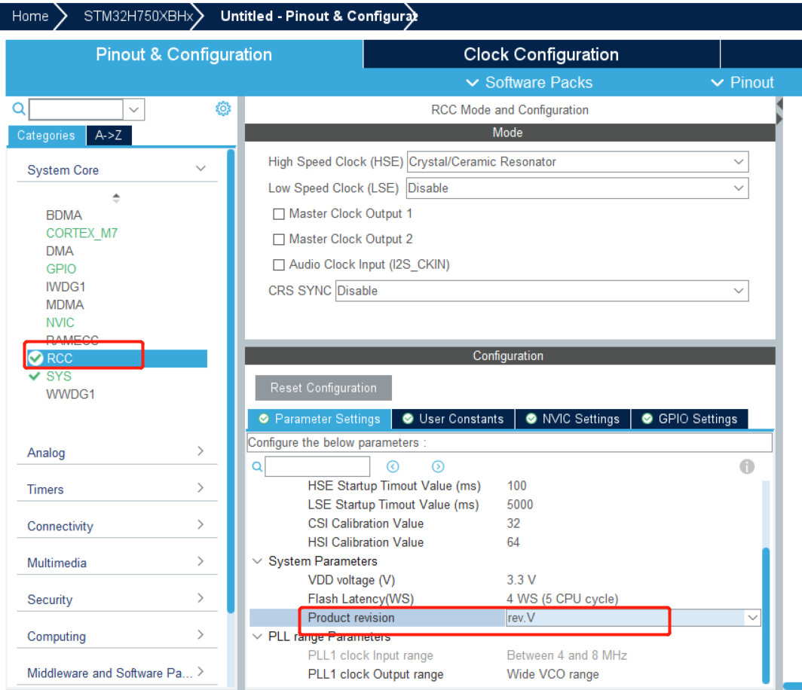

## 时钟配置（配置最大为480Mhz）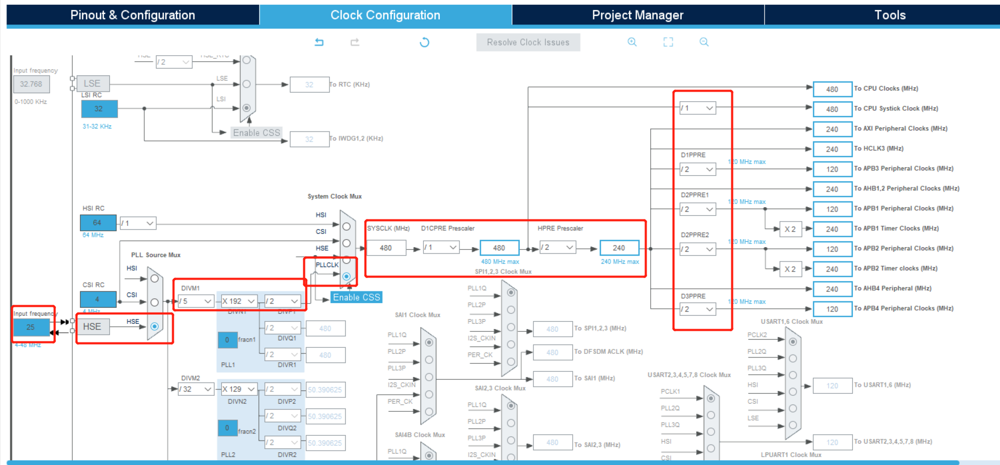

## 使用基本定时器作为时基（节省资源）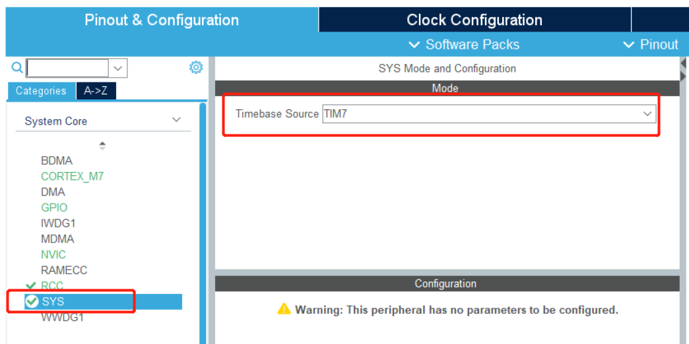

## 模板点灯

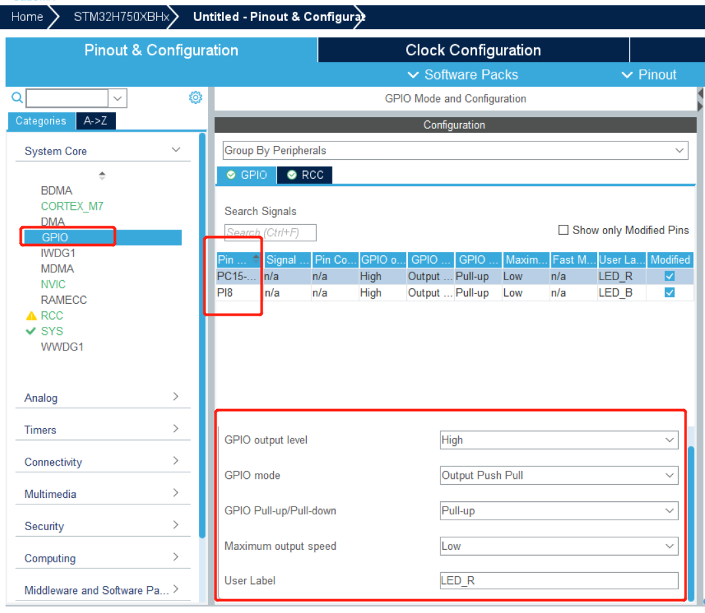

## 生成工程(不能有中文路径，会报错)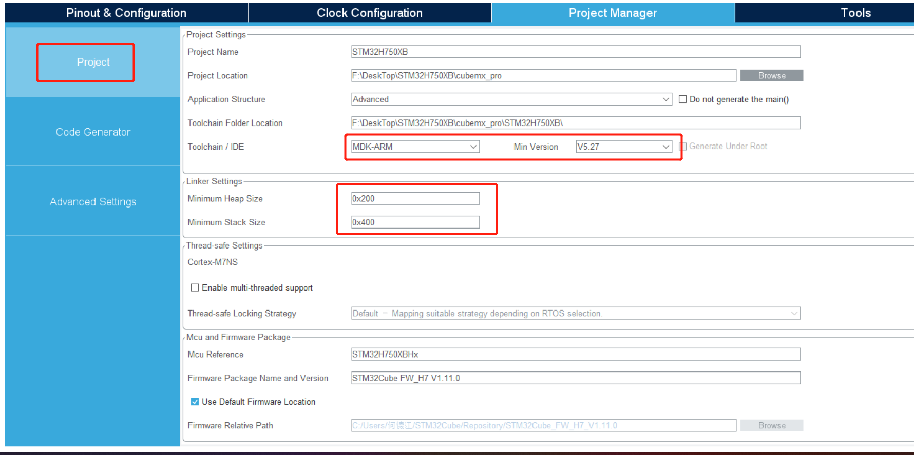

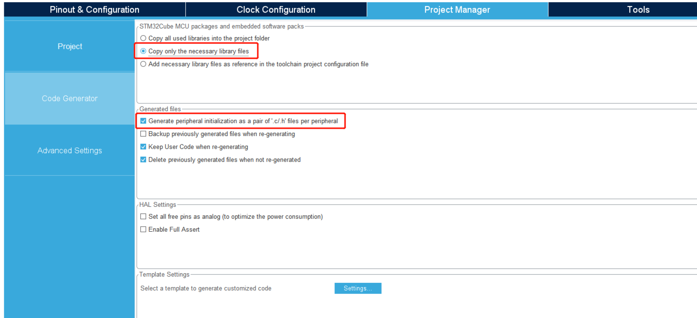

## 烧录验证(加入以下代码烧录)

## 验证成功（两个LED都打开）

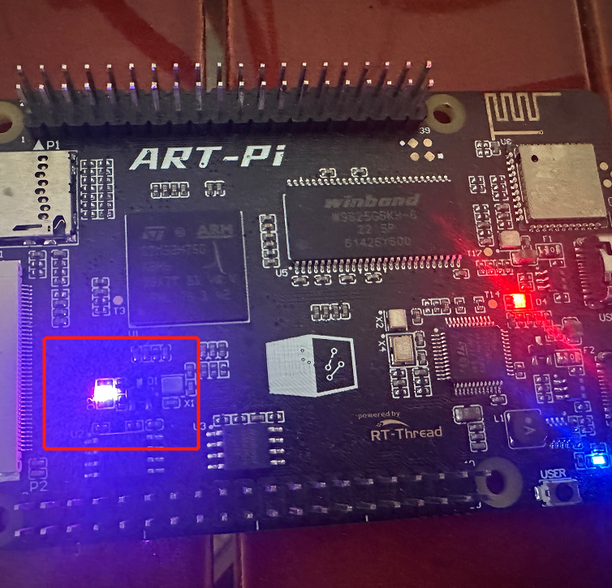

## 验证时基（在stm32h7xx_it.c加入以下代码）

cubemx配置PB2输出并加入以下代码

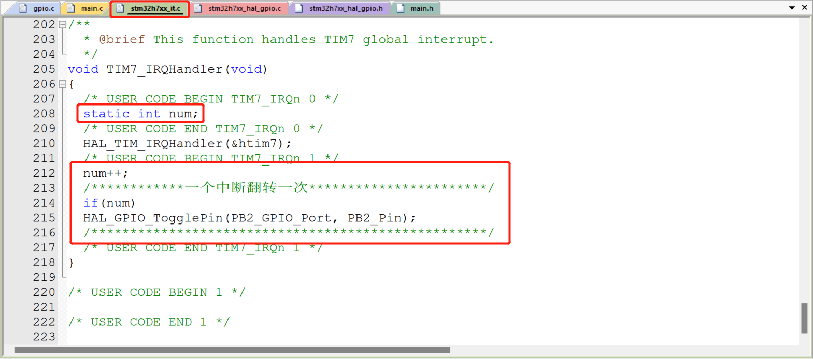

## 烧录验证

从示波器上可以看到进入中断的时间是1ms,实际上大多数MCU提供的时钟基准都是1ms

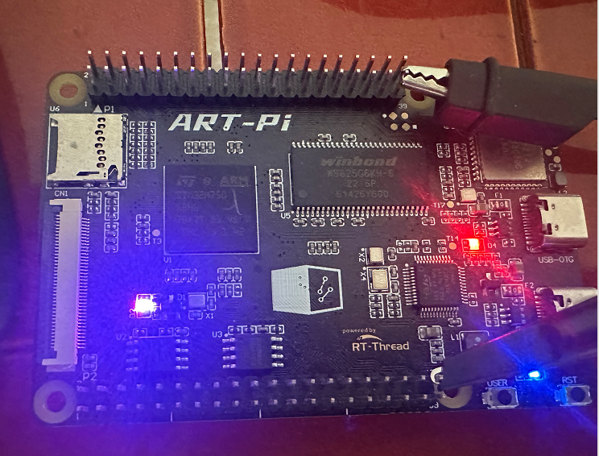

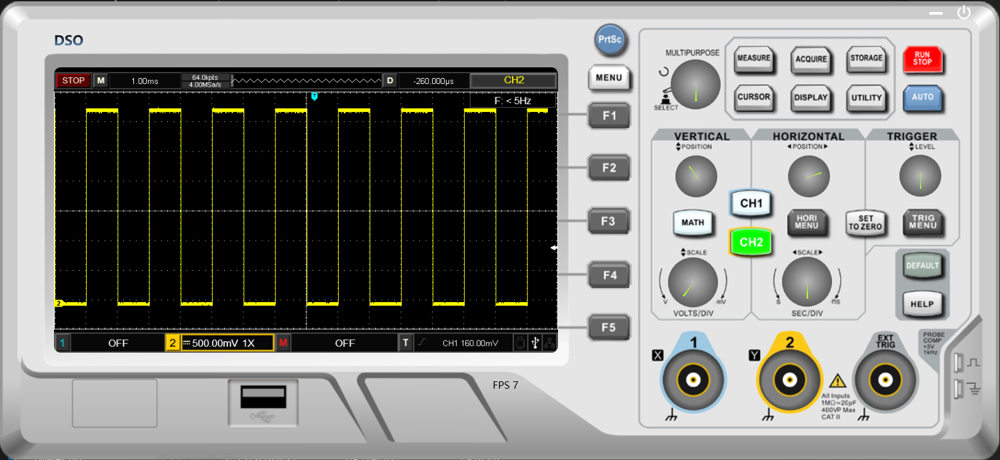

## 实用技巧清除编译文件

编译后的文件大小

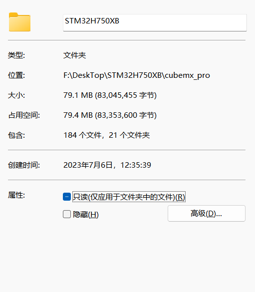

## 加入清除文件脚本    并运行

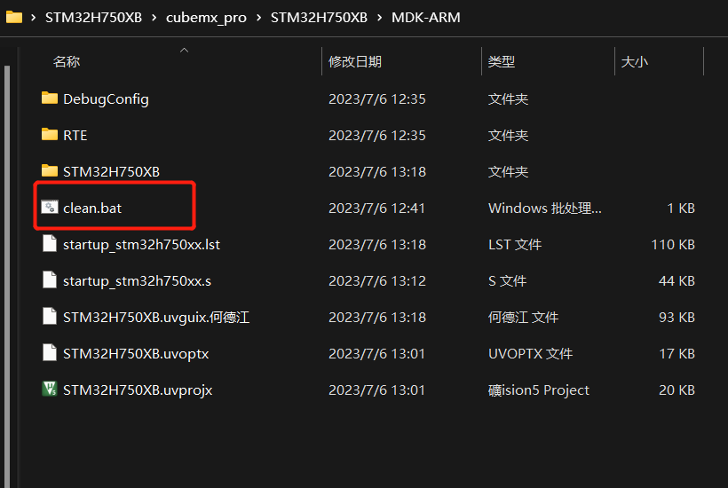

## 运行后的文件大小如下

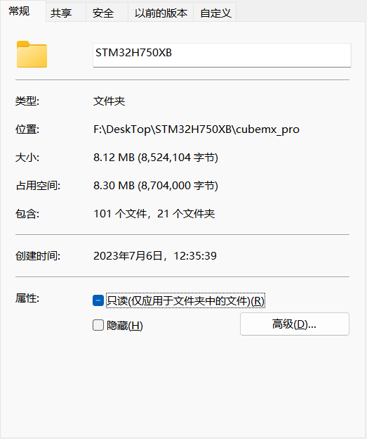

