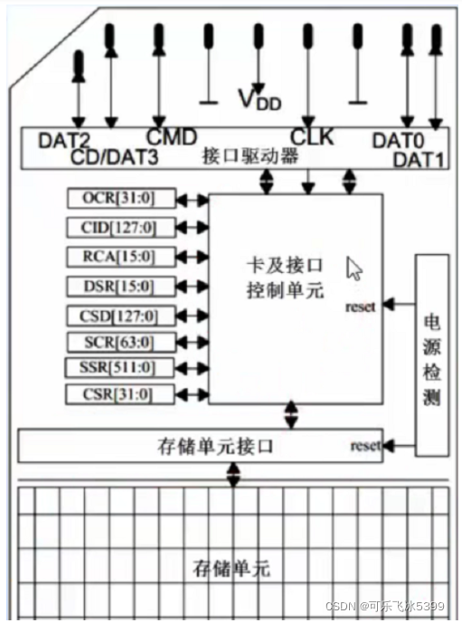
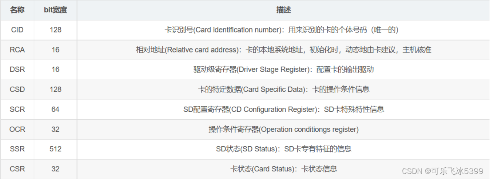
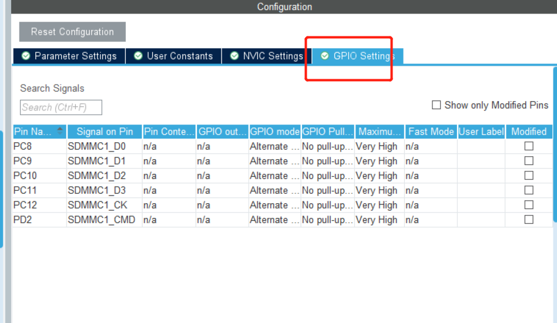
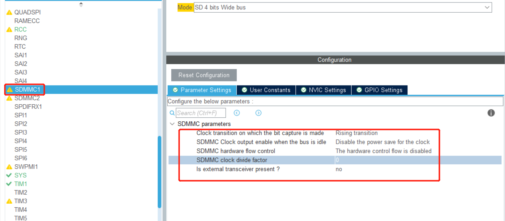
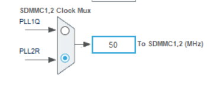
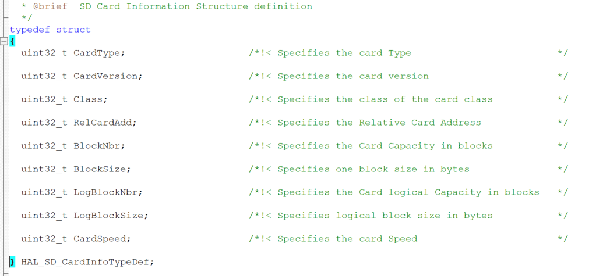

# 项目记录

## 环境搭建：

- 硬件平台：STM32H750XBH6
- 开发环境：STM32CubeMX V6.8.1+KEIL V5.28.0.0
- STM32H750固件版本：package V1.11.0
- 仿真下载驱动：ST-Link

# 10.SD card 读写测试

SD卡（Secure Digital Memory Card）在我们的生活中已经非常普遍了，控制器对SD卡进行读写通信操作一般有两种通信接口可选，一种是 SPI接口，另外一种就是 SDIO接口。SDIO 全称是 安全数字输入/输出接口，多媒体卡(MMC)、SD卡、SD I/O卡 都有 SDIO接口。STM32F103系列控制器有一个 SDIO主机接口，它可以与 MMC卡、SD卡、SD I/O卡 以及 CE-ATA 设备进行数据传输

一般SD卡包括有存储单元、存储单元接口、电源检测、卡及接口控制器和接口驱动器 5个部分。

- 存储单元是存储数据部件，存储单元通过存储单元接口与卡控制单元进行数据传输；
- 电源检测单元保证SD卡工作在合适的电压下，如出现掉电或上状态时，它会使控制单元和存储单元接口复位；
- 卡及接口控制单元控制SD卡的运行状态，它包括有8个寄存器；
- 接口驱动器控制SD卡引脚的输入输出。

# SD卡寄存器

SD卡总共有8个寄存器，用于设定或表示SD卡信息。这些寄存器只能通过对应的命令访问，SDIO定义64个命令，每个命令都有特殊意义，可以实现某一特定功能，SD卡接收到命令后，根据命令要求对SD卡内部寄存器进行修改，程序控制中只需要发送组合命令就可以实现SD卡的控制以及读写操作。

SDMMC接口：

DATA0--->PC8    DATA1--->PC9     DATA2--->PC10    DATA3--->PC11

CMD---> PD2     CLK--->PC12

获取SD卡信息结构体如下

这个结构体定义了一个名为 `HAL_SD_CardInfoTypeDef` 的数据类型，用于存储SD卡的信息。下面解释每个成员的含义：

1. `uint32_t CardType`: 表示SD卡的类型。可以用于区分SDSC（Standard Capacity）卡、SDHC（High Capacity）卡、SDXC（Extended Capacity）卡等。

2. `uint32_t CardVersion`: 表示SD卡的版本。用于标识SD卡的规范版本。

3. `uint32_t Class`: 表示SD卡的等级或类别。SD卡的等级通常用于指示其性能等级，例如，Class 2 表示最低性能，Class 10 表示较高的性能。

4. `uint32_t RelCardAdd`: 表示相对卡地址。在SD卡总线上，每张卡都有一个唯一的地址，此处存储的是相对于某个参考地址的偏移量。

5. `uint32_t BlockNbr`: 表示SD卡的容量，以块为单位。一个块是SD卡存储数据的最小单位。

6. `uint32_t BlockSize`: 表示一个块的大小，以字节为单位。这是指SD卡存储数据的最小单元的字节数。

7. `uint32_t LogBlockNbr`: 表示SD卡的逻辑容量，以块为单位。逻辑容量可能比物理容量（BlockNbr）大，因为SD卡可能使用额外的存储空间来管理数据。

8. `uint32_t LogBlockSize`: 表示逻辑块的大小，以字节为单位。逻辑块是SD卡逻辑管理的最小单元。

9. `uint32_t CardSpeed`: 表示SD卡的速度等级。速度等级通常用于指示SD卡读写数据的速度性能。

以上是这个结构体的成员含义，它们用于描述SD卡的一些重要参数和特性，方便在程序中进行SD卡的管理和使用。

测试读写：

擦除块--->读取块

--->写入块--->读取块

--->擦除块--->读取块

以上步骤可以