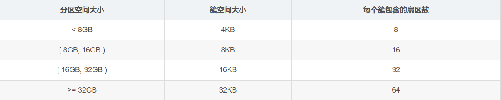
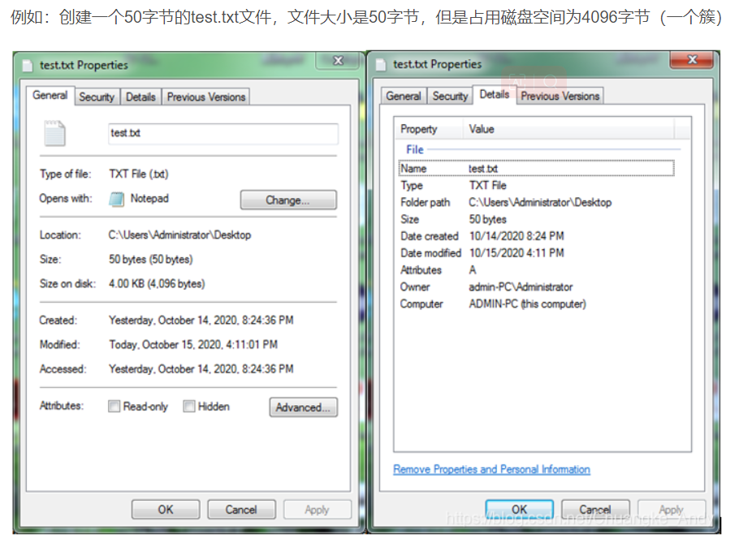
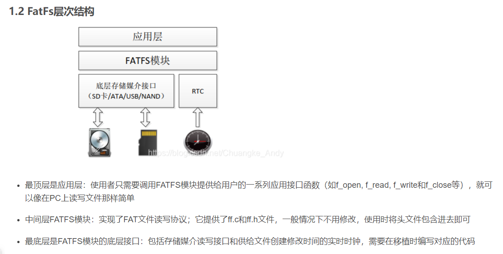
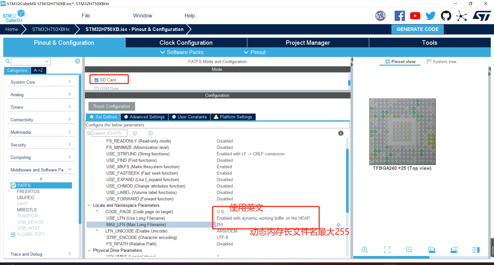
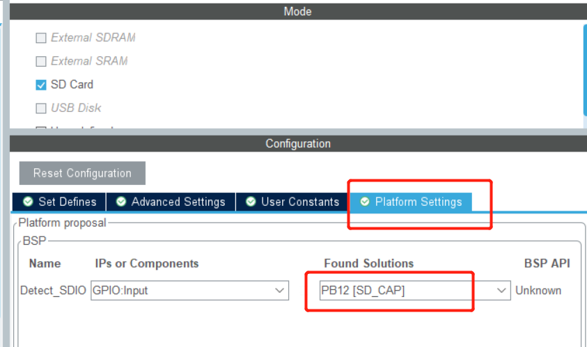
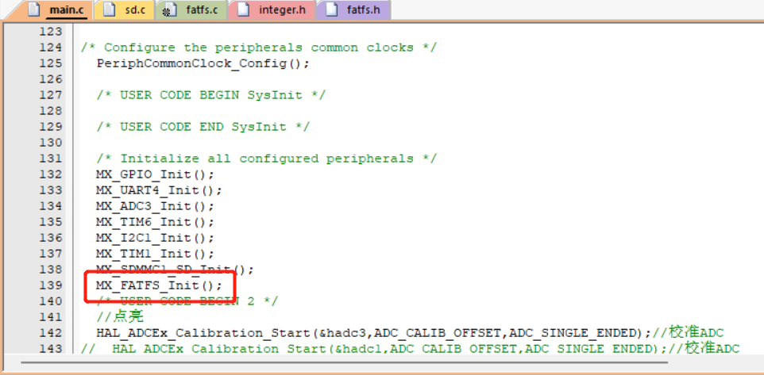
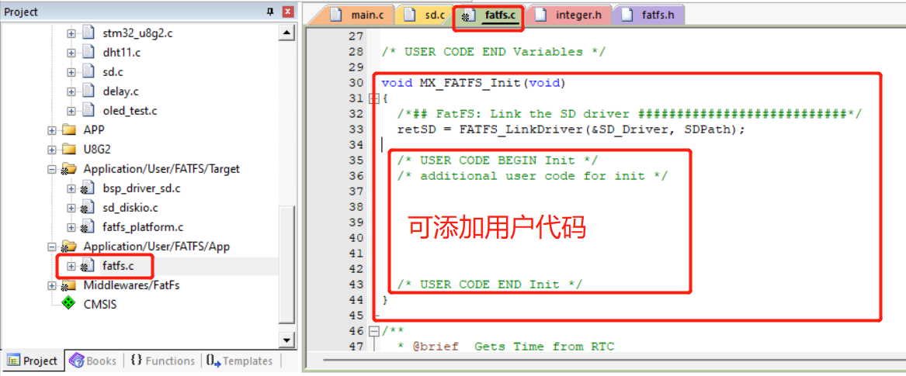
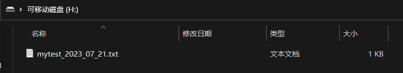
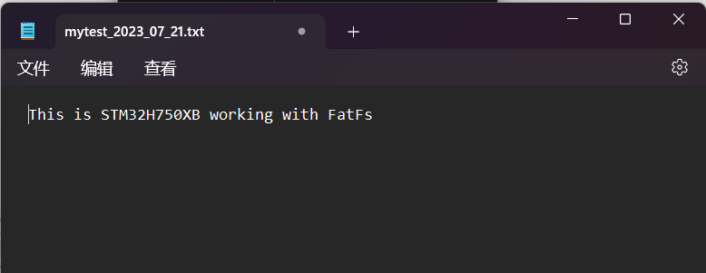

# 项目记录

## 环境搭建：

- 硬件平台：STM32H750XBH6
- 开发环境：STM32CubeMX V6.8.1+KEIL V5.28.0.0
- STM32H750固件版本：package V1.11.0
- 仿真下载驱动：ST-Link


# 10.SD card 读写测试

SD卡（Secure Digital Memory Card）在我们的生活中已经非常普遍了，控制器对SD卡进行读写通信操作一般有两种通信接口可选，一种是 SPI接口，另外一种就是 SDIO接口。SDIO 全称是 安全数字输入/输出接口，多媒体卡(MMC)、SD卡、SD I/O卡 都有 SDIO接口。STM32F103系列控制器有一个 SDIO主机接口，它可以与 MMC卡、SD卡、SD I/O卡 以及 CE-ATA 设备进行数据传输


一般SD卡包括有存储单元、存储单元接口、电源检测、卡及接口控制器和接口驱动器 5个部分。

- 存储单元是存储数据部件，存储单元通过存储单元接口与卡控制单元进行数据传输；
- 电源检测单元保证SD卡工作在合适的电压下，如出现掉电或上状态时，它会使控制单元和存储单元接口复位；
- 卡及接口控制单元控制SD卡的运行状态，它包括有8个寄存器；
- 接口驱动器控制SD卡引脚的输入输出。


# SD卡寄存器

SD卡总共有8个寄存器，用于设定或表示SD卡信息。这些寄存器只能通过对应的命令访问，SDIO定义64个命令，每个命令都有特殊意义，可以实现某一特定功能，SD卡接收到命令后，根据命令要求对SD卡内部寄存器进行修改，程序控制中只需要发送组合命令就可以实现SD卡的控制以及读写操作。


SDMMC接口：

DATA0--->PC8    DATA1--->PC9     DATA2--->PC10    DATA3--->PC11

CMD---> PD2     CLK--->PC12


获取SD卡信息结构体如下


这个结构体定义了一个名为 `HAL_SD_CardInfoTypeDef` 的数据类型，用于存储SD卡的信息。下面解释每个成员的含义：

1. `uint32_t CardType`: 表示SD卡的类型。可以用于区分SDSC（Standard Capacity）卡、SDHC（High Capacity）卡、SDXC（Extended Capacity）卡等。

2. `uint32_t CardVersion`: 表示SD卡的版本。用于标识SD卡的规范版本。

3. `uint32_t Class`: 表示SD卡的等级或类别。SD卡的等级通常用于指示其性能等级，例如，Class 2 表示最低性能，Class 10 表示较高的性能。

4. `uint32_t RelCardAdd`: 表示相对卡地址。在SD卡总线上，每张卡都有一个唯一的地址，此处存储的是相对于某个参考地址的偏移量。

5. `uint32_t BlockNbr`: 表示SD卡的容量，以块为单位。一个块是SD卡存储数据的最小单位。

6. `uint32_t BlockSize`: 表示一个块的大小，以字节为单位。这是指SD卡存储数据的最小单元的字节数。

7. `uint32_t LogBlockNbr`: 表示SD卡的逻辑容量，以块为单位。逻辑容量可能比物理容量（BlockNbr）大，因为SD卡可能使用额外的存储空间来管理数据。

8. `uint32_t LogBlockSize`: 表示逻辑块的大小，以字节为单位。逻辑块是SD卡逻辑管理的最小单元。

9. `uint32_t CardSpeed`: 表示SD卡的速度等级。速度等级通常用于指示SD卡读写数据的速度性能。

以上是这个结构体的成员含义，它们用于描述SD卡的一些重要参数和特性，方便在程序中进行SD卡的管理和使用。

SD卡的逻辑容量（BYTE）=LogBlockNbr*LogBlockSize


# FATFS

FatFs 是面向小型嵌入式系统的一种通用的 FAT 文件系统。它完全是由 ANSI C 语言编写并且完全独立于底层的 I/O 介质。因此它可以很容易地不加修改地移植到其他的处理器当中，如 8051、PIC、AVR、SH、Z80、H8、ARM 等。FatFs 支持 FAT12、FAT16、FAT32 等格式，

簇是文件存储的最小单元，FAT32分区大小与对应簇空间大小关系如下表示：







# cubemx配置如下：



## 配置SD卡检测引脚

SD卡插入检测引脚，如果不配置一个引脚生成文件时会报错，所以这里即使没有硬件连接，也可以任意设置一引脚使用，生成工程后注释代码。

这里使用PB12,默认低电平为选中引脚，配置拉低




看下生成工程中





# fatfs常用函数整理

档案存取:
f_open-打开/创建文件
f_close-关闭打开的文件
f_read-从文件读取数据
f_write-将数据写入文件
f_lseek-移动读/写指针，扩展大小
f_truncate-截断文件大小
f_sync-刷新缓存的数据
f_forward-将数据转发到流
f_expand-将连续块分配给文件
f_gets-读取字符串
f_putc-写一个字符
f_puts-写一个字符串
f_printf-编写格式化的字符串
f_tell-获取当前的读/写指针
f_eof-测试文件结尾
f_size-获取大小
f_error-测试错误


目录访问
f_opendir-打开目录
f_closedir-关闭打开的目录
f_readdir-读取目录项
f_findfirst-打开目录并读取匹配的第一项
f_findnext-阅读下一个匹配的项目


文件和目录管理
f_stat-检查文件或子目录是否存在
f_unlink-删除文件或子目录
f_rename-重命名/移动文件或子目录
f_chmod-更改文件或子目录的属性
f_utime-更改文件或子目录的时间戳
f_mkdir-创建一个子目录
f_chdir-更改当前目录
f_chdrive-更改当前驱动器
f_getcwd-检索当前目录和驱动器

卷管理和系统配置
f_mount-注册/注销卷的工作区
f_mkfs-在逻辑驱动器上创建FAT卷
f_fdisk-在物理驱动器上创建分区
f_getfree-获取卷上的可用空间
f_getlabel-获取卷标
f_setlabel-设置卷标
f_setcp-设置活动代码页


添加测试代码如下：

```c
FATFS fs;                 // Work area (file system object) for logical drive
FIL fil;                  // file objects
uint32_t byteswritten;                /* File write counts */
uint32_t bytesread;                   /* File read counts */
uint8_t wtext[] = "This is STM32H750XB working with FatFs"; /* File write buffer */
uint8_t rtext[100];                     /* File read buffers */
char filename[] = "0:/mytest_2023_07_27.txt";


printf("\r\n ****** FatFs Example ******\r\n\r\n");
    /*##-1- Register the file system object to the FatFs module ##############*/
	//f_mkfs("1:",FM_ANY,0,fatbuf,FF_MAX_SS);
	retSD = f_mount(&fs, SDPath, 1);
	if(retSD)
	{
			printf(" mount error : %d \r\n",retSD);
			Error_Handler();
	}
	else
			printf(" mount sucess!!! \r\n");
	/*##-2- Create and Open new text file objects with write access ######*/
	retSD = f_open(&fil, filename, FA_CREATE_NEW | FA_WRITE);
	if(retSD)
			printf(" open file error : %d\r\n",retSD);
	else
			printf(" open file sucess!!! \r\n");
	/*##-3- Write data to the text files ###############################*/
	retSD = f_write(&fil, wtext, sizeof(wtext), (void *)&byteswritten);
	if(retSD)
			printf(" write file error : %d\r\n",retSD);
	else
	{
			printf(" write file sucess!!! \r\n");
			printf(" write Data : %s\r\n",wtext);
	}
	/*##-4- Close the open text files ################################*/
	retSD = f_close(&fil);
	if(retSD)
			printf(" close error : %d\r\n",retSD);
	else
			printf(" close sucess!!! \r\n");
	/*##-5- Open the text files object with read access ##############*/
	retSD = f_open(&fil, filename, FA_READ);
	if(retSD)
			printf(" open file error : %d\r\n",retSD);
	else
			printf(" open file sucess!!! \r\n");
	/*##-6- Read data from the text files ##########################*/
	retSD = f_read(&fil, rtext, sizeof(rtext), (UINT*)&bytesread);
	if(retSD)
			printf(" read error!!! %d\r\n",retSD);
	else
	{
			printf(" read sucess!!! \r\n");
			printf(" read Data : %s\r\n",rtext);
	}
	/*##-7- Close the open text files ############################*/
	retSD = f_close(&fil);
	if(retSD) 
			printf(" close error!!! %d\r\n",retSD);
	else
			printf(" close sucess!!! \r\n");
```

串口打印如下:


查看文件如下



