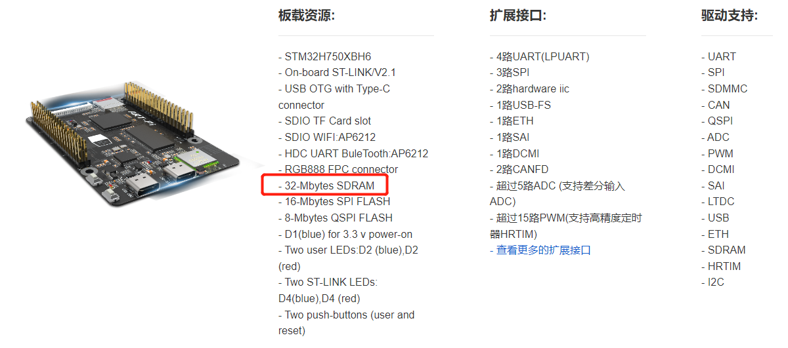
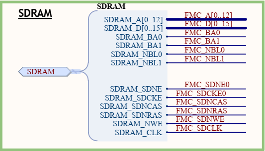
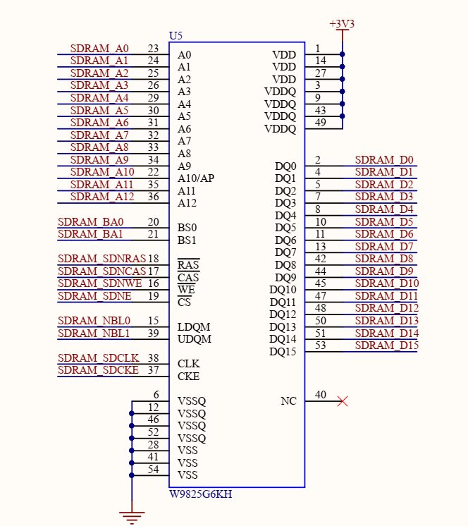
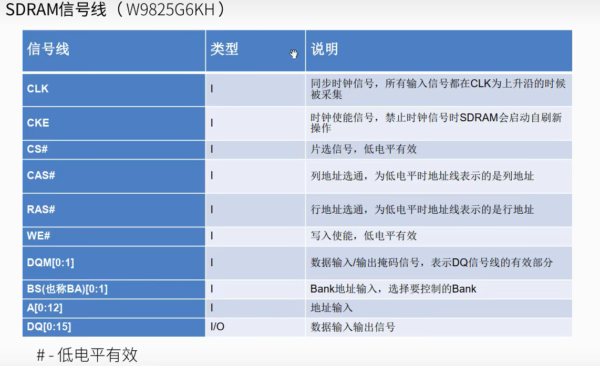
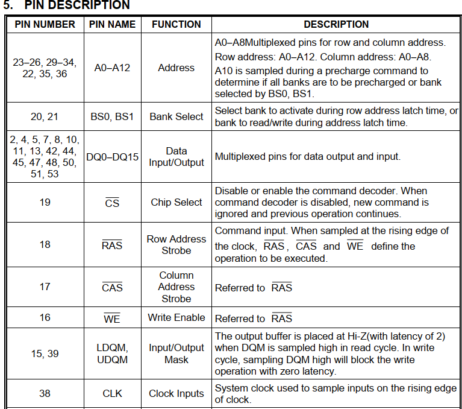
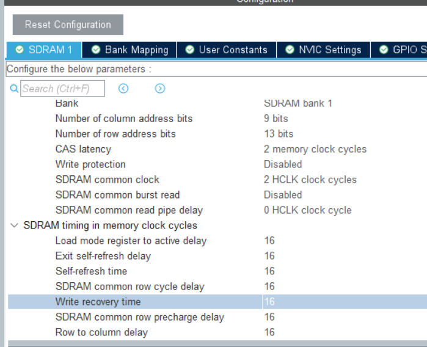
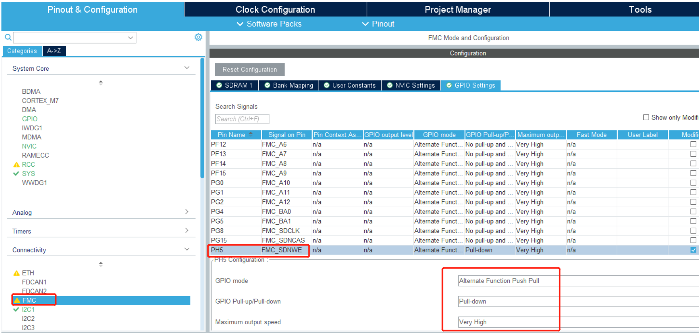
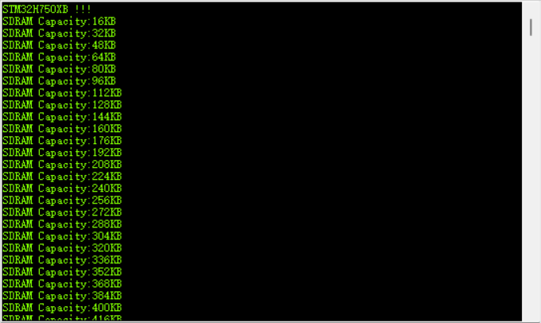

# 项目记录

## 环境搭建：

- 硬件平台：STM32H750XBH6
- 开发环境：STM32CubeMX V6.8.1+KEIL V5.28.0.0
- STM32H750固件版本：package V1.11.0
- 仿真下载驱动：ST-Link

# 11.SD RAM  --->同步动态随机存储器

参考资料地址：

https://blog.csdn.net/Mculover666/article/details/108232505

**SDRAM的全称是" Synchronous Dynamic Random-Access Memory"**

- "Synchronous"表示它与计算机系统的时钟同步运行，可以按照特定的时钟信号进行数据传输和访问。
- "Dynamic"表示它是一种动态随机存取存储器，意味着它需要不断地进行刷新以保持存储的数据，而不像静态随机存取存储器（SRAM）那样可以在不刷新的情况下保持数据。

从上图我们可以看到SDRAM占用非常多的引脚

官方手册引脚解释

SDRAM_A(即地址线)13条    SDRAM_D(即数据线)16条

SDRAM里面的存储单元被逻辑的分为几块，每一块叫一个bank

SDRAM_BA0        SDRAM_BA1       四种组合即这里可用四个back

## SDRAM_NBL0      SDRAM_NBL1

SDRAM_NBL0和SDRAM_NBL1是与SDRAM（同步动态随机存取存储器）相关的引脚，用于传输数据的字节掩码信息。

在某些SDRAM配置中，当使用8位数据总线（数据线）时，这些引脚被用于将数据字节掩码传输给SDRAM，以指示有效的数据字节。数据字节掩码用于标识在SDRAM中读取或写入数据时，哪些数据字节是有效的，哪些是无效的。在SDRAM中，数据通常以字节为单位进行读写，而在8位数据总线模式下，每次传输8位（1字节）数据。

SDRAM_NBL0和SDRAM_NBL1引脚用于将数据字节掩码传输给SDRAM。例如，在8位数据总线模式下，如果要传输的数据是0xAB（二进制：10101011），则相应的数据字节掩码为0xFF（二进制：11111111）。这意味着传输的数据字节是完全有效的，而没有任何字节被屏蔽。

# CUBEMX配置如下：

| FMC_A0     | PF0  |
| ---------- | ---- |
| FMC_A1     | PF1  |
| FMC_A2     | PF2  |
| FMC_A3     | PF3  |
| FMC_A4     | PF4  |
| FMC_A5     | PF5  |
| FMC_A6     | PF12 |
| FMC_A7     | PF13 |
| FMC_A8     | PF14 |
| FMC_A9     | PF15 |
| FMC_A10    | PG0  |
| FMC_A11    | PG1  |
| FMC_A12    | PG2  |
| FMC_D0     | PD14 |
| FMC_D1     | PD15 |
| FMC_D2     | PD0  |
| FMC_D3     | PD1  |
| FMC_D4     | PE7  |
| FMC_D5     | PE8  |
| FMC_D6     | PE9  |
| FMC_D7     | PE10 |
| FMC_D8     | PE11 |
| FMC_D9     | PE12 |
| FMC_D10    | PE13 |
| FMC_D11    | PE14 |
| FMC_D12    | PE15 |
| FMC_D13    | PD8  |
| FMC_D14    | PD9  |
| FMC_D15    | PD10 |
| FMC_BA0    | PG4  |
| FMC_BA1    | PG5  |
| FMC_NBL0   | PE0  |
| FMC_NBL1   | PE1  |
| FMC_SDNE0  | PC2  |
| FMC_SDCKE0 | PC3  |
| FMC_SDNCAS | PG15 |
| FMC_SDNRAS | PF11 |
| FMC_SDNWE  | PH5  |
| FMC_SDCLK  | PG8  |

配置参考地址：

https://blog.csdn.net/as480133937/article/details/123455833?ops_request_misc=%257B%2522request%255Fid%2522%253A%2522168998512716800211543792%2522%252C%2522scm%2522%253A%252220140713.130102334..%2522%257D&request_id=168998512716800211543792&biz_id=0&utm_medium=distribute.pc_search_result.none-task-blog-2~all~sobaiduend~default-2-123455833-null-null.142^v90^control_2,239^v3^insert_chatgpt&utm_term=cubemx%20sdram&spm=1018.2226.3001.4187

配置完成之后还需要配置一个引脚使能FMC_SDNWE   

添加sdram初始化代码并添加测试代码：

详细代码参考工程中示例文件

