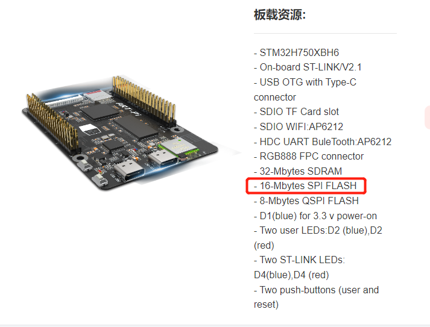
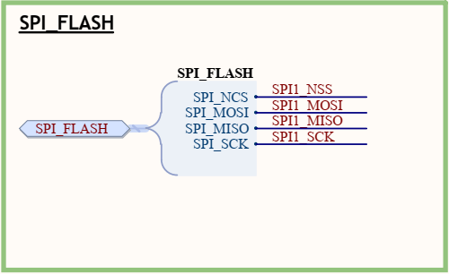
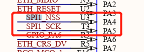
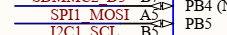
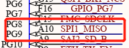
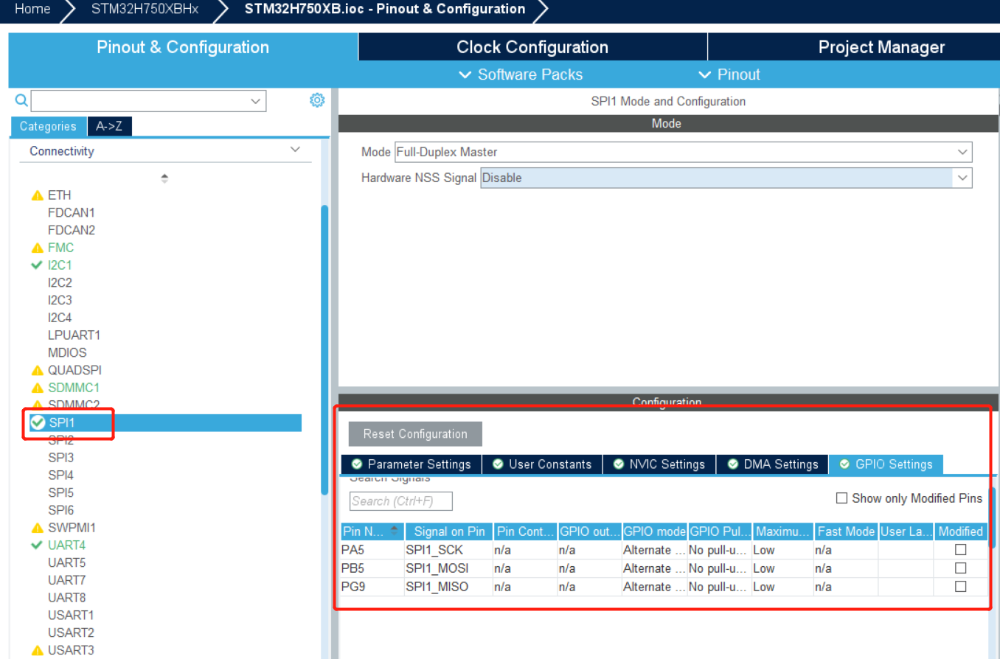
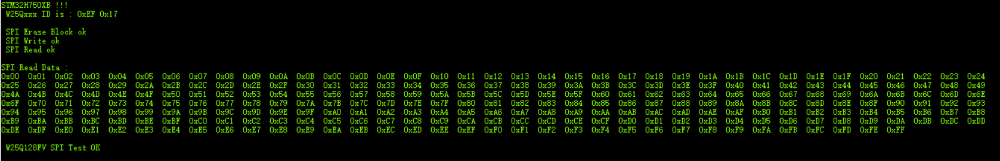

# 项目记录

## 环境搭建：

- 硬件平台：STM32H750XBH6
- 开发环境：STM32CubeMX V6.8.1+KEIL V5.28.0.0
- STM32H750固件版本：package V1.11.0
- 仿真下载驱动：ST-Link

# 12.SPI FLASH 

By Rudy RT-Thread 官方开发板 ART-Pi 上有两片外部 Flash 存储芯片，分别是 16MB 的 **W25Q128JV** 和 8MB 的 W25Q64JV。 其中，W25Q64JV 用于存放应用程序（称为“程序 Flash”），W25Q128JV 用于存放 WiFi 固件、蓝牙固件等，以及作为 OTA 存储区和文件系统（称为“数据 Flash”）。

SPI Flash（串行外部闪存）是一种常见的非易失性存储器，用于嵌入式系统和微控制器等设备中。它通过SPI（Serial Peripheral Interface，串行外设接口）进行通信，并提供了一种方便的存储解决方案，常用于存储配置信息、固件更新、日志数据等。

以下是 SPI Flash 的一些特点和用途：

1. **存储容量**：SPI Flash 的存储容量通常从几十KB到几百MB不等，有多种规格可供选择。
2. **SPI接口**：SPI Flash 通过四线式SPI接口（时钟线、数据输入线、数据输出线和片选线）与主控制器（通常是微控制器或处理器）进行通信。
3. **快速读取和写入**：SPI Flash 可以实现快速的读取和写入操作，因为它直接与主控制器通信，无需慢速的访问协议。
4. **非易失性**：SPI Flash 是一种非易失性存储器，意味着它可以在断电后保持存储的数据，不会因为断电而丢失。
5. **可擦写**：SPI Flash 具有可擦写的特性，可以擦除存储的数据并写入新的数据，使其适用于固件更新等场景。
6. **低功耗**：SPI Flash 具有较低的功耗特性，适合用于功耗要求较低的嵌入式系统。
7. **固件存储**：SPI Flash 常用于存储系统的固件，如引导程序、配置文件等。
8. **存储数据**：SPI Flash 也可以用于存储其他数据，如日志数据、用户数据等。

总体而言，SPI Flash 提供了一种简单而可靠的存储解决方案，广泛应用于嵌入式系统和微控制器中，以满足对非易失性存储器的需求

原理图中可以看到

SPI_NSS---> PA4          SPI_SCK--->PA5

SPI_MISO---> PG9       SPI_MOSI--->PB5

# CUBEMX配置如下，使用硬件spi

注意引脚的配置,可能用到复用引脚，NSS为片选引脚，因为硬件 NSS 使用比较麻烦，单独配置，拉低选中该引脚即可

生成工程加入测试代码：

详细代码请查看工程

测试结果如下：

