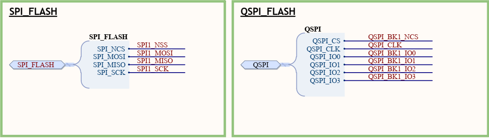
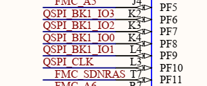
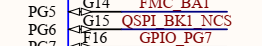
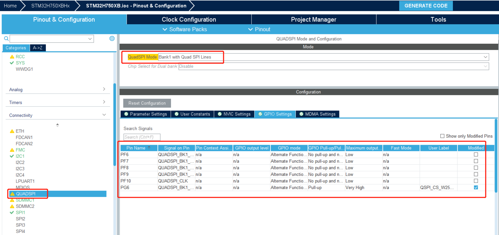
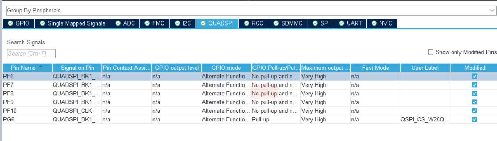
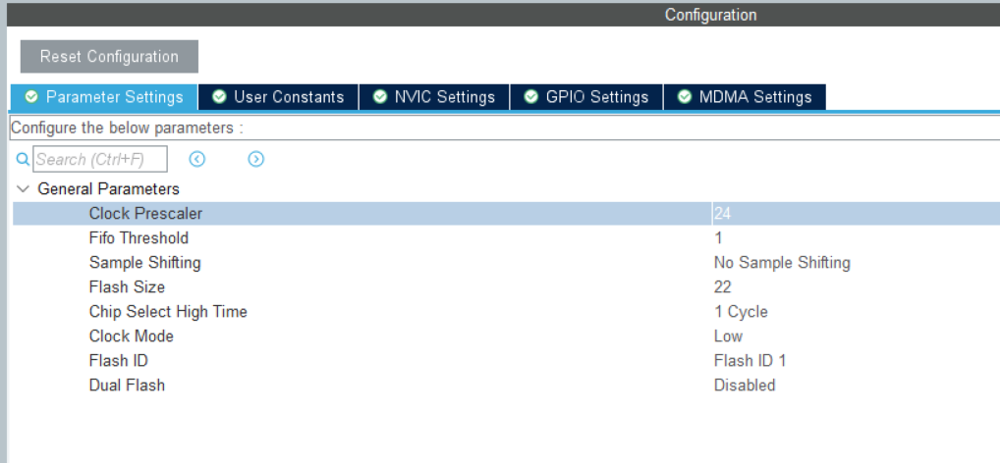
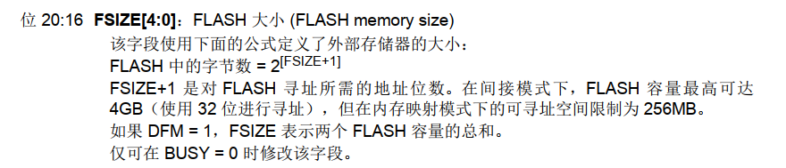

# 项目记录

## 环境搭建：

- 硬件平台：STM32H750XBH6
- 开发环境：STM32CubeMX V6.8.1+KEIL V5.28.0.0
- STM32H750固件版本：package V1.11.0
- 仿真下载驱动：ST-Link

# 13.QSPI FLASH (W25Q64JV)

SPI（Serial Peripheral Interface）和QSPI（Quad Serial Peripheral Interface）都是串行外设接口，用于在微控制器、微处理器和外部设备之间传输数据。它们之间的主要异同如下：

1. **速度**：
   - SPI：通常是单通道，具有简单的架构，时钟速度相对较慢，通常在几百Kbps或几Mbps范围内。
   - QSPI：是SPI的改进版本，通过同时使用4个数据线，形成四线全双工（Quad Full-Duplex）通信，因此传输速度较快。它通常可以达到几十Mbps或更高的速度。

2. **数据线数**：
   - SPI：使用3线（全双工模式）或4线（全双工模式带有主从选择功能）进行通信。
   - QSPI：使用4线（全双工）进行通信。

3. **架构复杂度**：
   - SPI：相对简单，适用于较为简单的通信需求。
   - QSPI：由于使用了四线全双工通信，因此在硬件上较SPI复杂，但在高速数据传输方面更加高效。

4. **应用**：
   - SPI：适用于低速设备，如传感器、显示屏、存储器等。
   - QSPI：适用于高速数据传输的设备，如快速存储器、图形显示等。

5. **芯片支持**：
   - SPI：广泛支持，许多微控制器和外围设备都有SPI接口。
   - QSPI：相对较新，只有一些高性能的芯片支持QSPI接口。

总的来说，SPI适用于简单的、低速的通信需求，而QSPI则适用于高速数据传输的场景。选择哪种接口取决于具体的应用要求和设备支持情况。

SPI和QSPI异同

https://blog.csdn.net/as480133937/article/details/126961149?ops_request_misc=%257B%2522request%255Fid%2522%253A%2522169000181716782427479479%2522%252C%2522scm%2522%253A%252220140713.130102334..%2522%257D&request_id=169000181716782427479479&biz_id=0&utm_medium=distribute.pc_search_result.none-task-blog-2~all~top_positive~default-1-126961149-null-null.142^v90^control_2,239^v3^insert_chatgpt&utm_term=qspi&spm=1018.2226.3001.4187

从以上原理图得到

QSPI_BK0--->PF8     QSPI_BK1--->PF9      QSPI_BK2--->PF7      QSPI_BK3--->PF6 

QSPI_CLK--->PF10     QSPI_BK1_NCS--->PG6

QSPI_BK1_NCS：片选信号线

# CUBEMX配置如下

QSPI传输输入较快，io电器属性 speed: very high

flash size计算方式

生成代码：

# 两种访问方式

QSPI Flash是一种外部存储器，通常用于存储程序代码、数据以及其他非易失性数据。在使用QSPI Flash时，有两种访问方式：间接读写和直接映射（也称为内存映射）。它们在访问方式和操作上有一些不同：

1. **间接读写**：
   - 在间接读写方式中，微控制器或处理器通过QSPI接口与Flash进行通信。读写数据需要使用特定的QSPI指令，以读取或写入指定的存储地址。
   - 在读取时，微控制器发送读取指令和地址到QSPI Flash，并接收Flash返回的数据。这个过程涉及到指令的传输和地址的寻址，需要花费一定的时间。
   - 在写入时，微控制器发送写入指令、地址和数据到QSPI Flash，Flash会将数据写入指定地址。写入也涉及到指令的传输和地址的寻址，因此相对较慢。
   - 这种方式更加灵活，允许对Flash进行更加复杂的操作，但由于涉及指令和地址的传输，读写速度相对较慢。
2. **直接映射**：
   - 在直接映射方式中，QSPI Flash的部分或全部存储空间被映射到了处理器的地址空间。这意味着处理器可以像访问内部RAM一样直接读取和写入Flash的数据，无需使用特定的QSPI指令。
   - 这种方式允许处理器通过直接内存访问（DMA）等技术来访问Flash的数据，从而加快读取速度。处理器可以像访问其他内存地址一样读取或写入Flash数据。
   - 直接映射简化了对Flash的访问，但在硬件层面需要一定的支持，例如片选信号、地址解码等。
   - 由于直接映射避免了指令和地址传输的开销，因此读写速度较快。

总的来说，间接读写方式更加灵活，适用于对Flash进行复杂操作的情况，但读写速度相对较慢。而直接映射方式虽然简化了访问，但要求硬件支持，读写速度较快。在选择使用哪种方式时，需要根据具体的应用需求和硬件设计来决定。