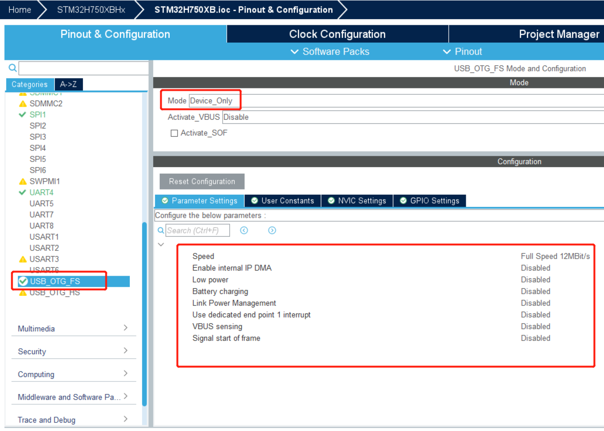
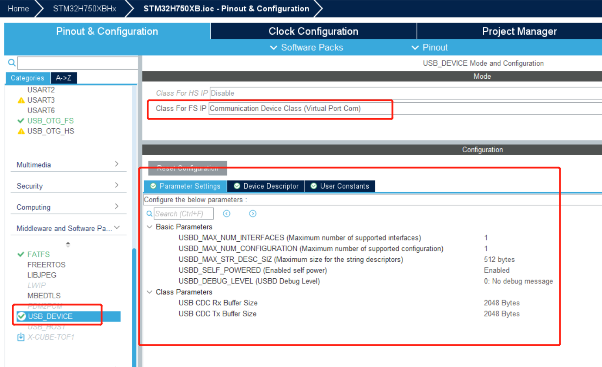
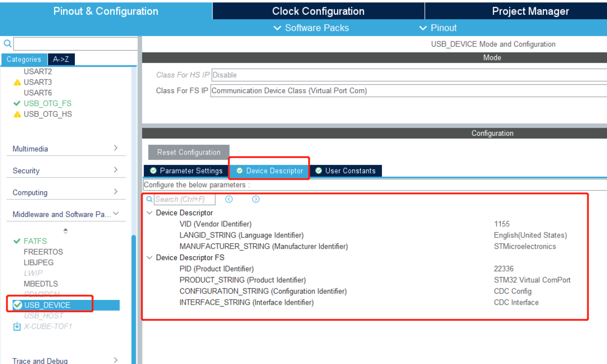
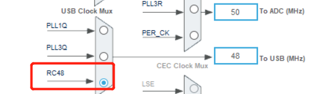

# 项目记录

## 环境搭建：

- 硬件平台：STM32H750XBH6
- 开发环境：STM32CubeMX V6.8.1+KEIL V5.28.0.0
- STM32H750固件版本：package V1.11.0
- 仿真下载驱动：ST-Link


# 14.USB虚拟串口

STM32H750是STMicroelectronics推出的微控制器，属于STM32H7系列。该系列基于Arm Cortex-M7核心，专为高性能应用而设计，配备了丰富的外设。其中，STM32H750微控制器具备USB功能，它可以用于以下多种用途：

1. USB设备通信：STM32H750可作为USB设备，能够与USB主机（例如PC或其他微控制器）进行通信。这使得STM32H750能够在计算机和其他外设之间进行数据传输和通信。
2. USB主机通信：除了作为USB设备，STM32H750还可以作为USB主机，连接和管理其他USB设备。这使得STM32H750能够控制和操作其他外部USB设备，例如USB存储器、键盘、鼠标等。
3. USB虚拟串口（USB CDC）：STM32H750可以通过USB接口模拟一个串口（虚拟串口），用于与计算机或其他支持串口通信的设备进行数据交换。这在许多嵌入式系统和通信应用中非常有用。
4. USB传输控制协议（USB MSC）：STM32H750支持USB传输控制协议，允许将其闪存或外部存储器以USB存储设备的形式连接到计算机，从而可以像连接U盘一样读取或写入数据。
5. USB音频：STM32H750可以支持USB音频类，从而能够作为USB音频设备，与计算机或其他音频设备进行音频数据传输。

总的来说，STM32H750的USB功能为开发者提供了灵活多样的选项，可用于构建各种USB通信和数据交换应用。

这里就是我们使用的第三种，usb虚拟串口


# CUBEMX配置如下：









生成代码：

加入以下代码

```c
#include "usbd_cdc.h" /*添加这个头文件使用cdc函数*/

uint8_t UserTxBuffer[] = "usb cdc test!\r\n";


while{

     USBD_CDC_SetTxBuffer(&hUsbDeviceFS,     (uint8_t*)&UserTxBuffer, sizeof(UserTxBuffer));

    USBD_CDC_TransmitPacket(&hUsbDeviceFS);

    HAL_Delay(1000);


}


```

实际测试时结构体hUsbDeviceFS找不到

在usb_device.h中添加 **extern USBD_HandleTypeDef hUsbDeviceFS;**


实现效果如下，USB CDC虚拟串口将数据封装在USB通信框架中，而不是直接使用硬件串口通信。因此，USB CDC虚拟串口可以自适应不同的传输速率，而不需要显式地配置波特率。通常，在使用USB CDC虚拟串口时，只需要在计算机或其他终端设备上选择正确的虚拟串口，而无需担心波特率设置。

这种灵活性使得USB CDC虚拟串口更加方便，特别是在与不同的设备和计算机进行通信时，无需担心波特率匹配的问题。

