# 项目记录

## 环境搭建：

- 硬件平台：STM32H750XBH6
- 开发环境：STM32CubeMX V6.8.1+KEIL V5.28.0.0
- STM32H750固件版本：package V1.11.0
- 仿真下载驱动：ST-Link


# 14.USB模拟U盘（USB_FS+SD卡+fatfs）

STM32H750是STMicroelectronics推出的微控制器，属于STM32H7系列。该系列基于Arm Cortex-M7核心，专为高性能应用而设计，配备了丰富的外设。其中，STM32H750微控制器具备USB功能，它可以用于以下多种用途：

1. USB设备通信：STM32H750可作为USB设备，能够与USB主机（例如PC或其他微控制器）进行通信。这使得STM32H750能够在计算机和其他外设之间进行数据传输和通信。
2. USB主机通信：除了作为USB设备，STM32H750还可以作为USB主机，连接和管理其他USB设备。这使得STM32H750能够控制和操作其他外部USB设备，例如USB存储器、键盘、鼠标等。
3. USB虚拟串口（USB CDC）：STM32H750可以通过USB接口模拟一个串口（虚拟串口），用于与计算机或其他支持串口通信的设备进行数据交换。这在许多嵌入式系统和通信应用中非常有用。
4. USB传输控制协议（USB MSC）：STM32H750支持USB传输控制协议，允许将其闪存或外部存储器以USB存储设备的形式连接到计算机，从而可以像连接U盘一样读取或写入数据。
5. USB音频：STM32H750可以支持USB音频类，从而能够作为USB音频设备，与计算机或其他音频设备进行音频数据传输。

总的来说，STM32H750的USB功能为开发者提供了灵活多样的选项，可用于构建各种USB通信和数据交换应用。

这里就是我们使用的第4种，usb模拟U盘


# cubemx配置如下

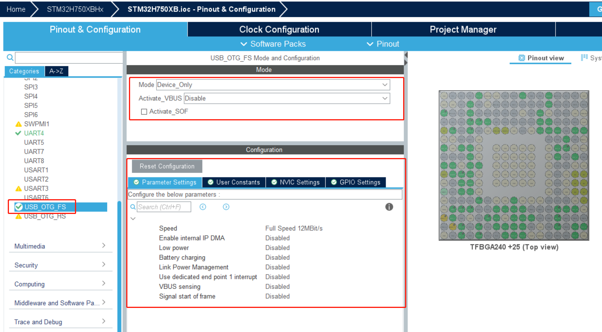

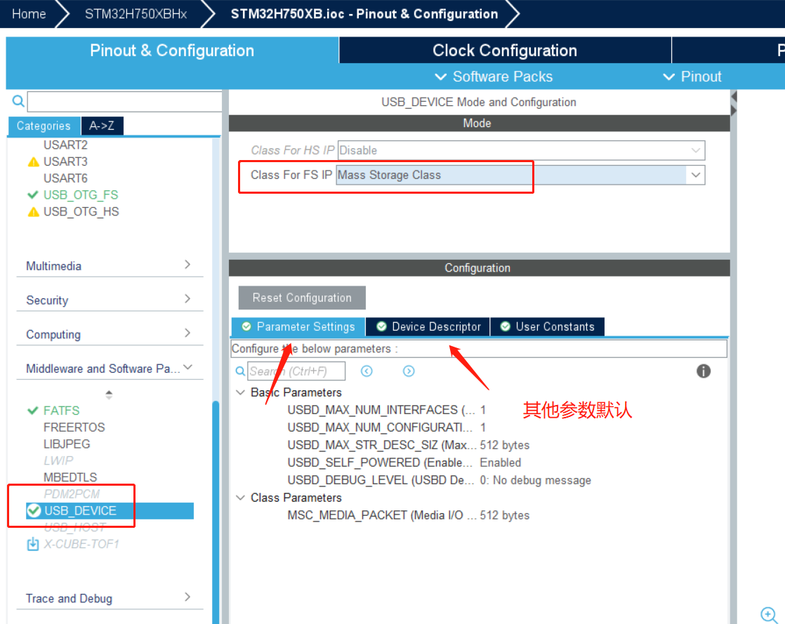

USB 的 DP 引脚必须上拉 1.5K 欧的电阻，电脑才能检测到 USB，否则检测不到。

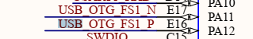

这里没有做上拉，手动配置上拉

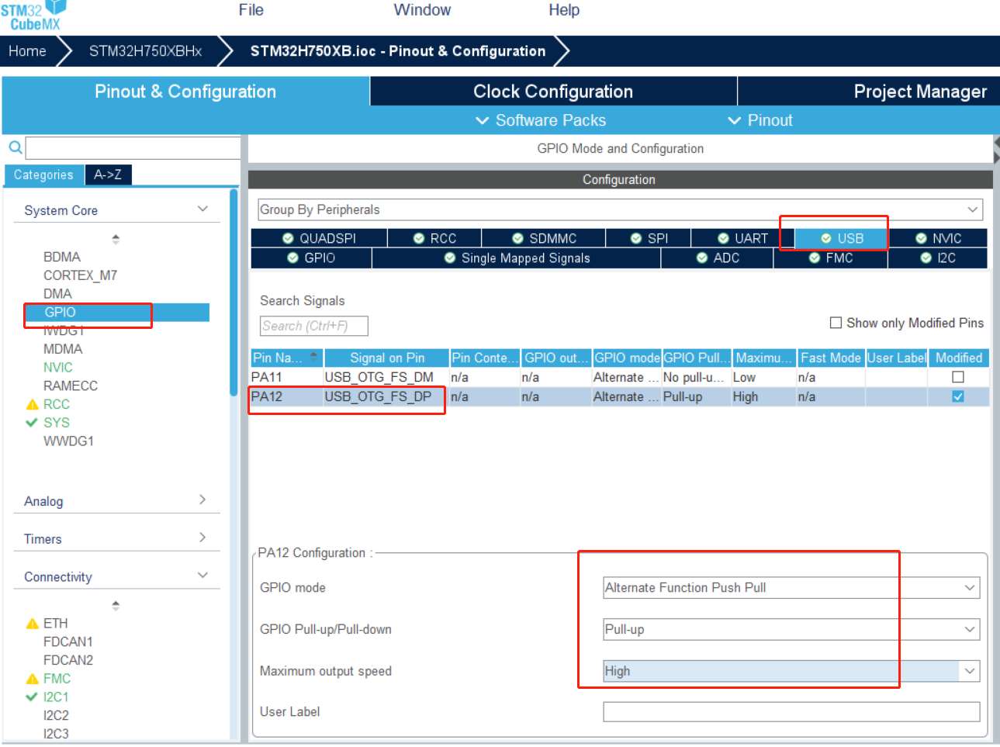

生成代码


# 以下部分为读写内部flash未完善，SD下滑

打开工程文件夹`Application/User/USB_DEVICE/App`下`usbd_storage_if.c`文件

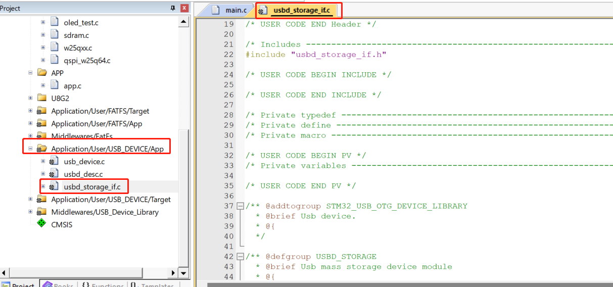

## 修改扇区个数和大小

本实验板使用的 STM32H750XB 型号芯片的参数，即 STM32H 互联型容量产品。若使用超大容量、中容量或小容量产品，它们主存储器的页数量、页大小均有不同，使用的时候要注意区分。
主存储器是以页为单位划分的。stm32根据FLASH主存储块容量、页面的不同，系统存储器的不同，分为小容量、中容量、大容量、互联型，共四类产品。

小容量产品：主存储块1-32KB， 每页1KB。系统存储器2KB
中容量产品：主存储块64-128KB， 每页1KB。系统存储器2KB
大容量产品：主存储块256KB以上， 每页2KB。系统存储器2KB
互联型产品：主存储块256KB以上， 每页2KB。系统存储器18KB

重新定义页大小和页数量以及增加宏定义FLASH_START_ADDR

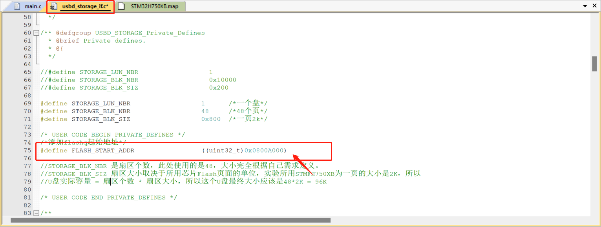

FLASH_START_ADDR大小计算如下：


由于内部 FLASH 本身存储有程序数据，若不是有意删除某段程序代码，一般不应修改程序空间的内容，所以在使用内部 FLASH 存储其它数据前需要了解哪一些空间已经写入了程序代码，存储了程序代码的扇区都不应作任何修改。通过查询应用程序编译时产生的“*.map”后缀文件，可以了解程序存储到了哪些区域。

双击即可打开map文件

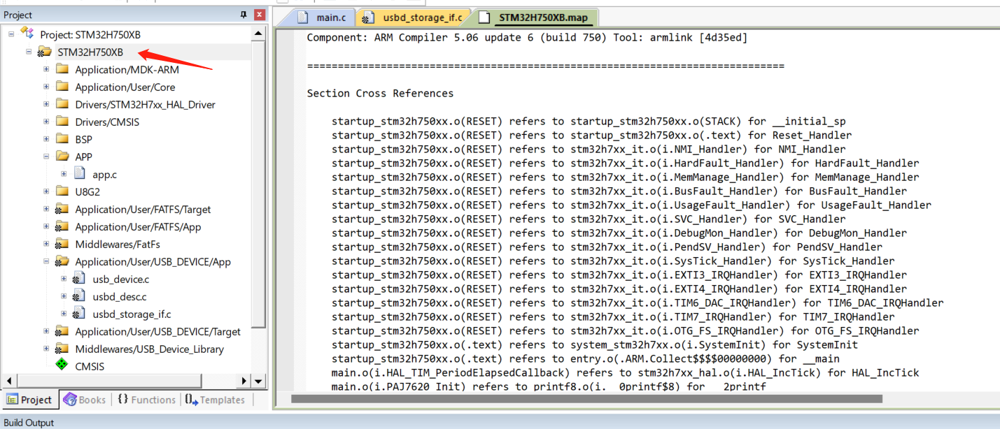

如果双击打不开，则定位到map文件，再双击就可以了

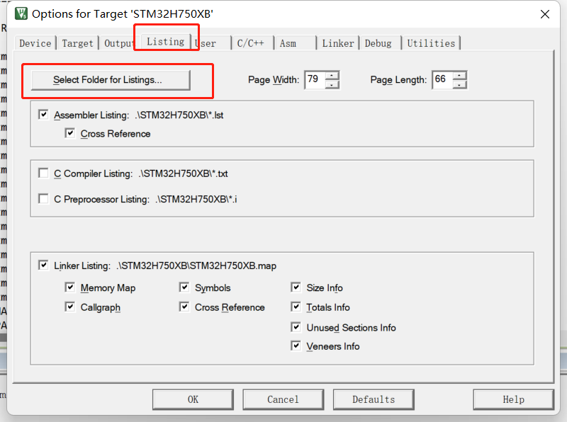

打开 map 文件后，查看文件最后部分的区域，可以看到一段以 **“Memory Map of the image”** 开头的记录

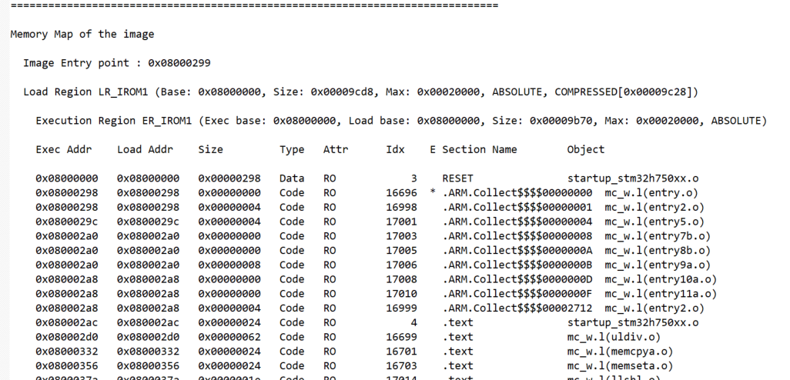

此处省略大部分内容……

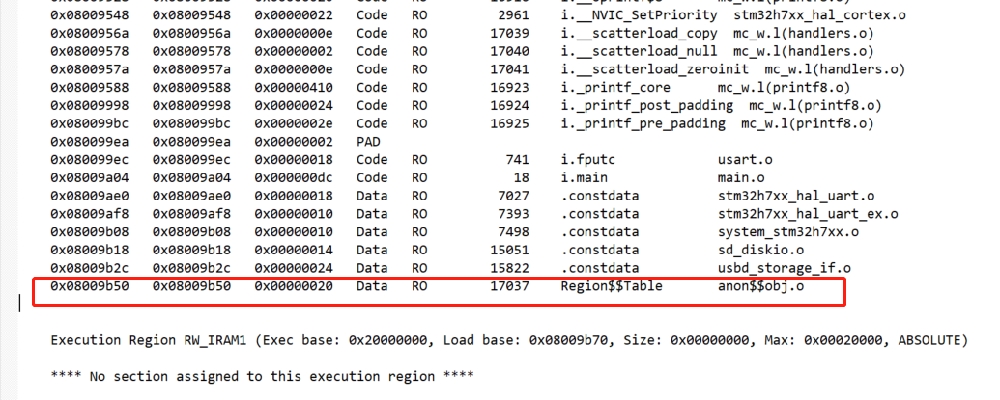

，"exec addr"通常指的是程序的入口点或启动地址，也就是程序开始执行的第一条指令所在的地址。这个地址决定了程序的运行起始位置。

可以看到如上最后一项的：起始地址是0x08009b50  ,大小为0x20,则结束地址为

0x08009b70   和占用地址0x9b70一样

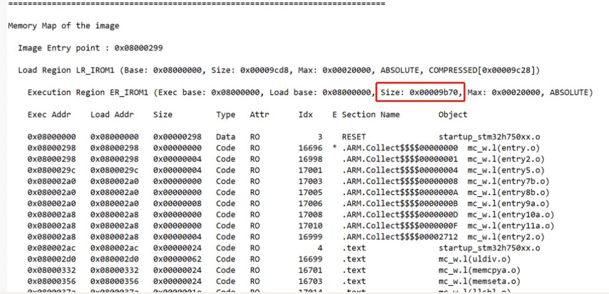


0x9b70约  38.9k大小     一页2k,占0-19页 我们从20页也就是40k开始写不会影响到我们的程序存储区

即地址0x0800 0000+0xA000=0X0800 A000

**(地址 0X0800 A000)** 后的存储空间都可以作其它用途，使用这些存储空间时不会篡改应用程序空间的数据。


# SD卡的读写

需要用户实现的只有USB虚拟U盘相关的函数，都在usbd_storage_if.c文件中。需要实现以下四个函数，必须实现的，其它的可选

**获取容量的函数**

```c
int8_t STORAGE_GetCapacity_FS(uint8_t lun, uint32_t *block_num, uint16_t *block_size)
{
  /* USER CODE BEGIN 3 */
  UNUSED(lun);

//  *block_num  = STORAGE_BLK_NBR;
//  *block_size = STORAGE_BLK_SIZ;
  *block_num  = hsd1.SdCard.BlockNbr;
  *block_size =  hsd1.SdCard.BlockSize;
  return (USBD_OK);
  /* USER CODE END 3 */
}

```

**判断U盘状态函数：**

```c
int8_t STORAGE_IsReady_FS(uint8_t lun)
{
  /* USER CODE BEGIN 4 */
  UNUSED(lun);
	
  uint8_t state = 0;
  state = HAL_SD_GetState(&hsd1) ;
  if(HAL_SD_STATE_READY != state)
  {
	  return USBD_FAIL ;
  }
  
  return (USBD_OK);
  /* USER CODE END 4 */
}

```

**U盘读数据函数：**

```c
int8_t STORAGE_Read_FS(uint8_t lun, uint8_t *buf, uint32_t blk_addr, uint16_t blk_len)
{
  /* USER CODE BEGIN 6 */
  UNUSED(lun);
  UNUSED(buf);
  UNUSED(blk_addr);
  UNUSED(blk_len);
	
	HAL_SD_ReadBlocks(&hsd1, buf, blk_addr,  blk_len, 5000);
	int n = 5000;
	while( HAL_SD_GetCardState(&hsd1) != HAL_SD_CARD_TRANSFER ){ if(n-- == 0) break; } ;
	
  return (USBD_OK);
  /* USER CODE END 6 */
}

```

**U盘写数据函数：**

```c
int8_t STORAGE_Write_FS(uint8_t lun, uint8_t *buf, uint32_t blk_addr, uint16_t blk_len)
{
  /* USER CODE BEGIN 7 */
  UNUSED(lun);
  UNUSED(buf);
  UNUSED(blk_addr);
  UNUSED(blk_len);
	
  int8_t state = HAL_SD_WriteBlocks(&hsd1, buf, blk_addr, blk_len, 5000);
  int n = 5000;
  while( HAL_SD_GetCardState(&hsd1) != HAL_SD_CARD_TRANSFER ){ if(n-- == 0) break; } ;
	
  return (USBD_OK);
  /* USER CODE END 7 */
}

```

   以前已经做好了SD卡+fatfs驱动的测试，可以直接使用了，使用之前最重要的一步要挂起SD卡设备


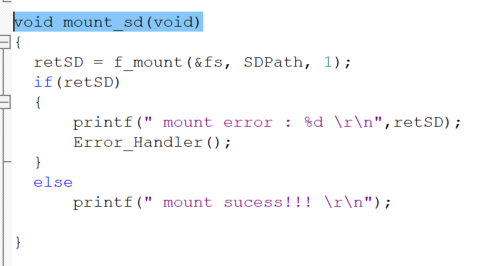

可正常读写，但速度慢的离谱正常来说1Mbyte差不多

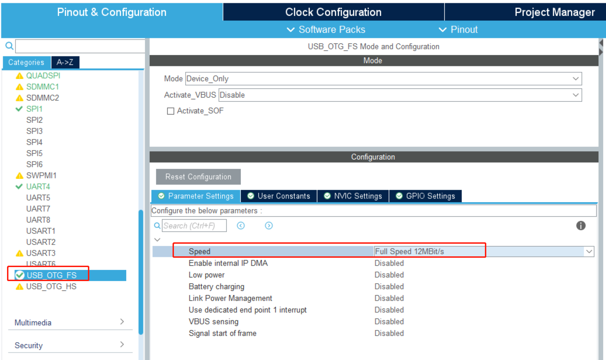

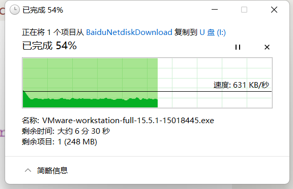

# 解决读写速度慢的问题

先从SD卡找问题，时钟频率决定传输的快慢，可以看到时钟频率最大为208MHZ

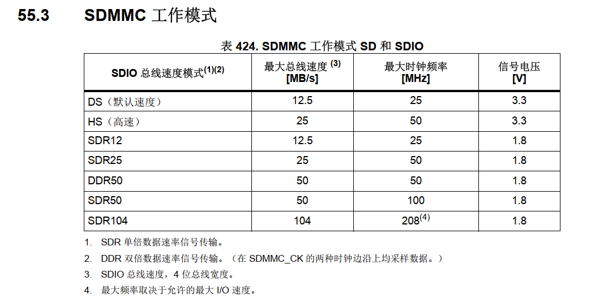

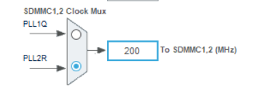

这里给到200Mhz   不分频


测试结果如下：

usb口有设备但工作不正常（sdmmc频率设置过大）SD使用的HS最大12Mbit/s


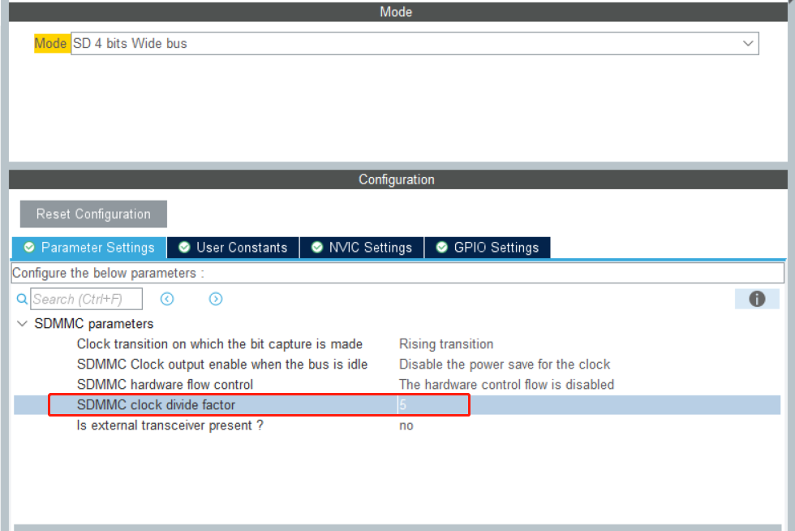

测试结果如下：峰值还是差点意思，传输速率不太稳定

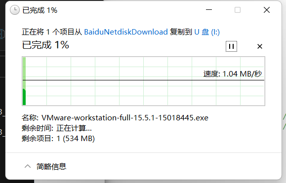

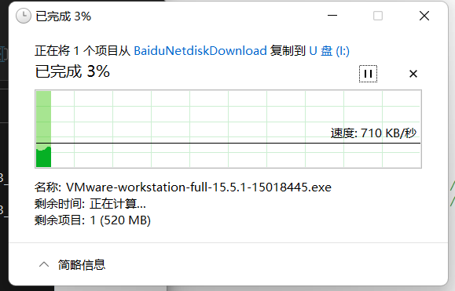

SDMMC的频率与 USB选取的传输速率相对应，SDMMC的频率较大USB可能会不识别，SDMMC频率较小时影响传输速率，传输速率较小时，可以超过参考手册给定的频率测试