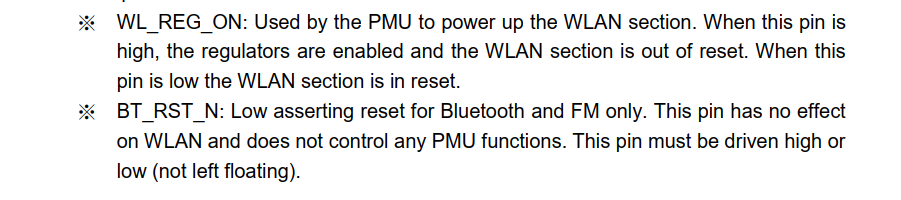
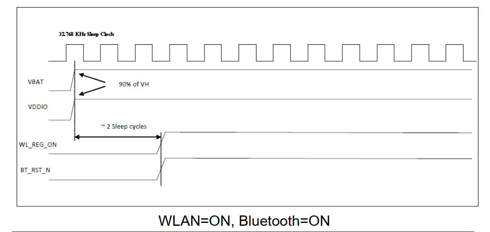
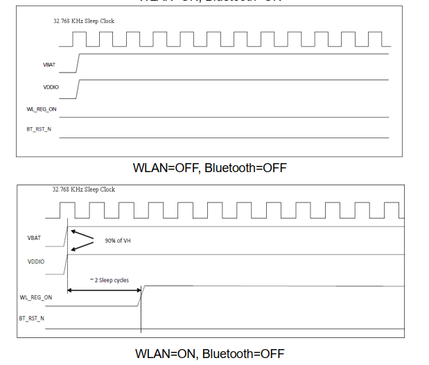
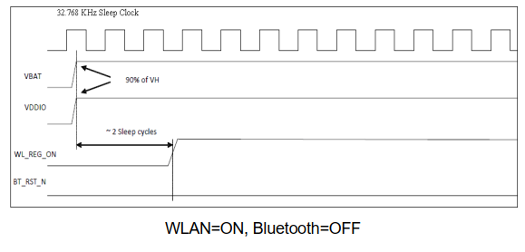
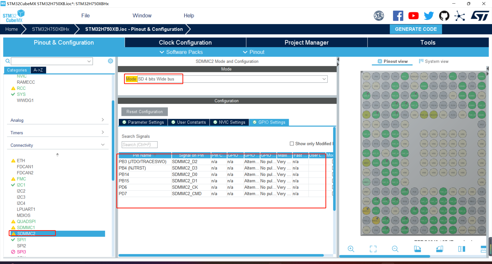
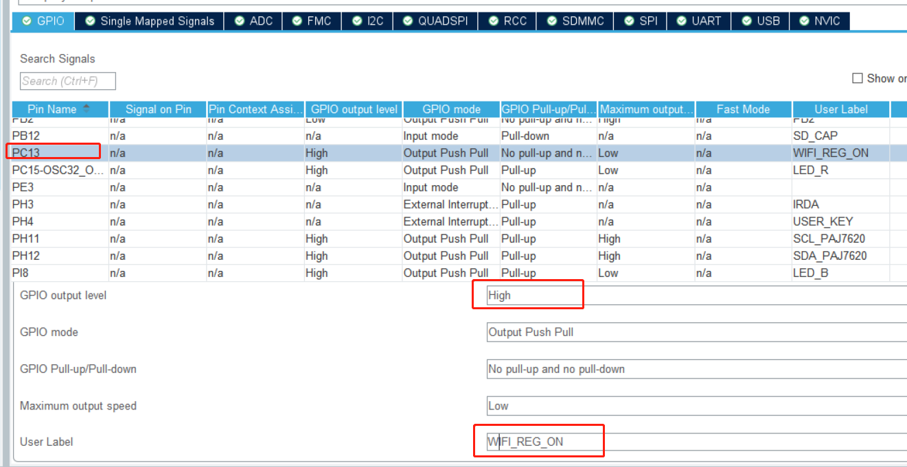
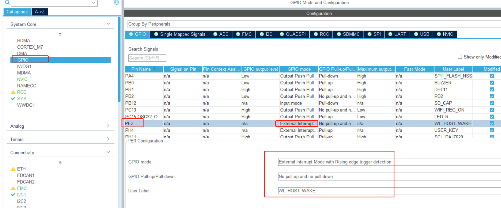
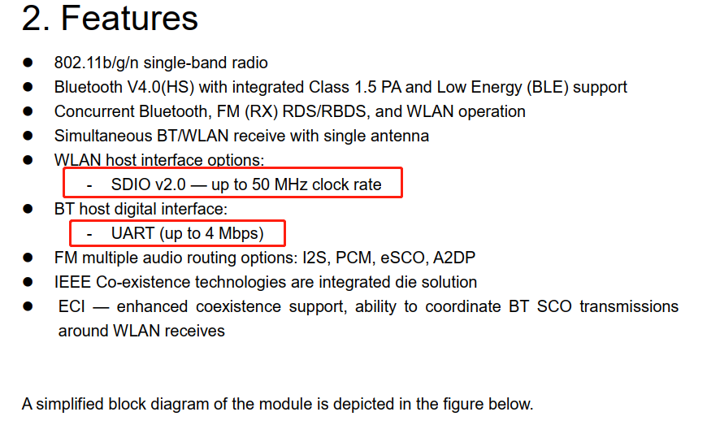
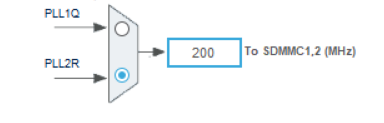

# 项目记录

## 环境搭建：

- 硬件平台：STM32H750XBH6
- 开发环境：STM32CubeMX V6.8.1+KEIL V5.28.0.0
- STM32H750固件版本：package V1.11.0
- 仿真下载驱动：ST-Link

# 16.AP6212WIFI (SDIO)

AP6212是一款集成了Wi-Fi和蓝牙功能的无线模块，这里先只使用WiFi

GPIO_WIFI_REG_ON 控制Wi-Fi模块的电源或复位   高电平工作低电平复位

GPIO_BT_RST_N  控制BT模块

WiFi+蓝牙 两个时钟周期之后拉高启动

WL_REG_ON 主要用于上电，休眠的时候，请保持GPIO上电，否则会丢失WiFi内部的状态，导致WiFi唤醒失败；
WL_HOST_WAKE 主要用于WiFi设备有数据的时候，唤醒CPU，进入中断.

其中引脚的电平要看CPU如何配置的，如果配置的是高电平有效，那么默认情况下是低电平，当WiFi有数据过来的时候就拉高，直到主控这边把数据拿完再拉低，如果主控一直没有来拿数据就一直是高电平．

通过WL_HOST_WAKE中断实现当有网络数据的时候，才唤醒CPU，平时CPU处于Standby状态下, 达到低功耗的第一步.

GPIO_WIFI_REG_ON：--->PC13  输出高电平 开启模块

WL_HOST_WAKE   --->PE3   输入模式外部中断

# CUBEMX配置如下：

AP6212 手册wifi的时钟频率最大50MHZ,这里200MHZ  需要4分频

生成代码编译之后有错误，红外的接口PH3，使用外部中断线3，现在PE3要使用外部中断线，PH3直接给关闭了，目前我们屏蔽红外遥控的代码。

接下来我懵逼了……手册上居然没有如何操作它，尝试读取设备状态没反应，

找了一圈只有打包好的固件烧写在外部flash启动，市面上资料相当少

后面再看看……