# 项目记录

## 环境搭建：

- 硬件平台：STM32H750XBH6
- 开发环境：STM32CubeMX V6.8.1+KEIL V5.28.0.0
- STM32H750固件版本：package V1.11.0
- 仿真下载驱动：ST-Link


# 17.定时器(基本定时器非阻塞延时)

定时器分类：

- 基本定时器

  1. 基本定时器通常是最简单的定时器，其功能较为有限。它通常与特定的外部时钟源连接，用于生成一定的时间延迟或者周期性的定时事件。基本定时器的主要功能包括：

  - 产生精确的时间延迟：可以设置定时器的初始值和预分频系数来生成精确的时间延迟。
  - 生成周期性的中断：定时器可以周期性地触发中断，用于执行特定的任务。
  - 用作计时器：可以测量外部事件的脉冲宽度或者计算时间间隔。

- 通用定时器

  1. 通用定时器： 通用定时器是在一些高级微控制器中提供的功能更丰富的定时器模块。它具有基本定时器的功能，并且通常支持更多的工作模式和配置选项。通用定时器的主要功能包括：

  - 多通道输出：通用定时器可以配置为产生多个PWM输出，用于控制电机、LED灯等应用。
  - 编码器模式：支持编码器信号的输入和处理，用于监测旋转运动。
  - 捕获模式：用于测量外部事件的脉冲宽度、周期等。
  - 输入捕获和输出比较：可以用于事件计数和与其他外设的时间同步。

- 高级定时器

  1. 高级定时器是一些性能更强大的微控制器中提供的定时器模块，它们通常与其他功能模块（例如中断控制器、DMA控制器等）紧密集成，可以实现更复杂的定时和计时任务。高级定时器的主要功能包括：

  - 高分辨率定时：可以提供更高的定时分辨率，用于精确的时间测量和控制。
  - 多通道输入捕获和输出比较：可以同时处理多个输入事件和输出比较。
  - 编码器接口：支持多种编码器接口和编码模式。
  - 死区控制：用于电机控制中的死区设置。
  - 事件触发：可以通过外部事件触发定时器的启动和停止。

我们来看一下STM32的定时器有哪些 除开低功耗和高分辨率定时器可以看到

基本定时器：TIM6  TIM7

通用定时器：TIM2/3/4/5/12/13/14/15/16/17

高级定时器：TIM1  TIM8

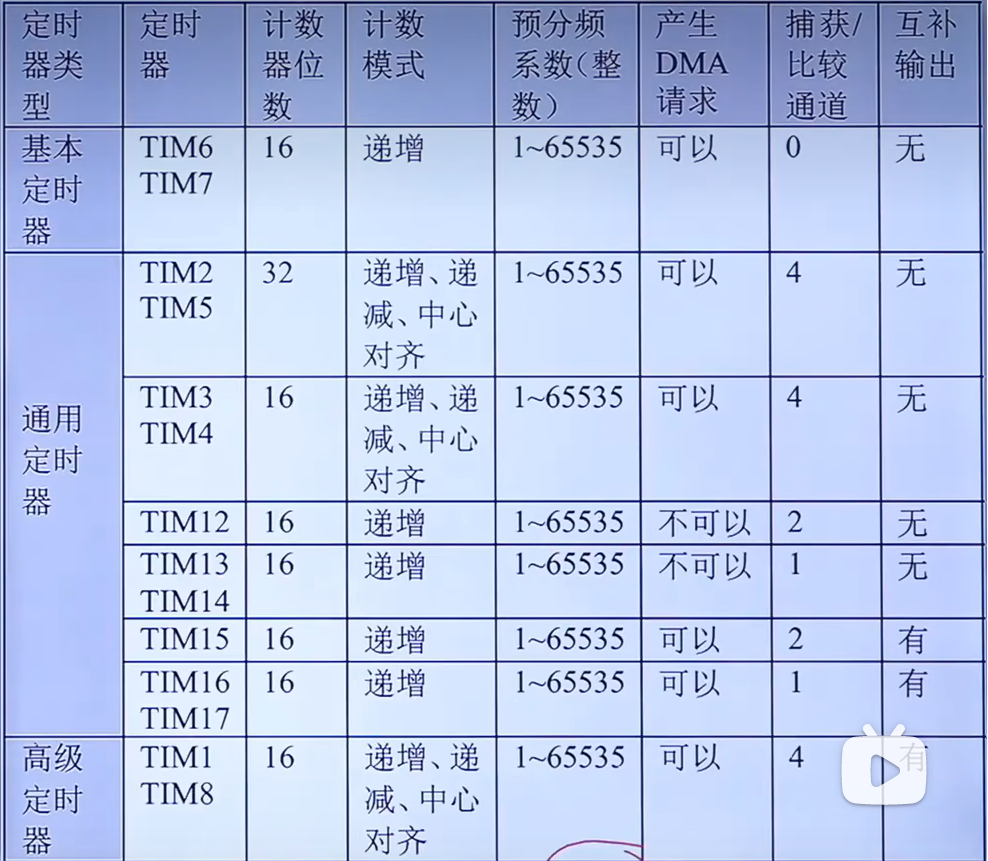

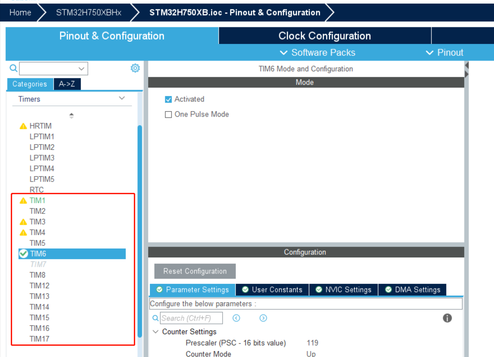

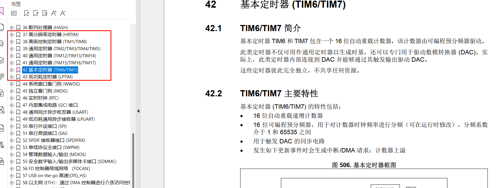


# 确定时钟频率：

定时器位于哪一个总线上可以直接打开工程文件在stm32h750xx.h查看

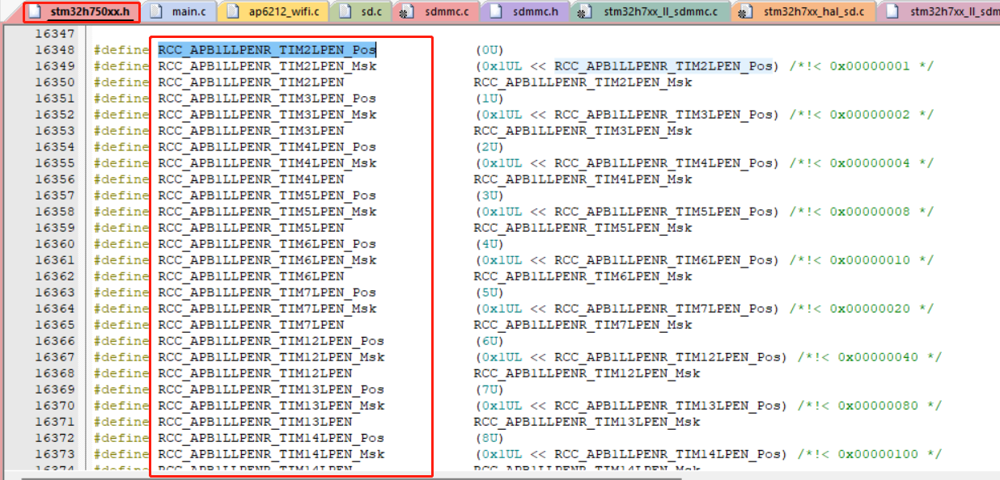 

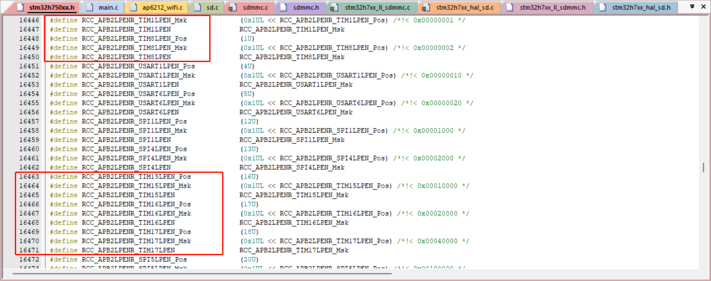

结合cubemx我们配置的是240Mhz，所以全部定时器的时钟频率都是240MHZ

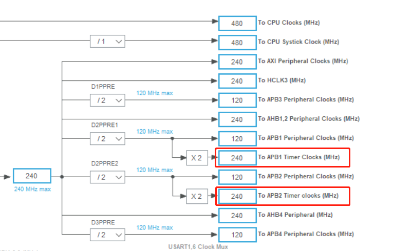


# 预分频器

  预分频器是定时器的一个重要功能模块，用于将输入时钟频率分频得到定时器的工作时钟频率。通过预分频器，我们可以调整定时器的计数速度，从而影响定时器的计时周期。

具体来说，预分频器通过将输入时钟频率除以一个预设的分频系数来得到定时器的工作时钟频率。这个分频系数通常是一个整数值，可以在定时器的控制寄存器中进行设置。预分频器的作用是将较高频率的输入时钟降低为一个更低的频率，以适应特定的定时需求。

预分频器对于定时器功能非常重要，它可以实现更大范围的计时周期，同时还可以节省定时器的工作时钟，降低功耗。例如，如果输入时钟频率为1MHz，而预分频系数设置为10，则定时器的工作时钟频率为100kHz


这里我们可以看到预分频器时16位的，值可以为0-65535，这里分频119+1即当前时钟频率为2MHZ,即当前的一个时钟周期为0.5μs

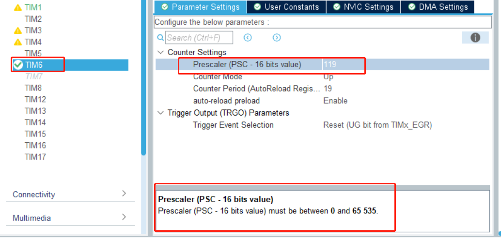

# 计数模式

在计时器中，向上计数是一种基本的计数模式。在这种模式下，计数器的值从一个初始值开始逐渐增加，直到达到一个预设的最大值（通常称为重装载值或自动重装载值）。一旦计数器达到最大值，它会自动重置为初始值，然后重新开始向上计数。这样的过程不断重复，形成了一个周期性的计数循环。

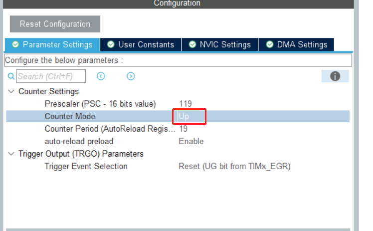

# 重装载值

在计时器（定时器）中，ARR代表的是自动重装载寄存器（Auto-Reload Register），也称为重装载值（Reload Value）或周期值（Period Value）。

ARR是定时器的一个重要寄存器，用于存储定时器的自动重装载值。当定时器工作在向上计数模式时，计数器的值从0开始逐渐增加，当计数器的值达到ARR中存储的值时，定时器会触发相应的事件，如产生中断、更新输出等，并自动将计数器的值重置为0。然后，计数器会重新开始向上计数，形成一个周期性的计数循环。

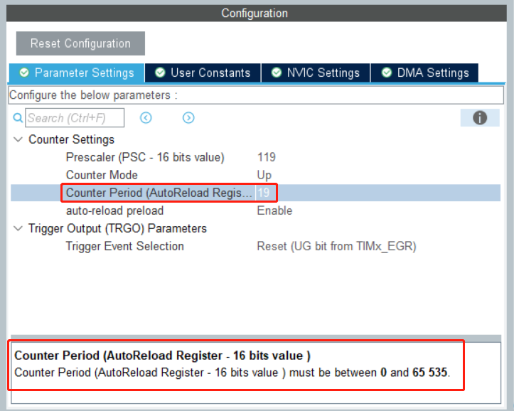

# 重装载值使能

"auto-reload preload"是一个定时器的特定功能选项。该选项用于控制定时器计数器的自动重装载（Auto-Reload）和预装载（Preload）行为。

解释这两个概念之前，让我们简要了解定时器的基本工作原理。定时器是一种硬件模块，它可以在每个时钟周期（计时器时钟）递增一个计数器的值。当计数器的值达到设定的上限（通常称为"重装载值"或"自动重装载值"），定时器将触发特定的事件，例如产生中断、更新输出等。然后，计数器会自动重新加载为预设的初始值，从而实现周期性的定时功能。

现在来解释"auto-reload preload"：

1. Auto-Reload（自动重装载）： 自动重装载是定时器的一种功能，当计数器达到重装载值时，它会自动重新加载为预设的初始值。这样，定时器就可以持续地重复计时，产生周期性的定时事件。
2. Preload（预装载）： 预装载是定时器的另一种功能，它与自动重装载相结合。当预装载使能时，重装载值的更新并不会立即生效，而是等待下一个定时器周期开始时才会应用。这样做的好处是确保在重装载值发生改变时，不会影响当前正在进行的计数过程。只有在下一个计数周期开始时，新的重装载值才会生效。

作用： 结合自动重装载和预装载功能，可以实现更加可靠和平滑的定时器运行。**当启用预装载后，可以在定时器工作期间更新重装载值，而不会中断当前计时过程。这在某些应用中很有用，特别是对于需要动态调整定时周期的情况**。

请注意，在使用CUBE-MX配置定时器时，根据具体的应用需求和定时器行为，您可以选择启用或禁用"auto-reload preload"选项，以满足定时器的功能要求。

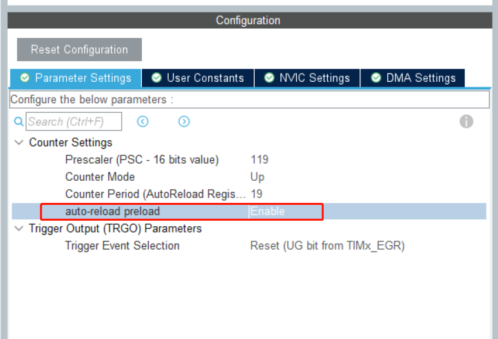

# 触发事件选择

在CUBE-MX（CubeMX）中，"Trigger Event Selection"（触发事件选择）是一种用于配置定时器或其他外设触发事件的功能。它通常用于将一个外部事件或信号连接到特定的定时器或其他外设，从而触发相关的操作或中断。

具体来说，"Trigger Event Selection" 允许您选择触发定时器或外设的条件和来源。例如，您可以选择一个外部GPIO引脚的信号作为触发事件，当该引脚的状态发生变化时，就触发定时器的计时或其他外设的操作。

1. Reset： "Reset"选项允许您选择一个外部事件，当该事件发生时，定时器的计数器（CNT）会被自动重置为初始值（通常是0）。这样可以实现在特定事件发生时重置定时器的计数，从而产生周期性的定时或周期性操作。例如，当定时器计数到达重装载值（ARR）时，可以设置为自动触发重置，从而实现定时器的周期性触发。
2. Enable (CNT_EN)： "Enable"或"Enable (CNT_EN)"选项允许您选择一个外部事件，当该事件发生时，定时器的计数使能（CNTEN）会被自动启用。这样可以实现在特定事件发生时使能定时器的计数，从而开始计时或执行其他操作。例如，当某个外部条件满足时，可以设置为自动触发计数使能，从而启动定时器的计时过程。
3. Update Event： "Update Event"选项允许您选择一个外部事件，当该事件发生时，定时器的更新事件（UEV）会被触发。在定时器中，更新事件通常是计数器的重装载（ARR）或比较（CCR）值发生改变时触发的。通过选择"Update Event"选项，可以在特定事件发生时触发定时器的更新事件，从而实现周期性的计数或更新。

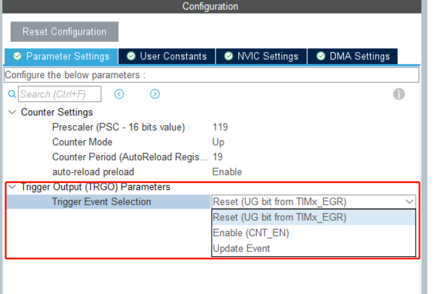

# 单脉冲模式

基本定时器（Basic Timer）的 "One Pulse Mode"（单脉冲模式）是一种特殊的计时模式，它在特定条件下只产生一次脉冲。在这种模式下，基本定时器通常用于生成单个脉冲或脉冲序列，而不是周期性的计时。

"One Pulse Mode" 的功能允许您在基本定时器达到预设的计时值后自动停止计数，并生成一个单脉冲输出。这通常用于控制器或系统中需要一次性触发某些事件的场景。

工作原理： 在 "One Pulse Mode" 下，基本定时器的计数器（CNT）开始从初始值开始计数，当计数器的值达到预设的计时值（通常是ARR寄存器中的值）时，定时器会触发一个更新事件（UEV）并自动停止计数。同时，定时器会生成一个单脉冲输出，该脉冲的宽度通常可以通过其他寄存器进行配置。

一旦单脉冲生成后，如果您需要再次产生单脉冲，您需要手动重新启动定时器的计数过程，并重置计数器的值。

"One Pulse Mode" 对于一次性事件触发和脉冲控制是非常有用的，可以在特定条件下生成单个脉冲或脉冲序列，适用于各种应用，如电机控制、脉冲驱动、触发器等场景。

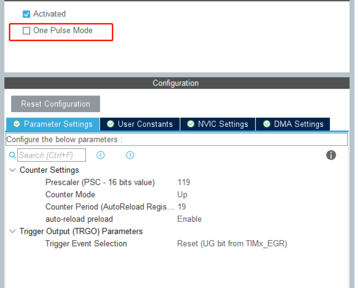


# 基本定时器us级阻塞延时实现

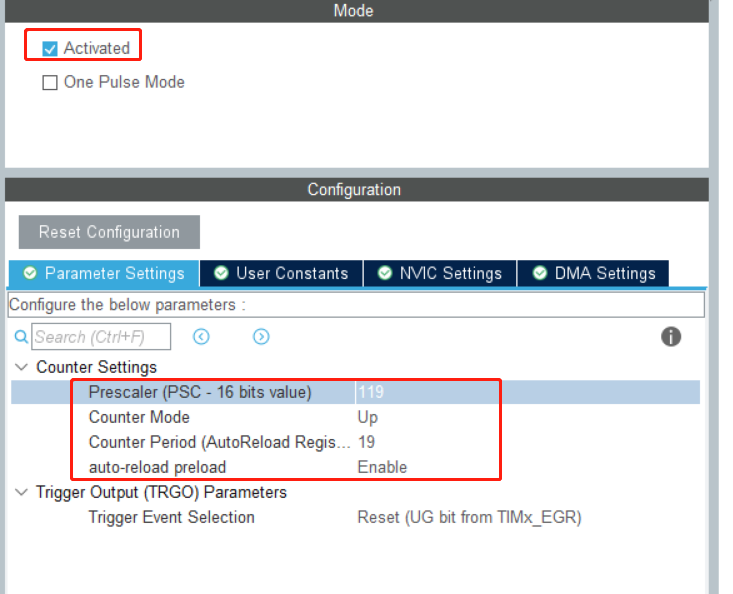


生成代码之后在加入以下代码，代码片中时钟频率与分频系数需与cubemx配置一致,代码中更改会导致计算错误

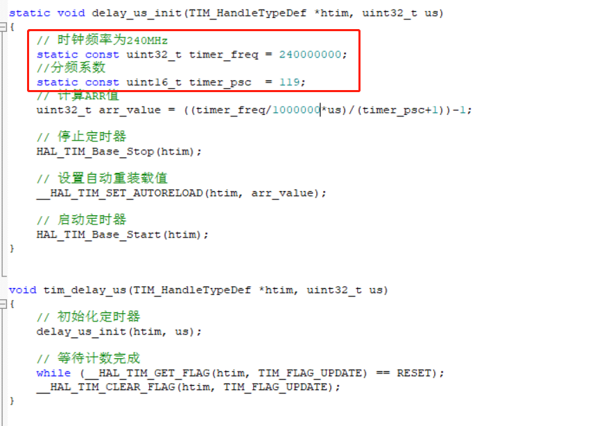

```c
static void delay_us_init(TIM_HandleTypeDef *htim, uint32_t us)
{
    // 时钟频率为240MHz
    static const uint32_t timer_freq = 240000000;
	  //分频系数
	  static const uint16_t timer_psc  = 119;  
    // 计算ARR值
    uint32_t arr_value = ((timer_freq/1000000*us)/(timer_psc+1))-1;
    
    // 停止定时器
    HAL_TIM_Base_Stop(htim);
    
    // 设置自动重装载值
    __HAL_TIM_SET_AUTORELOAD(htim, arr_value);
    
    // 启动定时器
    HAL_TIM_Base_Start(htim);
}


void tim_delay_us(TIM_HandleTypeDef *htim, uint32_t us)
{
    // 初始化定时器
    delay_us_init(htim, us);
    
    // 等待计数完成
    while (__HAL_TIM_GET_FLAG(htim, TIM_FLAG_UPDATE) == RESET);
    __HAL_TIM_CLEAR_FLAG(htim, TIM_FLAG_UPDATE);
}
```

while循环中添加测试代码

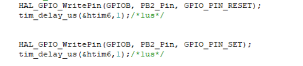

示波器捕获如下(存在些许误差)

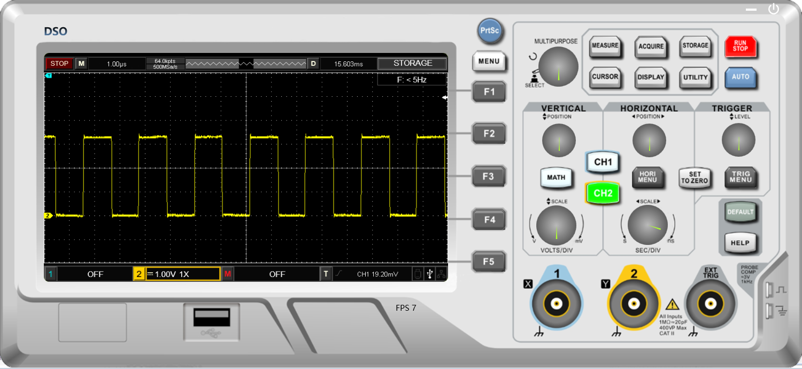

# 基本定时器中断红外章节有介绍

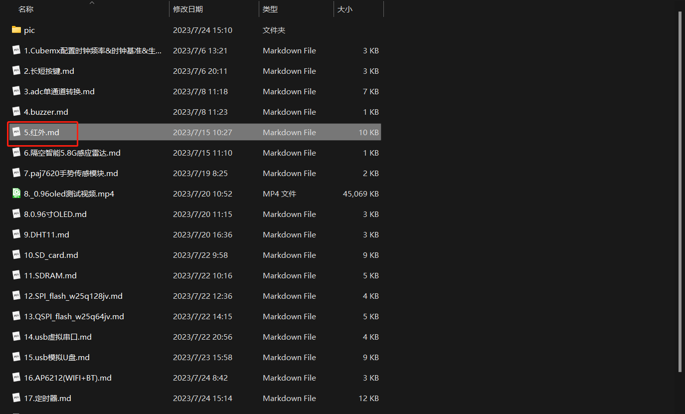