# 项目记录

## 环境搭建：

- 硬件平台：STM32H750XBH6
- 开发环境：STM32CubeMX V6.8.1+KEIL V5.28.0.0
- STM32H750固件版本：package V1.11.0
- 仿真下载驱动：ST-Link


# 19.通用定时器(输入捕获解码红外)


# Slave Mode(从模式)

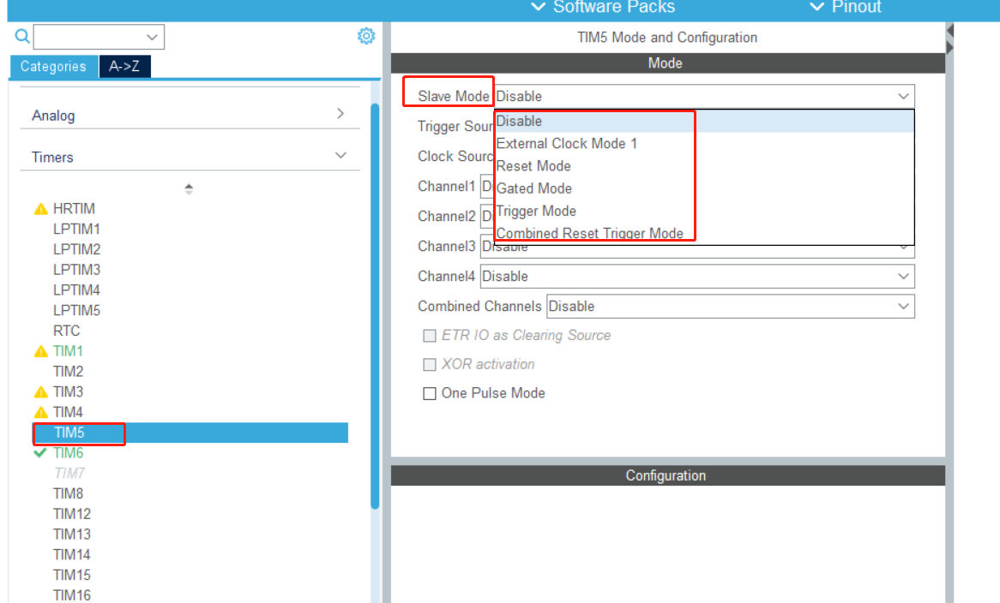

定时器的"Slave Mode"（从模式）是指定时器作为从设备与其他主设备（通常是另一个定时器）进行同步工作的一种模式。

在微控制器中，有时需要多个定时器同时运行，并且它们之间需要同步，以确保它们在正确的时间执行特定的任务。这时就可以使用定时器的Slave Mode来实现同步。

在Slave Mode下，一个定时器作为主定时器，而其他定时器作为从定时器。从定时器会根据主定时器的时钟信号进行计数，并在特定事件发生时执行相应的操作。通过这种方式，多个定时器可以同步地工作，以满足复杂的定时要求。

具体的Slave Mode选项和功能会因不同的定时器型号和硬件平台而有所不同。一般情况下，您可以在定时器的配置寄存器中找到Slave Mode相关的设置选项，并根据需要设置主定时器和从定时器的关系、触发条件等。

使用定时器的Slave Mode功能可以帮助您实现精确的定时控制和同步，特别在需要多个定时器同时运行的应用中，这是一个非常有用的功能。

**external clock mode :**这种模式下，定时器的时钟源来自外部引脚，而不是内部时钟源。外部引脚可以提供定时器所需的时钟信号。定时器会根据外部时钟信号进行计数。

**reset mode**:在复位模式下，定时器在启动计数后，当外部触发事件（例如外部引脚的信号）到来时，定时器的计数值会被复位为预先设置的值。这种模式允许您在外部事件到来时重新开始计数。

**gated mode**:门控模式下，定时器的计数仅在外部事件激活（例如特定的外部引脚状态）时才会进行。当外部事件未激活时，定时器的计数将暂停。

**trigger mode**:触发模式下，外部事件会触发一个特定的操作，例如生成输出比较或产生更新事件。该模式允许您在外部事件到来时触发定时器生成特定的动作或输出。

**combined reset trigger mode**:这是一种结合了复位模式和触发模式的工作模式。外部事件可以同时用于复位计数器和触发特定操作。

# Trigger Source（触发源）

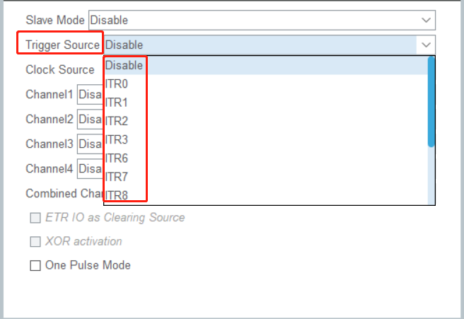

Trigger Source（触发源）是指用于触发STM32微控制器定时器（TIM）中的某些特定事件或操作的信号源。当配置了定时器的触发源后，触发事件发生时，定时器会根据该事件执行相应的操作，例如产生输出比较、更新计数值、启动/停止计数等。

在STM32定时器中，触发源可以是多种类型，具体取决于定时器的功能和配置。以下是一些常见的定时器触发源：

1. **外部触发源**：外部引脚的信号可以作为定时器的触发源。当外部引脚的信号满足特定条件（例如上升沿、下降沿等）时，触发器会触发定时器执行相应的操作。
2. **其他定时器**：一个定时器可以作为另一个定时器的触发源。当主定时器达到特定条件时，可以触发从定时器执行操作，实现定时器之间的同步和联动。
3. **软件触发源**：由软件编程触发定时器的特定操作，例如立即更新计数值或产生软件触发的输出比较。
4. **ADC触发源**：ADC（模数转换器）可以作为定时器的触发源，使得ADC转换在定时器的触发事件发生时启动。
5. **DMA触发源**：DMA（直接内存访问）可以作为定时器的触发源，使得DMA传输在定时器的触发事件发生时启动。

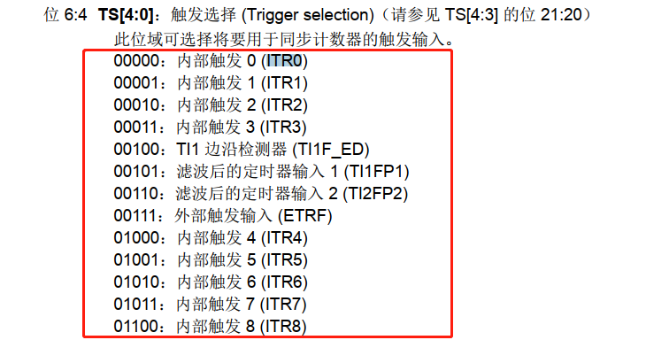


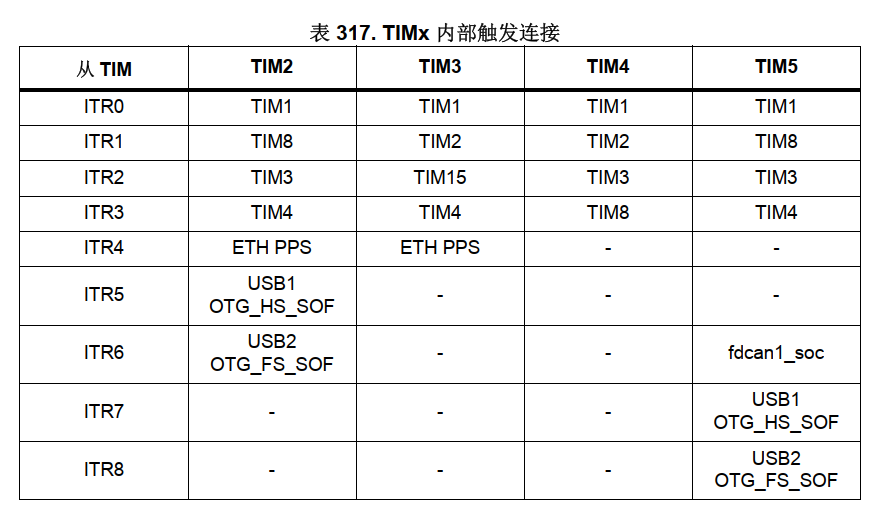


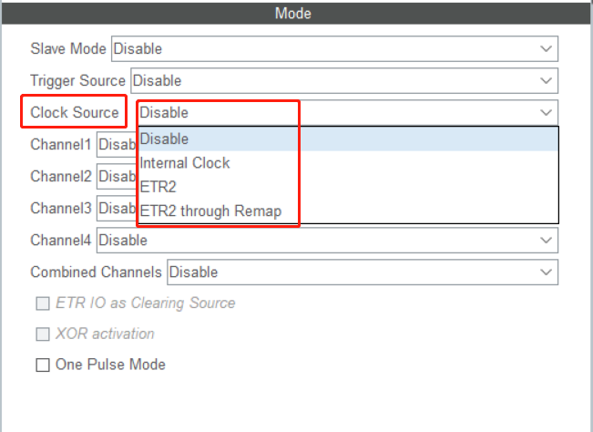

指定了定时器（TIM）所使用的时钟信号来源。定时器的计数操作和相关功能的正常工作都依赖于一个稳定的时钟信号。根据不同的应用需求和硬件配置，可以选择不同的时钟源来驱动定时器。

常见的定时器时钟源包括：

1. **内部时钟源**：一些STM32微控制器提供内部的RC振荡器或晶振作为定时器的时钟源。内部时钟源通常是系统时钟或低速时钟的分频信号。
2. **外部时钟源**：定时器可以使用来自外部晶振或其他外部信号的时钟源。外部时钟源可以提供更高的精度和稳定性，适用于需要精确定时的应用。
3. **主PLL时钟源**：某些STM32微控制器支持将主PLL（Phase-Locked Loop，锁相环）的输出作为定时器的时钟源。主PLL可以提供更高的时钟频率，适用于需要高速计数的应用。
4. **系统时钟源**：定时器可以使用系统时钟（SYSCLK）或系统时钟的分频信号作为时钟源。

1. **Internal Clock**（内部时钟）： 内部时钟是指STM32微控制器内部的RC振荡器或其他内部时钟源。在定时器中选择内部时钟作为时钟源时，定时器会使用来自内部时钟的时钟信号来进行计数操作。内部时钟通常不需要外部元件（如晶振）的支持，但其精度和稳定性可能相对较低，适用于一些不要求高精度的简单计时应用。
2. **ETR2**（外部触发输入2）： ETR2是STM32微控制器定时器的外部触发输入2。它允许通过外部引脚接收来自其他外部设备的触发信号，并用于触发定时器的特定操作。您可以根据应用需求配置ETR2触发源的触发条件和触发类型（例如上升沿触发、下降沿触发等）。
3. **ETR2 through Remap**（ETR2重映射）： "ETR2 through Remap"是一种功能，它允许将ETR2信号重新映射到不同的定时器或外设。通过重映射，您可以将ETR2信号连接到另一个定时器或外设的特定输入引脚，从而实现定时器之间的联动或与其他外设的连接。

channel(通道)

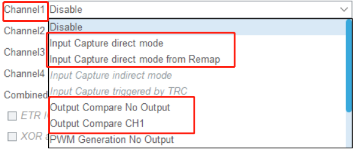

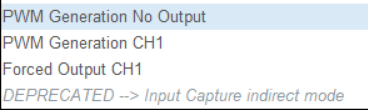

1. **Input Capture Direct Mode**（输入捕获直接模式）： 这是定时器输入捕获通道的一种工作模式，通常称为IC直接模式。在该模式下，输入捕获通道直接用于捕获外部信号的边沿（上升沿或下降沿），并将捕获的计数值存储在相关的寄存器中。
2. **Input Capture Direct Mode from Remap**（从重映射的输入捕获直接模式）： 这是定时器输入捕获通道重映射的一种工作模式。它允许将输入捕获通道从一个定时器重映射到另一个定时器或外设，从而实现更灵活的定时器资源分配。
3. **Output Compare No Output**（输出比较无输出）： 在该模式下，输出比较通道被配置为没有输出功能。定时器可以进行输出比较操作，但没有输出信号产生。
4. **Output Compare CH1**（输出比较通道1）： 这是定时器输出比较通道1的工作模式。在该模式下，通道1可以产生输出比较事件，并在比较匹配时产生特定的输出信号。
5. **PWM Generation No Output**（PWM生成无输出）： 在该模式下，PWM生成通道被配置为没有输出功能。定时器可以进行PWM生成操作，但没有输出信号产生。
6. **PWM Generation CH1**（PWM生成通道1）： 这是定时器PWM生成通道1的工作模式。在该模式下，通道1可以产生PWM信号，并通过比较值控制占空比。
7. **Forced Output CH1**（强制输出通道1）： 在该模式下，定时器通道1的输出被强制设置为特定的电平，不受定时器计数或外部触发的影响。


# cubemx配置如下

一次计数10us，完整计数周期655ms足够解码 

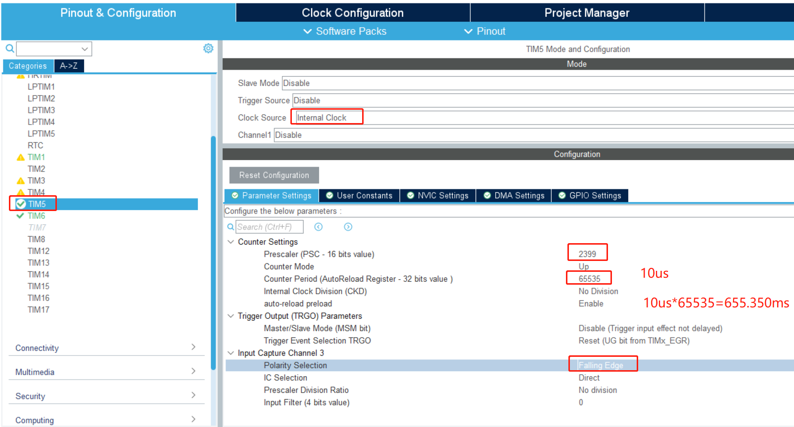

input capture channel下，以下详解

1. IC Selection（输入捕获选择）：

   - ，"IC Selection" 选项为 "Direct" 时，捕获事件会直接捕获输入信号的边缘（上升沿或下降沿），并将捕获到的计数器值记录下来。

     简而言之，当选择 "Direct" 选项时，输入捕获通道会在输入信号出现边缘时直接记录定时器/计数器的当前值，不受其他条件或特殊触发方式的影响。

2. Prescaler（预分频器）：

   - 预分频器用于降低输入信号的频率，从而减少定时器/计数器的计数频率。预分频器允许将高频率的输入信号降低到更低的计数频率，以适应定时器/计数器的计数范围。它允许更精确地捕获高频率的信号。

3. Prescaler Division Ratio（预分频器分频比）：

   - 预分频器分频比指定了输入信号频率与定时器/计数器计数频率之间的比例。它用于调整输入信号的频率，使其能够适应定时器/计数器的计数范围。例如，如果设置预分频器分频比为8，则输入信号的频率将降低为原来的1/8。

4. Input Filter (4-bit value)（输入滤波器）：

   - 输入滤波器是用于消除输入信号中的噪声和抖动的技术。它可以稳定输入信号并提高捕获的准确性。输入滤波器通常是一个4位的值，用于设置滤波器的时间常数。较大的滤波器值会导致更长的滤波时间，适用于稳定信号，但可能响应速度较慢；而较小的滤波器值适用于快速响应，但可能对噪声更敏感。

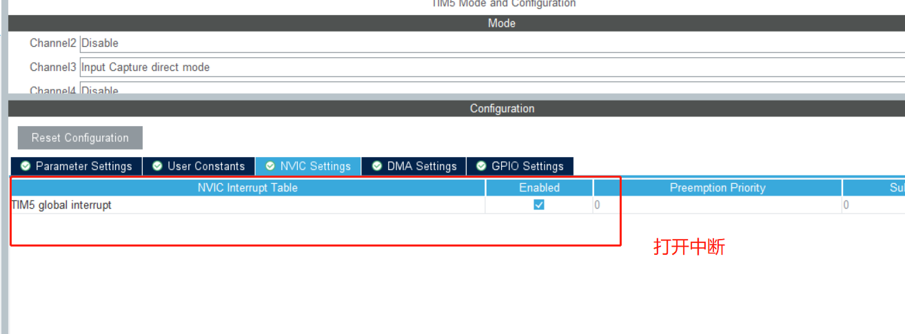

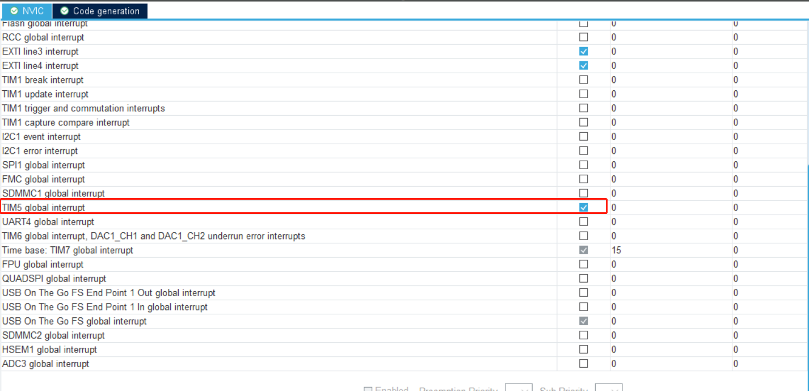

生成代码

这里我测试进入不了中断,原因是还要开始中断的使能函数

 HAL_TIM_IC_Start_IT(&htim5,TIM_CHANNEL_3);       IC :input capture 

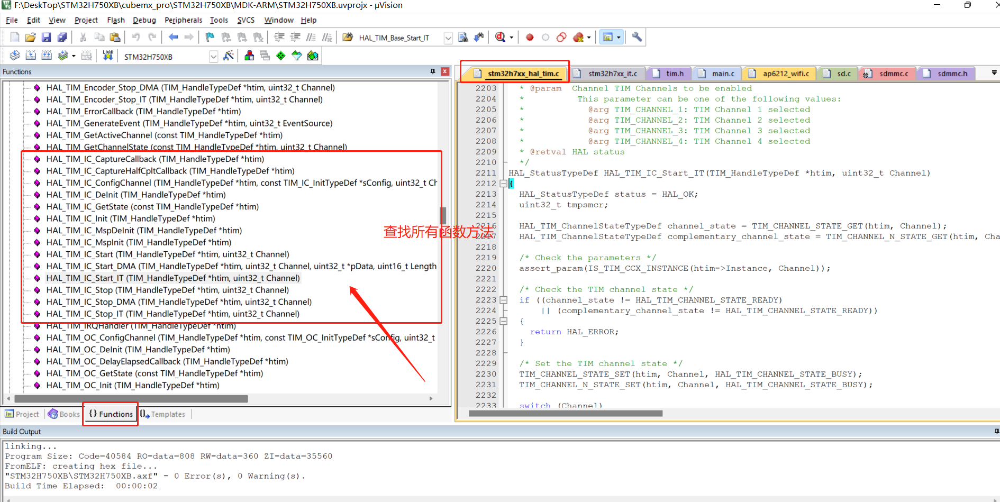

测试下降沿进入中断

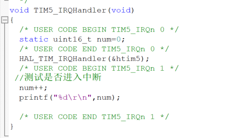

红外协议来看进入下降沿中断差不多

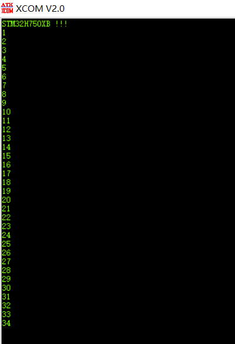

开始解码,解码之前再熟悉一下nec协议可以回看以前章节

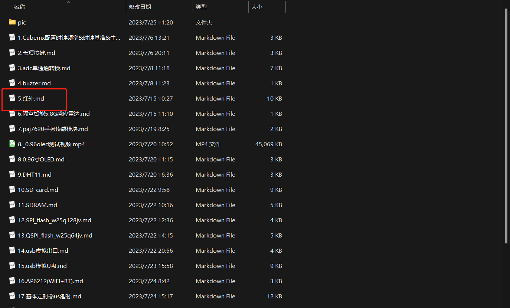

# 开始解码

解码方法和上次一样直接复制下来稍微改改就可以

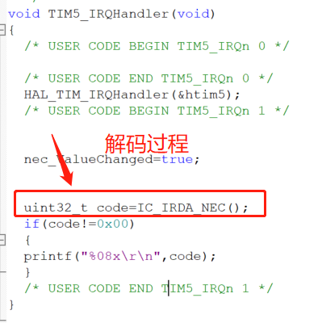

IC_IRDA_NEC()函数实现如下：（直接可以复用上次的中断解码，有几个地方稍微改改需要注意下）

```
/**********************根据定时器计数可调（可调参数）***************************************/
#define   TIM_INTERRUPT_TIME        10                     /* 计一次数时间(us)*/
#define   OVERFLOW                  65535                 /* 溢出值 (变量类型相关这里无符号16位) */
/******************NEC协议解码(适用于NEC协议，非必要勿改（可动态增加范围）)***********************/
#define   START_MIN               13000/TIM_INTERRUPT_TIME    /* 引导码最小计数次数 */
#define   START_MAX               14000/TIM_INTERRUPT_TIME    /* 引导码最大计数次数 */
  
#define   SURE_0_MIN              1000/TIM_INTERRUPT_TIME     /* 0最小计数次数 */           
#define   SURE_0_MAX              1200/TIM_INTERRUPT_TIME     /* 0最大计数次数 */            
 
#define   SURE_1_MIN              2100/TIM_INTERRUPT_TIME      /* 1最小计数次数 */ 
#define   SURE_1_MAX              2350/TIM_INTERRUPT_TIME      /* 1最大计数次数 */            
/*******************************************************************************************/  


uint32_t IC_IRDA_NEC(void)
{
	static uint16_t get_new_tim; /*获取最新时间*/
	static uint16_t get_old_tim; /*获取上次时间*/
	static uint16_t think_tim;/*间隔时间*/
	static char irda_state;/*解码状态*/
	static uint32_t irda_decoder,get_ir_code;/*解码值*/
	static uint8_t code_flag; /*解码成功标志位*/
  static uint8_t irda_data_bit_count=32;/*红外的32个bit*/

	if(nec_ValueChanged)/*产生下降沿中断*/
	{
	
		/*获取计数值*/
		get_new_tim=HAL_TIM_ReadCapturedValue(&htim5,TIM_CHANNEL_3);
		/**************向上溢出，考虑溢出情况**************************/	
		if(get_new_tim > get_old_tim) 
			think_tim = get_new_tim - get_old_tim;          /*无溢出*/
		else   
			think_tim = get_new_tim + OVERFLOW - get_old_tim;    /*溢出*/
		
		get_old_tim = get_new_tim;
    /***************************************************************/
		
		
	switch (irda_state)
	{
		case 0: 
			/*引导码*/
			if((think_tim>=START_MIN&&think_tim<=START_MAX))
					irda_state=1; /*引导码正确进入下一阶段*/
			else 
				//HAL_TIM_Base_Stop(&htim6);
			 break; /*非引导码直接跳出*/
	  
		case 1:
			/*判断0和1*/
	   if((think_tim>=SURE_0_MIN&&think_tim<=SURE_0_MAX))   /*判断为0   1.12ms*/
			{
				irda_decoder|=0<<(irda_data_bit_count-1); 
			  irda_data_bit_count-=1; /*红外32位数据*/
				irda_state=2;
				
			}
			else if(think_tim>=SURE_1_MIN&&think_tim<=SURE_1_MAX) /*判断为1   2.24ms*/
			{
			  irda_decoder|=1<<(irda_data_bit_count-1);
				irda_data_bit_count-=1;
				irda_state=2;
			}
			
			else /*非0和1*/
			{
			 irda_state=0; /*重新判断引导码*/
			
			}
			
			
		/*判断是否接受满32位数据，接受满则完成解码，未解码完成重新判断0和1*/	
		case 2:
			
		if(irda_data_bit_count==0)   /*是否满足32位数据*/
		{
		  code_flag=1; /*解码完成解码标志位置1*/
		  irda_data_bit_count=32; /*重新设置32bit数据*/
		  irda_state=0; /*重新判断引导码*/
	  }
	 else
			irda_state=1; /*继续判断0和1*/
		  	
	
	}
	
	 
	 nec_ValueChanged=false;/*恢复中断标志位*/
	
	}
	
	if(code_flag==1)
	{
	  
	  get_ir_code=irda_decoder;
    code_flag=0;	
		irda_decoder=0;	
		return get_ir_code;
		
	}
	
	 return 0x00;
	
	
	
}

```

自己实现需要改动如下：需要与配置的一致

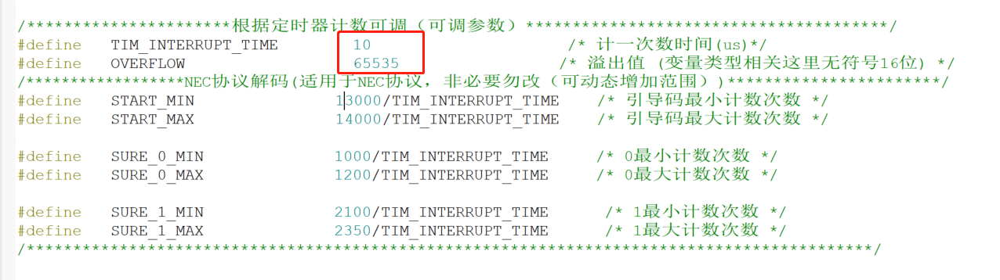

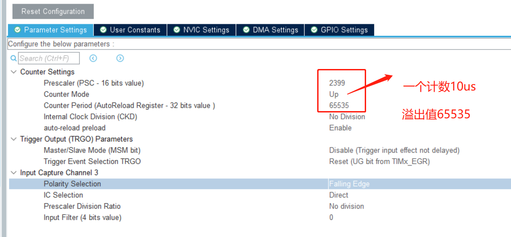

​                   外部中断+定时器方式  ： 计数值的获取 是获取中断中所添加变量 从而确定时间，这里还改了一下标志位

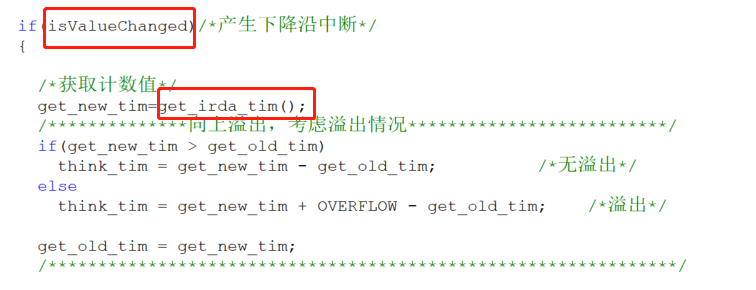

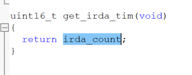

捕获方式时间获取是使用HAL_TIM_ReadCapturedValue(&htim5,TIM_CHANNEL_3); 函数计数值

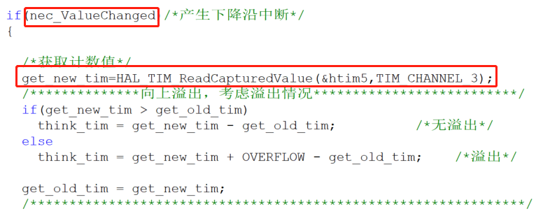

其他无任何异同，这里我们再做一个红外的校验吧

```c
	if(code_flag==1) /*接收到32位数据标志位*/
	{
	  
	  get_ir_code=irda_decoder;
    code_flag=0;	
		irda_decoder=0;	
		/***********************校验******************************/
		
		unsigned int address = (get_ir_code >> 24) & 0xFF;/*获取地址码*/
    unsigned int address_complement = (get_ir_code >> 16) & 0xFF;// 获取地址反码
    unsigned int data = (get_ir_code >> 8) & 0xFF;  // 获取数据码
    unsigned int data_complement = get_ir_code & 0xFF;// 获取数据反码
		
		//    printf("地址码: 0x%02X\n", address);
    //    printf("地址反码: 0x%02X\n", address_complement);
    //    printf("数据码: 0x%02X\n", data);
    //    printf("数据反码: 0x%02X\r\n", data_complement);
		
		
		if((address+address_complement==0xff)&&(data+data_complement==0xff))
		{
		 return get_ir_code;/*所有码*/
		 //return data;/*数据码*/
		}
/**************************************************************************/
//	return get_ir_code;
```

