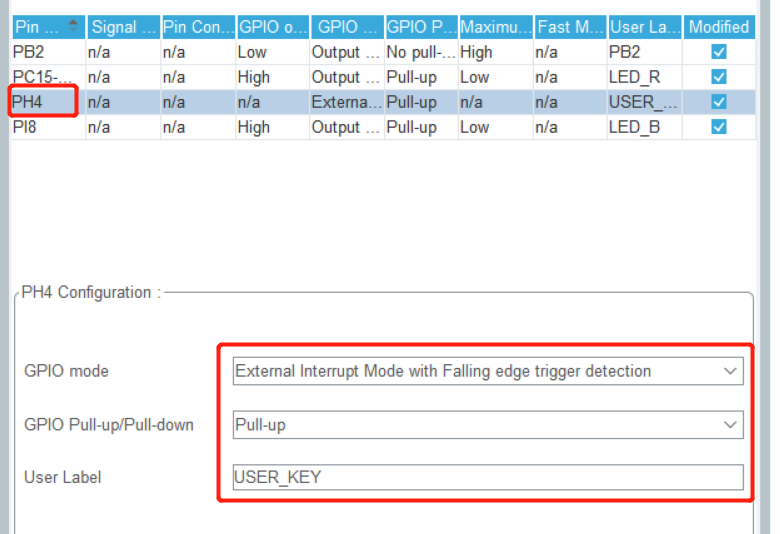
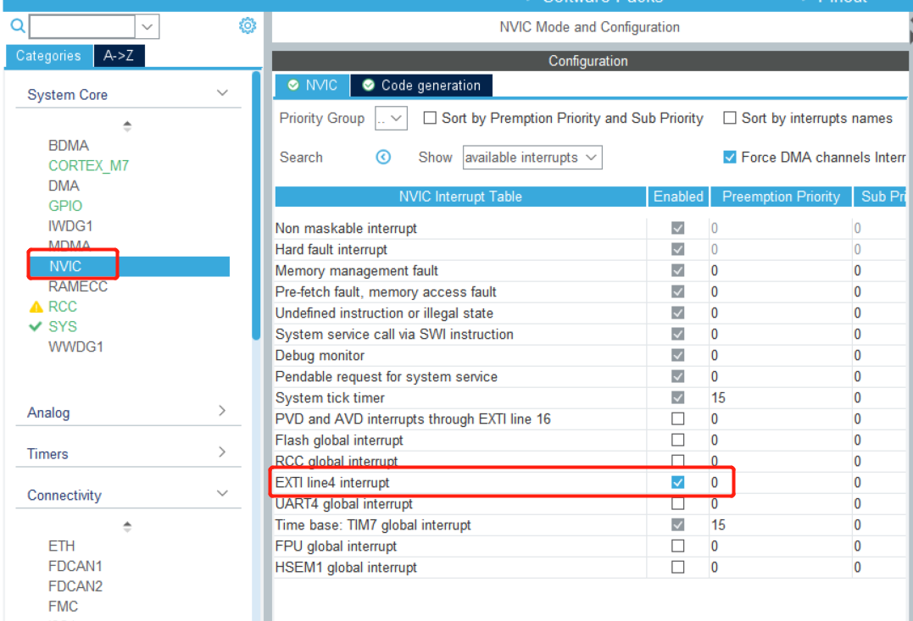
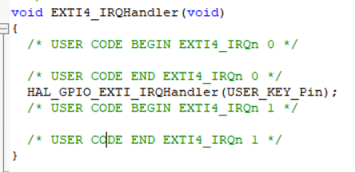
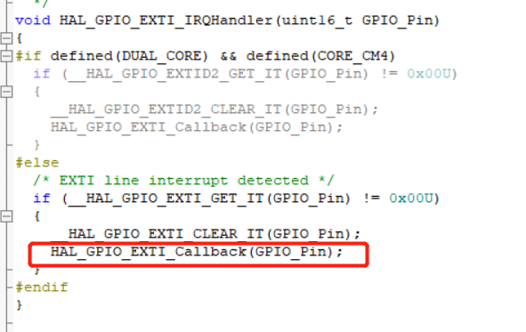
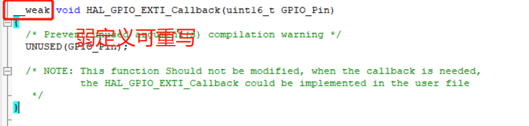
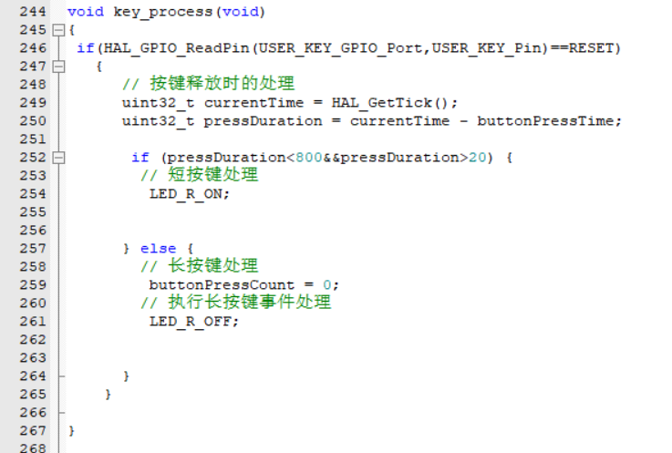
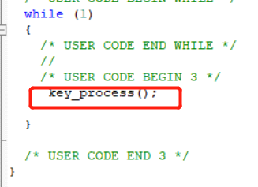
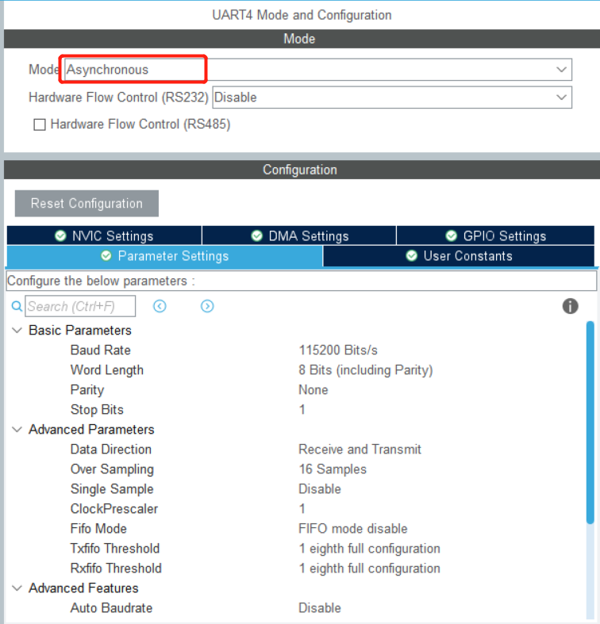
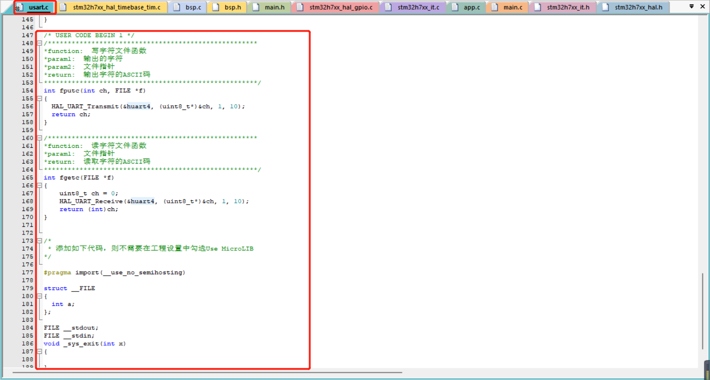
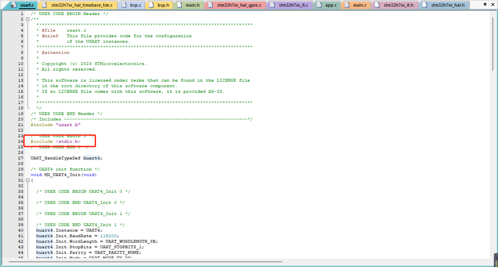

# 项目记录

## 环境搭建：

- 硬件平台：STM32H750XBH6
- 开发环境：STM32CubeMX V6.8.1+KEIL V5.28.0.0
- STM32H750固件版本：package V1.11.0（使用较高版本时钟频率无法配置到最大）
- 仿真下载驱动：ST-Link


# 2.长短按键，串口

思路：结合定时器实现长短按键，此种方法试试性较高，延时判断按键这种会影响系统的实时性系统时基自带1ms的定时器，可以利用它来做  

下图中PH4为用户按键


## 使用外部中断做一个长短按键



## 选择中断线



## 按键按下会进入该中断



打开HAL_GPIO_EXTI_IRQHandler(USER_KEY_Pin);

我们一般在如下这个回调函数中写程序



## 打开该函数



## 重写该函数


## 长短按键判断



## 加入while循环测试完成



# 串口（非中断）


## 选择这个其他默认（接着直接生成项目）



生成工程后在usart.c文件中添加如下代码（直接使用print）

```c
/*****************************************************
*function:	写字符文件函数
*param1:	输出的字符
*param2:	文件指针
*return:	输出字符的ASCII码
******************************************************/
int fputc(int ch, FILE *f)
{
	HAL_UART_Transmit(&huart4, (uint8_t*)&ch, 1, 10);
	return ch;
}

/*****************************************************
*function:	读字符文件函数
*param1:	文件指针
*return:	读取字符的ASCII码
******************************************************/
int fgetc(FILE *f)
{
    uint8_t ch = 0;
    HAL_UART_Receive(&huart4, (uint8_t*)&ch, 1, 10);
    return (int)ch;
}


/*
 * 添加如下代码，则不需要在工程设置中勾选Use MicroLIB
*/

#pragma import(__use_no_semihosting)
 
struct __FILE
{
	int a;
};
 
FILE __stdout;
FILE __stdin;
void _sys_exit(int x)
{
	
}

```



使用printf还需要包含头文件 stdio.h



接着就可以直接使用printf来打印了（默认波特率115200）

