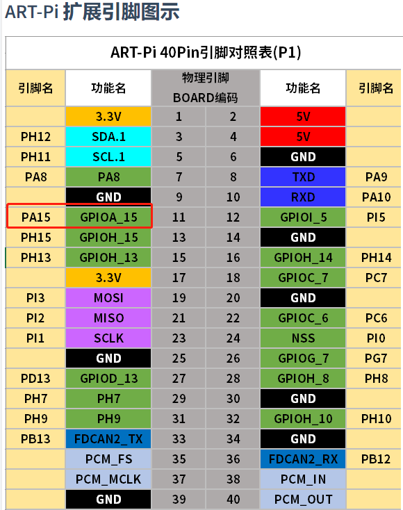
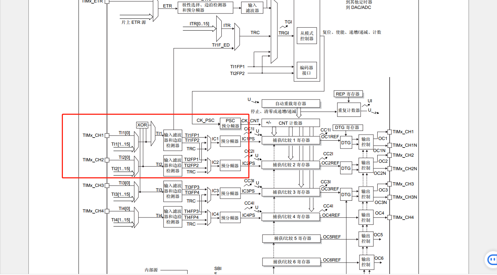
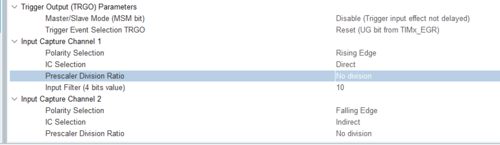
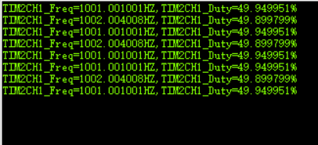

# 项目记录

## 环境搭建：

- 硬件平台：STM32H750XBH6
- 开发环境：STM32CubeMX V6.8.1+KEIL V5.28.0.0
- STM32H750固件版本：package V1.11.0
- 仿真下载驱动：ST-Link


# 20.通用定时器(输入捕获采集频率占空比)


使用该引脚配置为输入捕获

1. 使用一个通道（例如通道1）在 PWM 信号的上升沿触发中断，在中断处理函数中读取定时器的计数值（即上升沿的时间）。
2. 使用另一个通道（例如通道2）在 PWM 信号的下降沿触发中断，在中断处理函数中读取定时器的计数值（即下降沿的时间）。
3. 启动定时器的更新（溢出）中断，每当定时器溢出时，该中断会被触发。
4. 在更新（溢出）中断处理函数中，增加一个溢出计数器。
5. 在输入捕获中断处理函数中，利用上升沿的时间、下降沿的时间和溢出计数器，来计算 PWM 信号的频率和占空比。



# cubemx配置如下:

使能从模式，并且工作在复位模式，且触发信号源是TI1FP1，也就是在TI1FP1的上升沿，会复位所有的计数器，并更新对应的寄存器。定时器2分频之后使用10M的信号源。此处设置的重点是，将IC1捕获设置为上升沿捕获，且设置为直连模式，IC2设置为下降沿捕获。







开启中断捕获，开启更新中断

```c
HAL_TIM_Base_Start_IT(&htim2);/*开启更新中断*/	
HAL_TIM_IC_Start_IT(&htim2,TIM_CHANNEL_1);
HAL_TIM_IC_Start_IT(&htim2,TIM_CHANNEL_2);
```


```c
/*输入捕获回调函数*/


void HAL_TIM_IC_CaptureCallback(TIM_HandleTypeDef *htim)
{
	uint16_t value1=0,value2=0;
	static uint32_t count=0;
	double fre,duty;
	count++;
	 if (htim->Instance == TIM2) 
  {
	    if(htim->Channel==HAL_TIM_ACTIVE_CHANNEL_1)
		   {
		   	value1 = HAL_TIM_ReadCapturedValue(htim,TIM_CHANNEL_1);	//直接	
		   	value2 = HAL_TIM_ReadCapturedValue(htim,TIM_CHANNEL_2);	//间接
				HAL_TIM_IC_Stop(htim,TIM_CHANNEL_1);	//重新开启定时器通道
		   	HAL_TIM_IC_Stop(htim,TIM_CHANNEL_2);	//重新开启定时器通道
		   	__HAL_TIM_SetCounter(htim,0);			//计数值清零
		   	fre = (240000000.0/240)/value1;		//计算频率
		   	duty = (float)value2/value1 * 100;  //计算占空比
		   	HAL_TIM_IC_Start(htim,TIM_CHANNEL_1);	//重新开启定时器通道
		   	HAL_TIM_IC_Start(htim,TIM_CHANNEL_2);	//重新开启定时器通道
		   }

  }
	
	
   	if(count>=1000&&fre&&duty)
   	{
   	  printf("TIM2CH1_Freq=%lfHZ\n,TIM2CH1_Duty=%lf%%\r\n",fre,duty);
   	  count=0;
   	}
   		
	
		
}

```


如果考虑溢出则根据溢出次数在上面代码做相对应改变


实验测试使用外部1khz的频率  50%占空比测试

