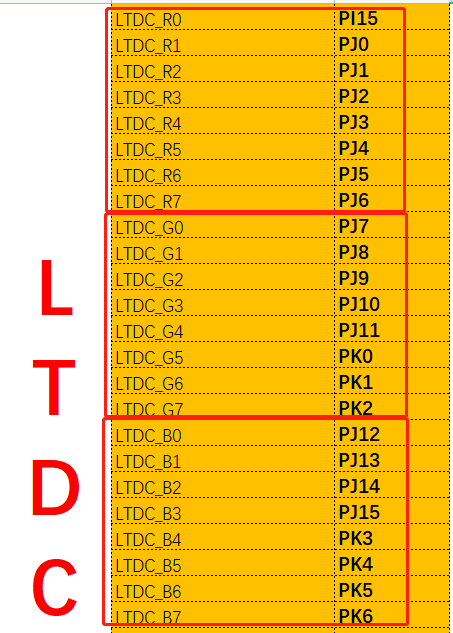
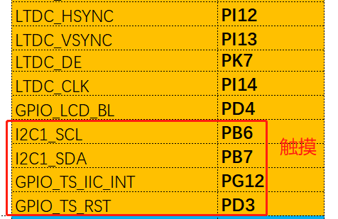
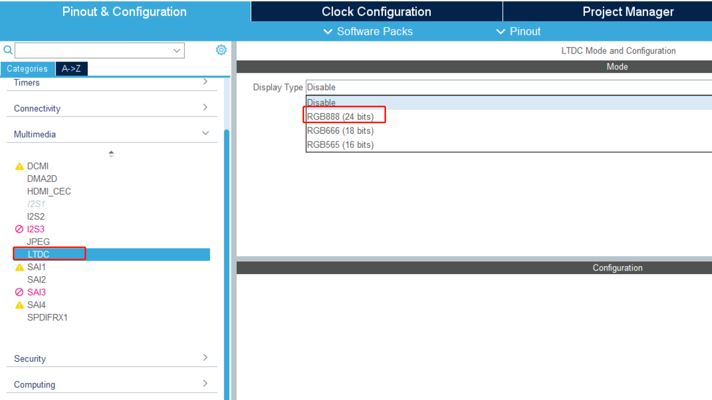
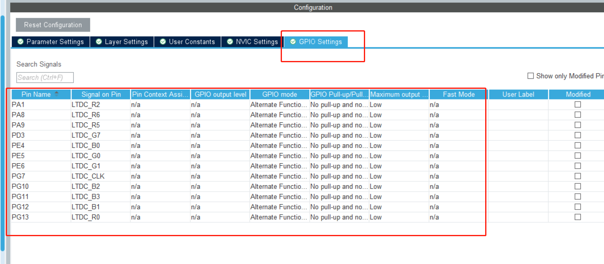
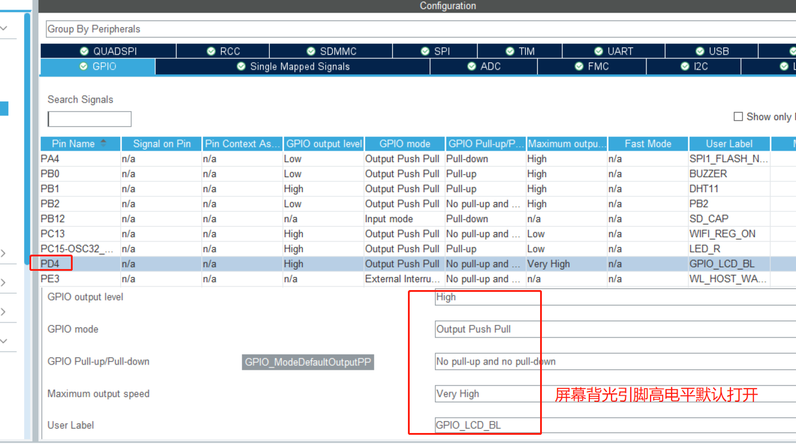
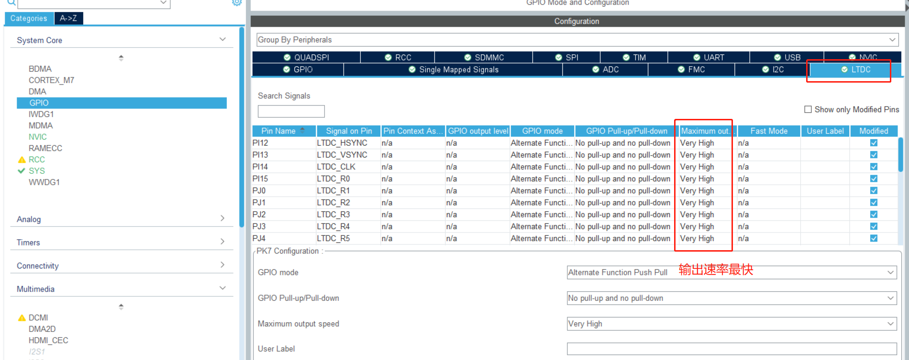
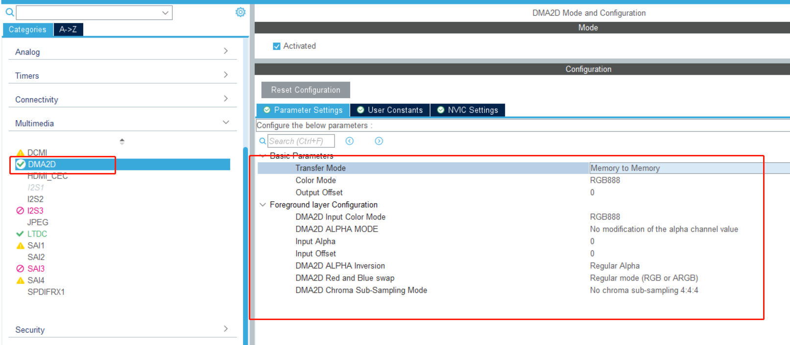
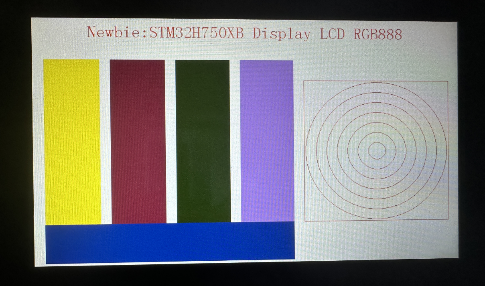

# 项目记录

## 环境搭建：

- 硬件平台：STM32H750XBH6
- 开发环境：STM32CubeMX V6.8.1+KEIL V5.28.0.0
- STM32H750固件版本：package V1.11.0
- 仿真下载驱动：ST-Link


# 21.LCD_RGB 888

屏幕购买链接：

【淘宝】https://m.tb.cn/h.51YIWGW?tk=vgVbdFEkN5t CZ3457 「4.3寸RGB电容触摸屏800x480高清IPS屏双接口


RGB888 是一种常见的色彩编码方式，用于在计算机和电视显示器等设备中表示颜色。RGB 是红色（Red）、绿色（Green）、蓝色（Blue）三个颜色通道的首字母缩写。

在 RGB888 编码中，每个颜色通道使用 8 位（一个字节）的数据表示，所以一个 RGB888 编码的颜色值包含 24 位数据，可表示 224224 或约 1670 万种颜色。因此，RGB888 也被称为 24 位颜色。

RGB888 中的每个颜色通道的值的范围是 0-255（0x00-0xFF），其中 0 表示该通道的颜色强度最弱（即没有该颜色），255 表示该通道的颜色强度最强。因此，RGB888 编码的颜色值可以表示为三个 0-255 范围内的数值，或者一个 24 位的十六进制数。

例如，红色可以表示为 RGB888 编码的 `(255, 0, 0)` 或者十六进制的 `0xFF0000`，绿色可以表示为 `(0, 255, 0)` 或 `0x00FF00`，蓝色可以表示为 `(0, 0, 255)` 或 `0x0000FF`，黑色可以表示为 `(0, 0, 0)` 或 `0x000000`，白色可以表示为 `(255, 255, 255)` 或 `0xFFFFFF`。


# 所有颜色由红绿蓝组成，每一个接口可以看做一个开关，控制这些开关可以显示不同的颜色



除此之外还有这些引脚，重点看看这些引脚的作用是什么（先不看触摸）



| LTDC_HSYNC  |
| ----------- |
| LTDC_VSYNC  |
| LTDC_DE     |
| LTDC_CLK    |
| GPIO_LCD_BL |

1. **LTDC_HSYNC**：这是水平同步信号。在图像扫描过程中，这个信号用来标识一行（水平线）的开始。
2. **LTDC_VSYNC**：这是垂直同步信号。在图像扫描过程中，这个信号用来标识一个新的画面（帧）的开始。
3. **LTDC_DE**：这是数据使能信号。当这个信号为高电平时，表示当前传输的数据是有效的图像数据；当这个信号为低电平时，表示当前传输的数据应被忽略。
4. **LTDC_CLK**：这是像素时钟信号。这个信号用来同步数据的传输，每一个像素时钟周期，LCD 控制器都会输出一个像素的数据。
5. **GPIO_LCD_BL**：这是背光控制信号。这个信号通常用来控制 LCD 的背光开关或亮度。具体的功能可能会根据 LCD 模块的设计有所不同。

这些信号都是液晶显示控制器（例如 STM32 的 LTDC）用来驱动 LCD 的。在设计 LCD 系统时，需要根据 LCD 模块的规格和液晶显示控制器的特性来正确配置这些信号的参数（例如同步信号的极性和时序）。

## 更加具体一点的解释：

1. **LTDC_HSYNC (水平同步信号)**：假设你正在看一个电影，你的 LCD 显示器正在扫描图像。当扫描到一行的结束时，LTDC_HSYNC 信号会改变状态，表示现在是新的一行的开始。这就像是阅读一本书，当你读到一行的末尾，你的眼睛会移动到下一行的开始。
2. **LTDC_VSYNC (垂直同步信号)**：还是以电影为例，当你的显示器扫描到一个画面的末尾，也就是屏幕的最后一行时，LTDC_VSYNC 信号会改变状态，表示现在是新的一个画面（帧）的开始。这就像是翻书页，当你读完一页，你会翻到下一页的开始。
3. **LTDC_DE (数据使能信号)**：这个信号用来表示当前传输的数据是否是有效的图像数据。当你的显示器在扫描图像时，LTDC_DE 信号会是高电平，表示正在传输的数据是有效的图像数据。但是在垂直和水平的回跳期间（也就是扫描从一行的末尾跳到下一行的开始，或者从一个画面的末尾跳到下一个画面的开始的过程），LTDC_DE 信号会是低电平，表示此时传输的数据应被忽略。
4. **LTDC_CLK (像素时钟信号)**：这个信号用来控制数据的传输速度。每一个像素时钟周期，LCD 控制器都会输出一个像素的数据。就像你在读书时，每一个心跳周期，你可能会读一到两个单词。
5. **GPIO_LCD_BL (背光控制信号)**：这个信号用来控制 LCD 的背光。当你想看书但是光线太暗时，你可能会打开阅读灯。同样，当你想看 LCD 但是光线太暗时，GPIO_LCD_BL 信号可以用来打开 LCD 的背光。这个信号也可以用来控制背光的亮度，就像你可以调节阅读灯的亮度一样。

我们使用的是一个4.3寸的800*480像素的屏幕，支持RGB888,支持触摸，我们先实现显示再来实现触摸


# cubemx配置如下



如上图可以看到我们使用LTDC接口，使用24位的RGB888


检查对应引脚是否对应，先更改引脚







其他配置根据不同分辨率参考代码块中的，也可保持默认，后面会重新赋值

以下为正点原子的各分辨率屏幕的配置可做参考

```
lcdid=LTDC_PanelID_Read();			//读取LCD面板ID	
	if(lcdid==0X4342)
	{
		lcdltdc.pwidth=480;			    //面板宽度,单位:像素
		lcdltdc.pheight=272;		    //面板高度,单位:像素
		lcdltdc.hsw=1;				    //水平同步宽度
		lcdltdc.vsw=1;				    //垂直同步宽度
		lcdltdc.hbp=40;				    //水平后廊
		lcdltdc.vbp=8;				    //垂直后廊
		lcdltdc.hfp=5;				    //水平前廊
		lcdltdc.vfp=8;				    //垂直前廊
		LTDC_Clk_Set(5,160,88);			//设置像素时钟 9Mhz 
		//其他参数待定.
	}else if(lcdid==0X7084)
	{
		lcdltdc.pwidth=800;			    //面板宽度,单位:像素
		lcdltdc.pheight=480;		    //面板高度,单位:像素
		lcdltdc.hsw=1;				    //水平同步宽度
		lcdltdc.vsw=1;				    //垂直同步宽度
		lcdltdc.hbp=46;				    //水平后廊
		lcdltdc.vbp=23;				    //垂直后廊
		lcdltdc.hfp=210;			    //水平前廊
		lcdltdc.vfp=22;				    //垂直前廊
		LTDC_Clk_Set(5,160,24);			//设置像素时钟 33M(如果开双显,需要降低DCLK到:18.75Mhz  pll3r=43,才会比较好)
	}else if(lcdid==0X7016)		
	{
		lcdltdc.pwidth=1024;			//面板宽度,单位:像素
		lcdltdc.pheight=600;			//面板高度,单位:像素
        lcdltdc.hsw=20;				    //水平同步宽度
		lcdltdc.vsw=3;				    //垂直同步宽度
		lcdltdc.hbp=140;			    //水平后廊
		lcdltdc.vbp=20;				    //垂直后廊
		lcdltdc.hfp=160;			    //水平前廊
		lcdltdc.vfp=12;				    //垂直前廊
		LTDC_Clk_Set(5,160,18);			//设置像素时钟  45Mhz 
		//其他参数待定.
	}else if(lcdid==0X7018)		
	{
		lcdltdc.pwidth=1280;			//面板宽度,单位:像素
		lcdltdc.pheight=800;			//面板高度,单位:像素
		//其他参数待定.
	}else if(lcdid==0X4384)		
	{
		lcdltdc.pwidth=800;			    //面板宽度,单位:像素
		lcdltdc.pheight=480;		    //面板高度,单位:像素
		lcdltdc.hbp=88;				    //水平后廊
		lcdltdc.hfp=40;			    	//水平前廊
		lcdltdc.hsw=48;				    //水平同步宽度
		lcdltdc.vbp=32;				    //垂直后廊
		lcdltdc.vfp=13;				    //垂直前廊
		lcdltdc.vsw=3;				    //垂直同步宽度
		LTDC_Clk_Set(5,160,24);			//设置像素时钟 33M
		//其他参数待定.
	}else if(lcdid==0X1018)				//10.1寸1280*800 RGB屏	
	{
		lcdltdc.pwidth=1280;			//面板宽度,单位:像素
		lcdltdc.pheight=800;			//面板高度,单位:像素
		lcdltdc.hbp=140;				//水平后廊
		lcdltdc.hfp=10;			    	//水平前廊
		lcdltdc.hsw=10;					//水平同步宽度
		lcdltdc.vbp=10;					//垂直后廊
		lcdltdc.vfp=10;					//垂直前廊
		lcdltdc.vsw=3;					//垂直同步宽度
		LTDC_Clk_Set(5,160,16);			//设置像素时钟 50MHz
	}	else if(lcdid==0XA001)              //接VGA显示器
     { 
		lcdltdc.pwidth=1366;		    //面板宽 度,单位:像素
		lcdltdc.pheight=768;		    //面板高度,单位:像素
		lcdltdc.hsw=143;			    //水平同步宽度 
		lcdltdc.hfp=70;			        //水平前廊
		lcdltdc.hbp=213;			    //水平后廊
		lcdltdc.vsw=3;				    //垂直同步宽度 
		lcdltdc.vbp=24;				    //垂直后廊  
		lcdltdc.vfp=3;				    //垂直前廊
        LTDC_Clk_Set(5,160,28);//设置像素时钟 28.5Mhz
	 
	 }else if(lcdid==0XA002)            //接VGA显示器
     {  
        lcdltdc.pwidth=1280;		    //面板宽度,单位:像素
		lcdltdc.pheight=800;		    //面板高度,单位:像素
		lcdltdc.hsw=32;			        //水平同步宽度 
		lcdltdc.hfp=48;			        //水平前廊
		lcdltdc.hbp=80;			        //水平后廊
		lcdltdc.vsw=6;				    //垂直同步宽度
		lcdltdc.vbp=14;				    //垂直后廊 
		lcdltdc.vfp=3;				    //垂直前廊
		LTDC_Clk_Set(5,160,22);//设置像素时钟 35.5Mhz
	 }else if(lcdid==0XA003)	        //接VGA显示器
	 {
		lcdltdc.pwidth=1280;		    //面板宽度,单位:像素
		lcdltdc.pheight=768;		    //面板高度,单位:像素
		lcdltdc.hsw=32;				    //水平同步宽度 
		lcdltdc.hbp=80;			        //水平后廊
		lcdltdc.hfp=48;			        //水平前廊
		lcdltdc.vsw=7;				    //垂直同步宽度
		lcdltdc.vbp=12;				    //垂直后廊
		lcdltdc.vfp=3;				    //垂直前廊
		LTDC_Clk_Set(5,160,23);//设置像素时钟  34.25Mhz
	 }else if(lcdid==0XA004)            //接VGA显示器
	 {
		lcdltdc.pwidth=1024;		    //面板宽度,单位:像素
		lcdltdc.pheight=768;		    //面板高度,单位:像素
		lcdltdc.hsw=136;			    //水平同步宽度 
		lcdltdc.hfp=24;			        //水平前廊
		lcdltdc.hbp=160;			    //水平后廊
		lcdltdc.vsw=6;				    //垂直同步宽度
		lcdltdc.vbp=29;				    //垂直后廊 
		lcdltdc.vfp=3;				    //垂直前廊
		LTDC_Clk_Set(5,160,18);//设置像素时钟 43.25Mhz	
	 }else if(lcdid==0XA005)            //接VGA显示器
	 {
		lcdltdc.pwidth=848;		        //面板宽度,单位:像素 
		lcdltdc.pheight=480;		    //面板高度,单位:像素
		lcdltdc.hsw=112;		        //水平同步宽度
		lcdltdc.hbp=112;			    //水平后廊
		lcdltdc.hfp=16;			        //水平前廊
		lcdltdc.vsw=8;				    //垂直同步宽度
		lcdltdc.vbp=23;				    //垂直后廊
		lcdltdc.vfp=6;				    //垂直前廊
		LTDC_Clk_Set(5,160,47);//设置像素时钟 17Mhz 
	 }else if(lcdid==0XA006)            //接VGA显示器
	 {
		lcdltdc.pwidth=800;		        //面板宽度,单位:像素
		lcdltdc.pheight=600;		    //面板高度,单位:像素
		lcdltdc.hsw=128;			    //水平同步宽度
		lcdltdc.hbp=88;			        //水平后廊
		lcdltdc.hfp=40;			        //水平前廊
		lcdltdc.vsw=4;				    //垂直同步宽度
		lcdltdc.vbp=23;				    //垂直后廊
		lcdltdc.vfp=1;				    //垂直前廊
		LTDC_Clk_Set(5,160,40);//设置像素时钟 20mz		
	 }else if(lcdid==0XA007)            //接VGA显示器
	 {
        lcdltdc.pwidth=640;		        //面板宽度,单位:像素
		lcdltdc.pheight=480;		    //面板高度,单位:像素
		lcdltdc.hsw=96;				    //水平同步宽度
		lcdltdc.hfp=8;			        //水平前廊
		lcdltdc.hbp=56;			        //水平后廊
		lcdltdc.vsw=2;				    //垂直同步宽度
		lcdltdc.vbp=41;				    //垂直后廊
		lcdltdc.vfp=2;				    //垂直前廊
		LTDC_Clk_Set(5,160,62);//设置像素时钟 12.75Mhz
	 } 
```


开启DMA2D



生成工程


写LCD的驱动很麻烦，我使用的屏幕比较大众，直接移植别人的吧，参考正点原子的屏幕驱动

移植步骤不详细概述了，可在工程中查看，熟悉提供的显示函数就可以了，一般做GUI的显示使用第三方的库，比较火的

littleVGL     适用于stm32的TouchGFX 等



```c
        SDRAM_InitSequence(); /*初始化SDRAM*/
		
		  LCD_Init();
		  POINT_COLOR=RED; /*画笔颜色*/ 
	     LCD_Display_Dir(1);		//屏幕显示方向：0竖屏，1横屏
	     LCD_Clear(WHITE);	LCD_Fill(20 , 80,120 ,400,0xFFE0);
			LCD_Fill(140, 80,240 ,400,0x8888);
			LCD_Fill(260, 80,360 ,400,0x2222);
			LCD_Fill(380, 80,480 ,400,0xbbbb); 
			
			LCD_Fill(20,400,480,475,0x1111);
			
		  LCD_ShowString(100,10,800,80,32,"Newbie:STM32H750XB Display LCD RGB888"); 
			
			
			LCD_DrawRectangle(500,120,780,400);/*画矩形*/
			
			LCD_Draw_Circle(640,260,137);/*画圆*/
			LCD_Draw_Circle(640,260,117);/*画圆*/
			LCD_Draw_Circle(640,260,97);/*画圆*/
			LCD_Draw_Circle(640,260,77);/*画圆*/
			LCD_Draw_Circle(640,260,57);/*画圆*/
			LCD_Draw_Circle(640,260,37);/*画圆*/
			LCD_Draw_Circle(640,260,17);/*画圆*/
	    
	    
```

