# 项目记录

## 环境搭建：

- 硬件平台：STM32H750XBH6
- 开发环境：STM32CubeMX V6.8.1+KEIL V5.28.0.0
- STM32H750固件版本：package V1.11.0
- 仿真下载驱动：ST-Link


# 21.TOUCH_GT1151Q

屏幕购买链接：

【淘宝】https://m.tb.cn/h.51YIWGW?tk=vgVbdFEkN5t CZ3457 「4.3寸RGB电容触摸屏800x480高清IPS屏双接口

# 支持五点触摸


## 如上我们可以看到该触摸ic使用i2c通信,scl,sda引脚都知道，那么剩余两个引脚的作用是什么来看看

GPIO_TS_IIC_INT：该引脚配置为输入模式,检测到触摸这里会接收信号，也可以开启外部中断

GPIO_TS_RST：复位引脚


# 通讯地址

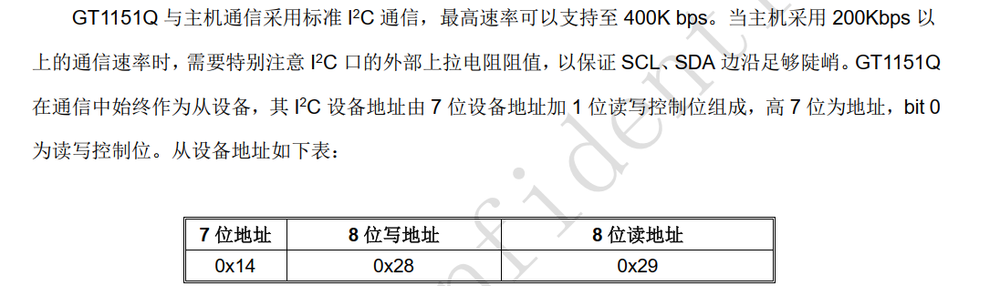

## 0X28:写通讯地址   0x29：读通讯地址

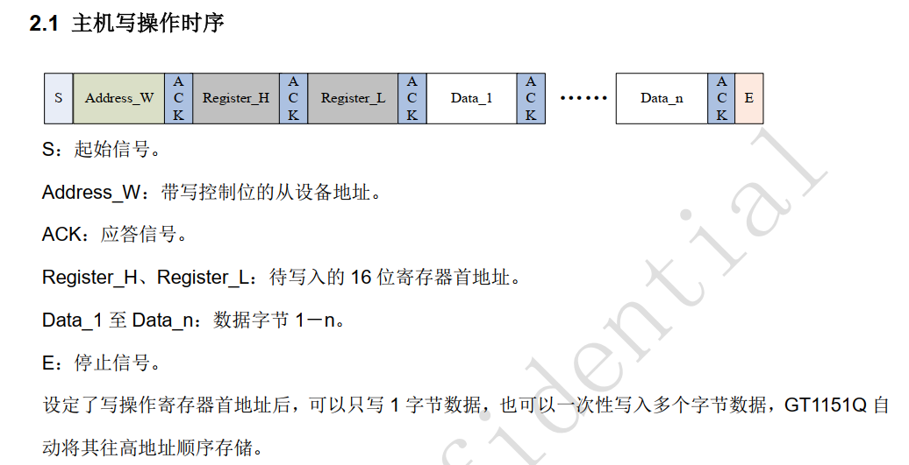

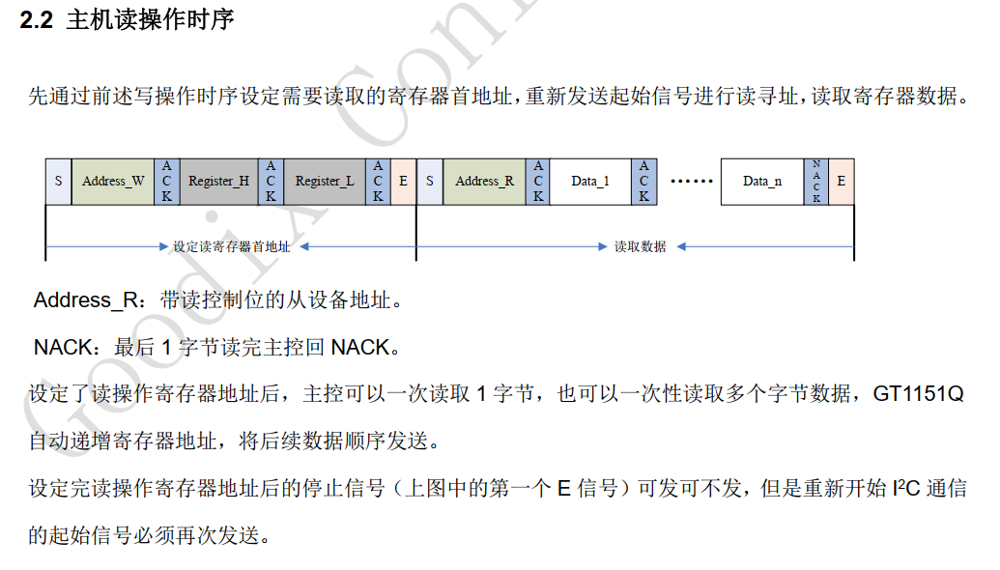

寄存器名称：

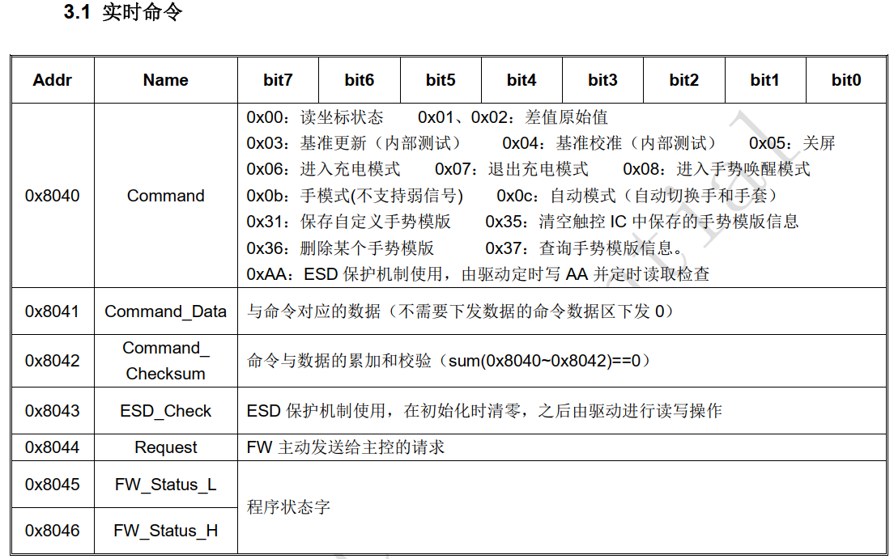

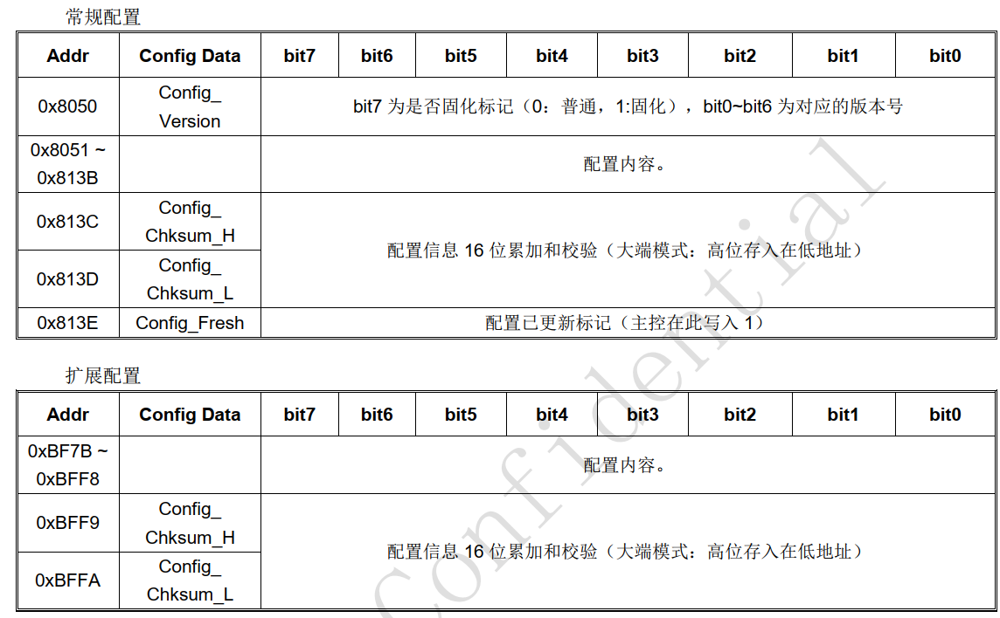

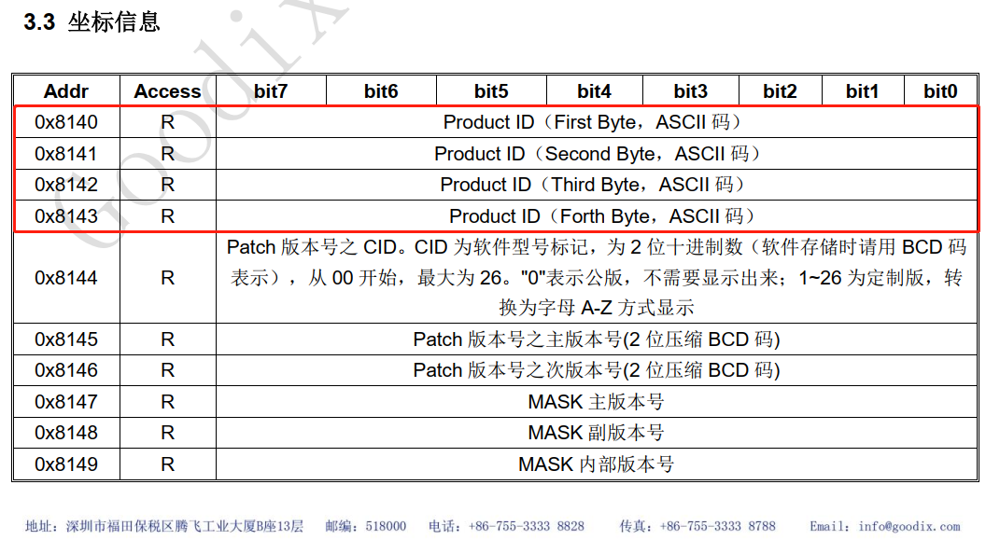

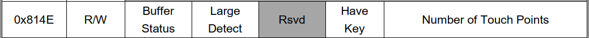

**以上比较重要的：**

**0x8040                                               控制命令寄存器        0x00  可读取坐标状态**

**0X8050                                              配置起始地址寄存器**         

**0x8140-0x8143                                 产品ID寄存器          读取ascii值    如该IC型号为GT1151读取的该数值为1158**   

**X813C                                                校验和寄存器**

**0x814E                                               检测当前触摸寄存器**

 **0X8150  	 //第一个触摸点数据地址**
 **0X8158		//第二个触摸点数据地址**
 **0X8160		//第三个触摸点数据地址**
 **0X8168		//第四个触摸点数据地址**
 **0X8170		//第五个触摸点数据地址**  


以上的寄存器都可在GT1151编程手册中找到


步骤如下：  

1.初始化RESET以及INT引脚     RESET输出  INT输入     

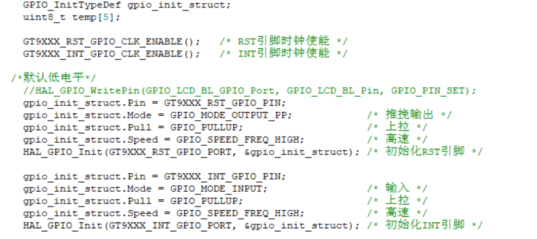

2.初始化i2c总线

```c
ct_iic_init();      /* 初始化电容屏的I2C总线 */
```

3.根据编程手册复位

```c
    GT9XXX_RST(0);      /* 复位 */
    tim_delay_us(&htim6,200);
    GT9XXX_RST(1);      /* 释放复位 */
```

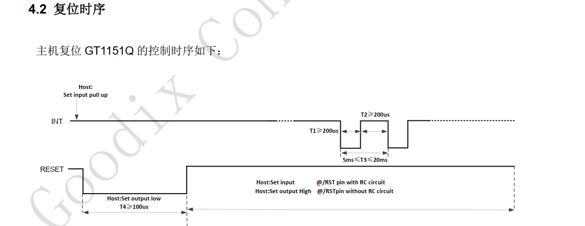

4.读取ID

```c
    
   #define GT9XXX_PID_REG      0X8140      /* GT9XXX产品ID寄存器 */
    gt9xxx_rd_reg(GT9XXX_PID_REG, temp, 4); /* 读取产品ID */
    temp[4] = 0;
    printf("CTP ID:%s\r\n", temp);          /* 打印ID */
```

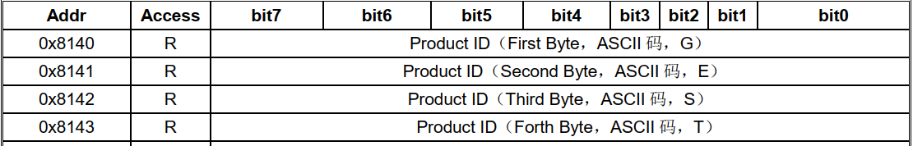

5.软复位

```c
    #define GT9XXX_CTRL_REG     0X8040      /* GT9XXX控制寄存器 */
    temp[0] = 0X02;
    gt9xxx_wr_reg(GT9XXX_CTRL_REG, temp, 1);    /* 软复位GT9XXX */
```

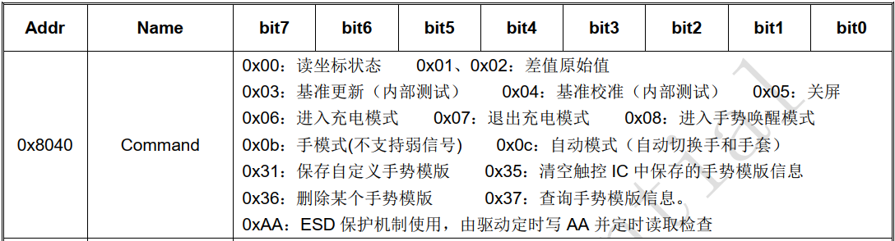

6.进入读坐标状态

```c
   #define GT9XXX_CTRL_REG     0X8040      /* GT9XXX控制寄存器 */
    temp[0] = 0X00;
    gt9xxx_wr_reg(GT9XXX_CTRL_REG, temp, 1);    /* 结束复位, 进入读坐标状态 */
```

7.判断是否按下接收坐标信息并处理

……………………………………………………见程序

触摸屏幕会打印坐标以及在对应屏幕画点

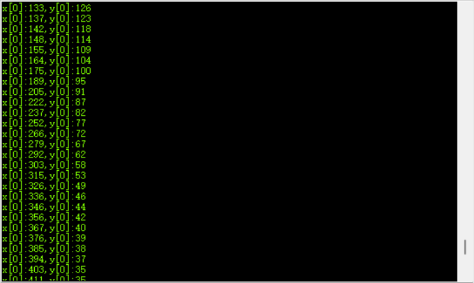


# 注：

### 在移植过程中遇到以下问题

#### 1.i2c通信不成功,无应答信号

解决：

1.使用for循环的delay函数运行时间不确定，更改为定时器精准微秒级延时

2.在开始通信之前需要对RESET进行复位，必须严格按照时序来


#### 2.触摸屏幕在对应位置上画点，触摸过快会导致屏幕抖动/晃动，

解决

降低LTDC的时钟频率,原33MHZ,降低至20Mhz后非常稳定


