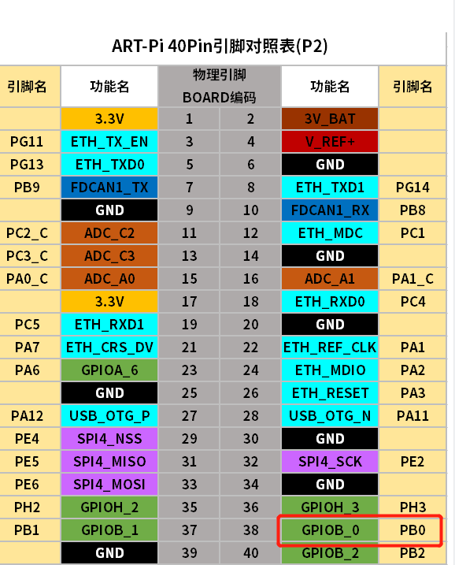
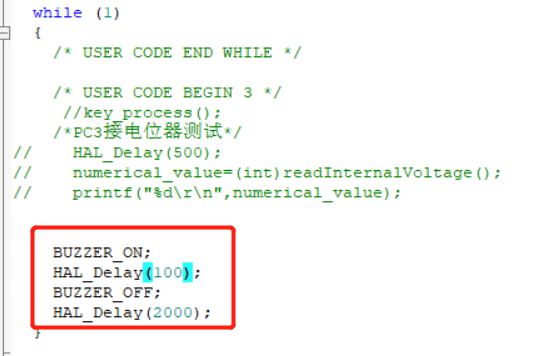
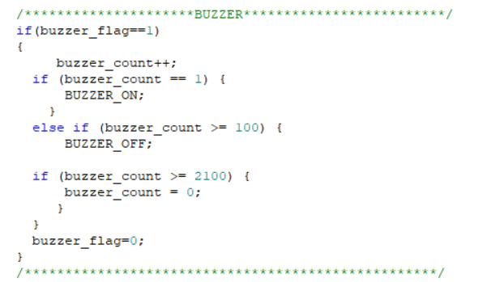
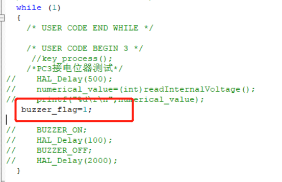
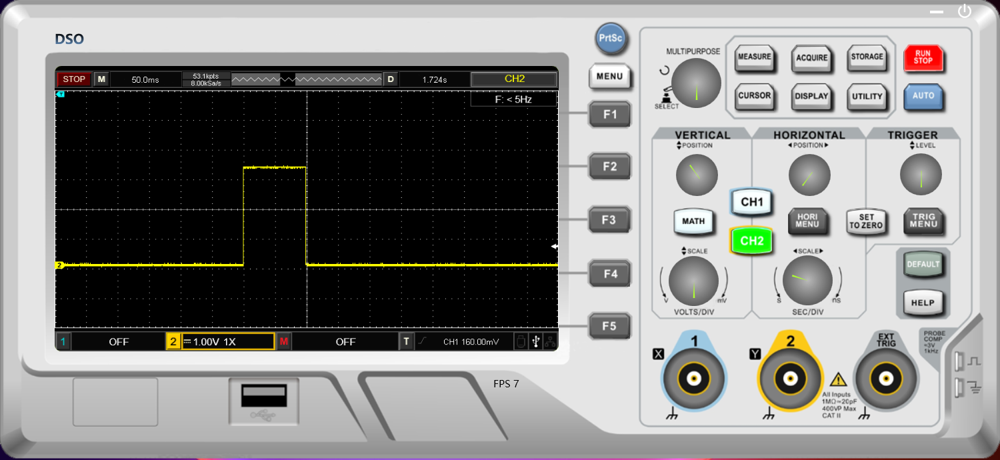

# 项目记录

## 环境搭建：

- 硬件平台：STM32H750XBH6
- 开发环境：STM32CubeMX V6.8.1+KEIL V5.28.0.0
- STM32H750固件版本：package V1.11.0（使用较高版本时钟频率无法配置到最大）
- 仿真下载驱动：ST-Link

# 4.蜂鸣器

有源蜂鸣器，给高电平就响 使用PB0引脚

## 简单测试下可行

不过以上这样写会影响其他任务的运行

优化思路：使用系统时基的1ms计时,中断中添加标志位，在while循环中判断

