# 项目记录

## 环境搭建：

- 硬件平台：STM32H750XBH6
- 开发环境：STM32CubeMX V6.8.1+KEIL V5.28.0.0
- STM32H750固件版本：package V1.11.0
- 仿真下载驱动：ST-Link


# 5.红外解码（外部中断+定时器）

常用红外为NEC协议


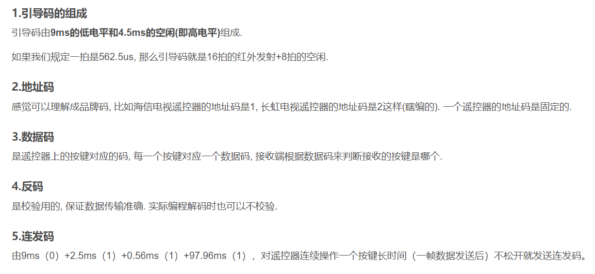

由上述可知,NEC协议为引导码+32位码（8位地址码+8位地址反码+8位数据码+8位数据反码），地址码和地址反码一般是由厂家设置的，采集可以直接省略这16位，我们要解析的就是地址码和地址反码，实际上我们只需要采集地址码就可以得到数据了，数据反码只是做一个校验。

补充：红外的接收引脚默认是高电平状态,低电平时开始解析数据

解码NEC需要了解

- NEC协议的组成
- 引导码的表示
- 0和1的表示


以下是示波器采集到的一次红外接收码


由上述我们可以看到，该NEC协议

引导码9ms低电平与4.5ms高电平

地址码为八个0，地址反码为八个1

数据码为0000 0010

数据反码1111 1101


# 再看一组

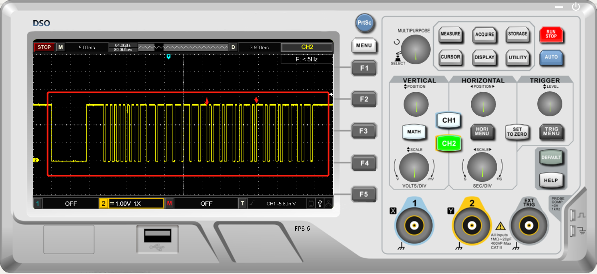

引导码9ms低电平与4.5ms高电平

地址码为八个0，地址反码为八个1

数据码为0101 0010

数据反码1010 1101

在示波器中我们可以更加直观的看到NEC协议，接下来就应该解码了

解码的方式有很多种,这里我们利用外部中断下降沿触发+定时器,根据下降沿触发间隔的时间可以判断0和1，由此解码NEC

配置PH3引脚为外部中断下降沿触发,红外默认为高电平，这里硬件没有接上拉电阻，防止意外配置上拉

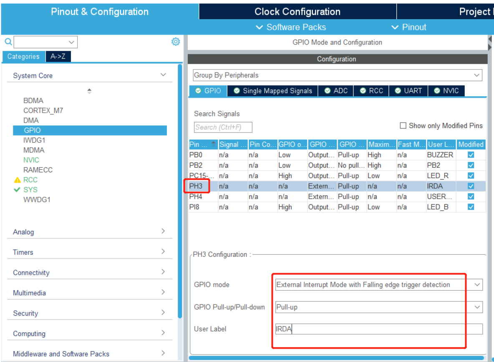

别忘记了开启中断线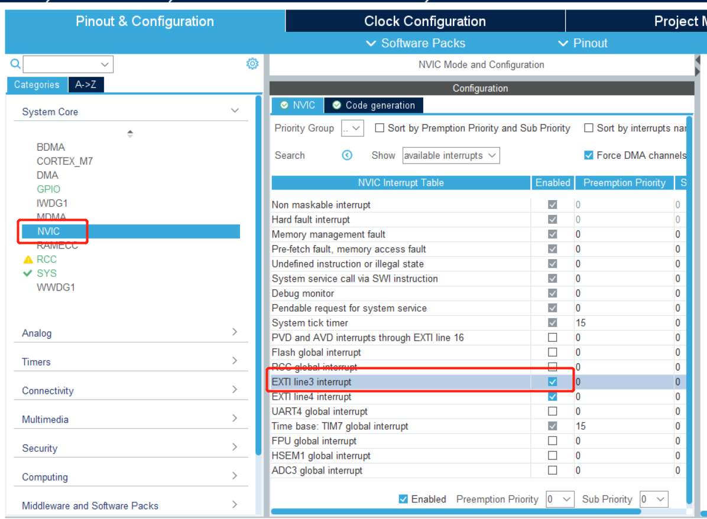

生成之后加入测试代码如下:

硬件接到PH3,    板载LED默认关闭状态，红外遥控任意按键按下之后会有下降沿产生，这时候板载的LED会亮起，验证了硬件以及基本测试没有问题

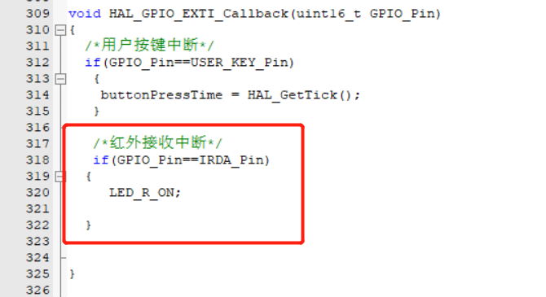

接下来编写解码代码，我们还需要一个基本的定时器来作为时钟基准的判断，系统自带的为1ms中断时间较长不适用，用基本定时器做一个10us的中断吧

查找手册可知基本定时器TIM6在APB1总线上，APB1的频率如下为240Mhz

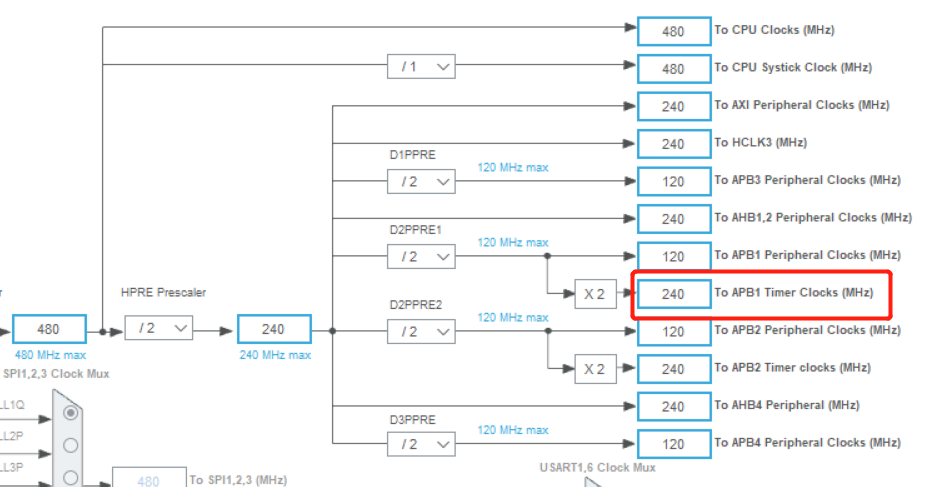

使用基本定时器TIM6(节省资源)

配置如下，时间计算公式如下

timeout=(arr+1)(psc+1)/clk

此时需要timeout=10us   clk=240MHZ

(arr+1)(psc+1)=2400时满足     

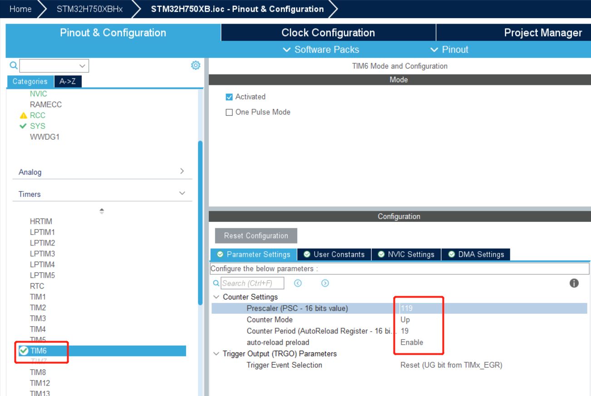

开启中断

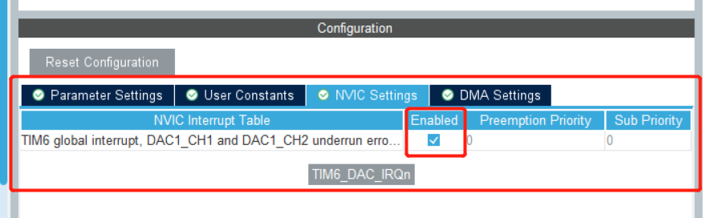

生成项目文件之后，在主函数添加： **HAL_TIM_Base_Start_IT(&htim6);**

需要在程序中手动启动定时器，系统才能进入定时器中断。

测试中断时间是否正常，可能疑问为什么还有DAC等字样，TIM6可以做DAC触发源，我们在此没用到不用管即可

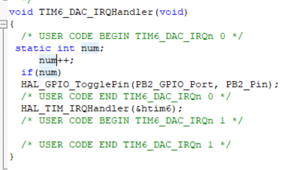

示波器中可以看到定时器运行状态正常10ms产生一次中断，这里的疑问，如果定时器6一直运行，10us进入一次中断，会消耗cpu资源，我们可以把开启定时器的函数与关闭定时器的函数与红外的外部中断相关联，没有外部中断产生的时候关闭，有外部中断产生则开启该定时器，隔一段时间后自动关闭该定时器，这样没有红外外部中断的触发，该定时器不会运行不消耗cpu资源

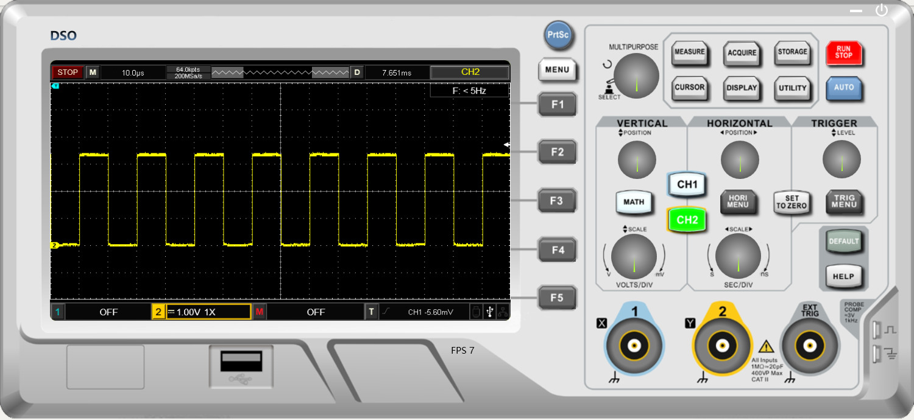

# 定时器搞定了,接下来开始解码了

大致思路：通过外部中断下降沿触发红外解码，定时器中断放入变量，通过判断变量的前后值可以对红外进行解码


代码如下：

外部中断，下降沿触发，这里加入一个bool的标志位，判断标志位开启解码

```
void HAL_GPIO_EXTI_Callback(uint16_t GPIO_Pin)
{
	/*用户按键中断*/
  if(GPIO_Pin==USER_KEY_Pin)
	 {
	  buttonPressTime = HAL_GetTick();
	 }
	 
	 /*红外接收中断*/
	 if(GPIO_Pin==IRDA_Pin)
	{
		
		 isValueChanged=true;
		
		 
	}
```

定时器中断这里必须设置无符号类型，根据定时器时间该类型值必须能够完成一次完整解码的时间

如：65535*10us=655ms(足够完成一次完整红外解码时间)

```
void TIM6_DAC_IRQHandler(void)
{
  /* USER CODE BEGIN TIM6_DAC_IRQn 0 */
	
	/*uint16_t  0-65535*/
	irda_count++; /*10us一次*/


  /* USER CODE END TIM6_DAC_IRQn 0 */
  HAL_TIM_IRQHandler(&htim6);
  /* USER CODE BEGIN TIM6_DAC_IRQn 1 */

  /* USER CODE END TIM6_DAC_IRQn 1 */
}
```

解码如下：

​        使用局部变量+返回值的形式，方便移植，模块化较好

该解码值是将32bit全部解码出来

```c
/******************************NEC协议******************************************************
引导码:  低电平9ms      高电平4.5ms      13.5ms
0:       低电平0.56ms   高电平0.56ms     1.12ms
1:       低电平0.56ms   高电平1.68ms     2.24ms
********************************************************************************************/
/**********************根据定时器计数可调（可调参数）***************************************/
#define   TIM_INTERRUPT_TIME        10                    /* 计一次数时间(us)*/
#define   OVERFLOW                  65535                 /* 溢出值 (变量类型相关这里无符号16位) */
/******************NEC协议解码(适用于NEC协议，非必要勿改（可动态增加范围）)***********************/
#define   START_MIN               13000/TIM_INTERRUPT_TIME    /* 引导码最小计数次数 */
#define   START_MAX               14000/TIM_INTERRUPT_TIME    /* 引导码最大计数次数 */
  
#define   SURE_0_MIN              1000/TIM_INTERRUPT_TIME     /* 0最小计数次数 */           
#define   SURE_0_MAX              1200/TIM_INTERRUPT_TIME     /* 0最大计数次数 */            
 
#define   SURE_1_MIN              2100/TIM_INTERRUPT_TIME      /* 1最小计数次数 */ 
#define   SURE_1_MAX              2350/TIM_INTERRUPT_TIME      /* 1最大计数次数 */            
/*******************************************************************************************/  

uint32_t scan_irda(void)
{
	static uint16_t get_new_tim; /*获取最新时间*/
	static uint16_t get_old_tim; /*获取上次时间*/
	static uint16_t think_tim;/*间隔时间*/
	static char irda_state;/*解码状态*/
	static uint32_t irda_decoder,get_ir_code;/*解码值*/
	static uint8_t code_flag; /*解码成功标志位*/
    static uint8_t irda_data_bit_count=32;/*红外的32个bit*/

	if(isValueChanged)/*产生下降沿中断*/
	{
	
		/*获取计数值*/
		get_new_tim=get_irda_tim();
		/**************向上溢出，考虑溢出情况**************************/	
		if(get_new_tim > get_old_tim) 
			think_tim = get_new_tim - get_old_tim;          /*无溢出*/
		else   
			think_tim = get_new_tim + OVERFLOW - get_old_tim;    /*溢出*/
		
		get_old_tim = get_new_tim;
    /***************************************************************/
		
		
	switch (irda_state)
	{
		case 0: 
			/*引导码*/
			if((think_tim>=START_MIN&&think_tim<=START_MAX))
					irda_state=1; /*引导码正确进入下一阶段*/
			else 
				
			 break; /*非引导码直接跳出*/
	  
		case 1:
			/*判断0和1*/
	   if((think_tim>=SURE_0_MIN&&think_tim<=SURE_0_MAX))   /*判断为0   1.12ms*/
			{
				irda_decoder|=0<<(irda_data_bit_count-1); 
			  irda_data_bit_count-=1; /*红外32位数据*/
				irda_state=2;
				
			}
			else if(think_tim>=SURE_1_MIN&&think_tim<=SURE_1_MAX) /*判断为1   2.24ms*/
			{
			  irda_decoder|=1<<(irda_data_bit_count-1);
				irda_data_bit_count-=1;
				irda_state=2;
				
			}
			
			else /*非0和1*/
			{
			 irda_state=0; /*重新判断引导码*/
			}
			
			
		/*判断是否接受满32位数据，接受满则完成解码，未解码完成重新判断0和1*/	
		case 2:
			
		if(irda_data_bit_count==0)   /*是否满足32位数据*/
		{
		  code_flag=1; /*解码完成解码标志位置1*/
		  irda_data_bit_count=32; /*重新设置32bit数据*/
		  irda_state=0; /*重新判断引导码*/
		
		}
		else
			irda_state=1; /*继续判断0和1*/
		  	
	
	}
	
	
	 isValueChanged=false;/*恢复中断标志位*/
	}
	
	if(code_flag==1)
	{
	 
	  get_ir_code=irda_decoder;
    code_flag=0;	
		irda_decoder=0;	
		return get_ir_code;
		
	}
	
	 return 0x00;
		
			
}
```

主函数：

%08x :格式化输出8位（该地址码前8位为0，方便现实所有数据）  16进制表示

```
while
{

	uint32_t code=scan_irda();
		if(code!=0x00)
		{
		 printf("%08x\r\n",code);
			
		}

}
```

串口查看解码值：

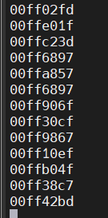

如上：在实际的应用中，如果我们使用多个厂家的遥控，可以判断地址码的值进行适配，为保证解码的正确性，可以对数据码与数据反码进行校验。


以上并未实现连发码以及当前该定时器是在一直运行的状态10us中断一次

太浪费资源，下一节补上代码