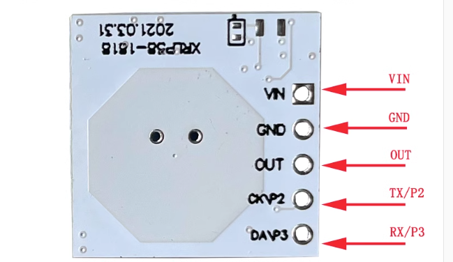
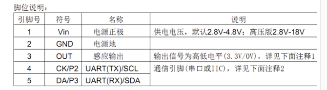
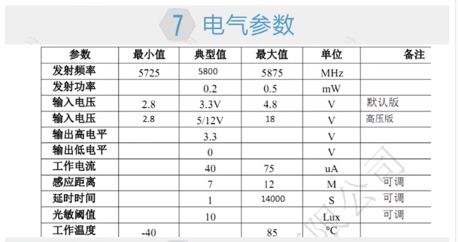

# 项目记录

## 环境搭建：

- 硬件平台：STM32H750XBH6
- 开发环境：STM32CubeMX V6.8.1+KEIL V5.28.0.0
- STM32H750固件版本：package V1.11.0
- 仿真下载驱动：ST-Link

# 6.感应雷达

隔空智能5.8G感应雷达，可通过上位机直接调参,out口输出高电平时间可控，感应范围和灵敏度可控

忘带串口转TTL的 下载线了，过几天更新……

