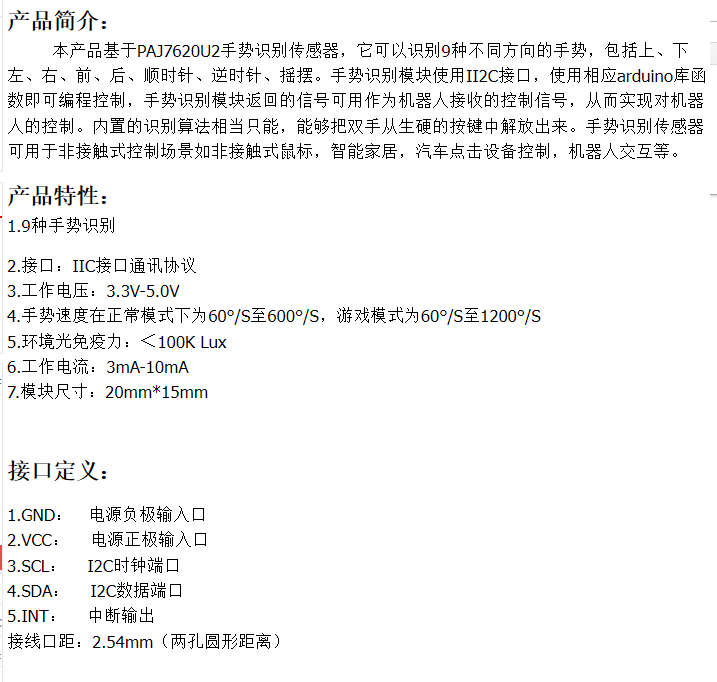
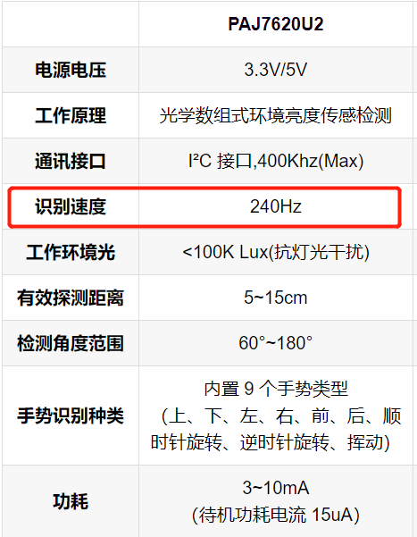
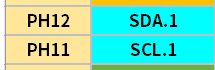
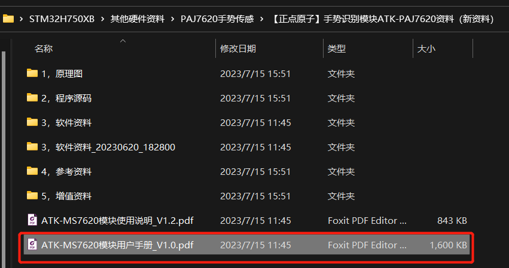
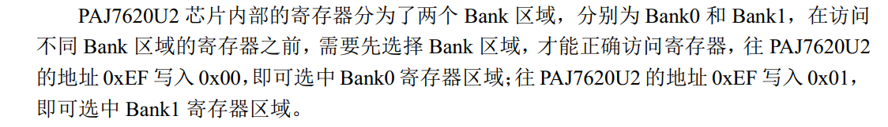
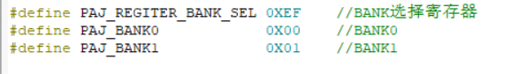
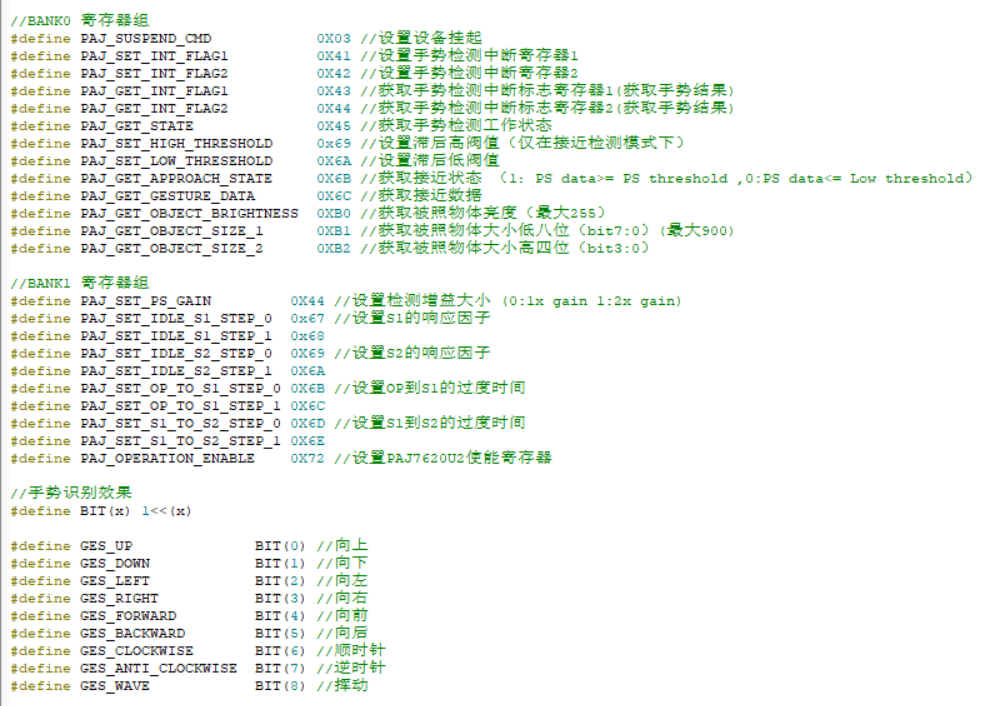
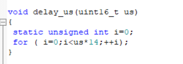

# 项目记录

## 环境搭建：

- 硬件平台：STM32H750XBH6
- 开发环境：STM32CubeMX V6.8.1+KEIL V5.28.0.0
- STM32H750固件版本：package V1.11.0
- 仿真下载驱动：ST-Link

# 7.PAJ7620u2手势传感模块

实际测试采样速度过快会导致误触，根据实际测试为准

可增加采样时间，我这里使用200ms采样,还是误触可增加采样时间

i2c通信   支持九种手势 工作电压3.3-5v,可直接STM32供电

csdn参考链接：https://blog.csdn.net/qq_42605300/article/details/120616257?ops_request_misc=%257B%2522request%255Fid%2522%253A%2522168939078516800213068452%2522%252C%2522scm%2522%253A%252220140713.130102334..%2522%257D&request_id=168939078516800213068452&biz_id=0&utm_medium=distribute.pc_search_result.none-task-blog-2~all~sobaiduend~default-2-120616257-null-null.142^v88^control_2,239^v2^insert_chatgpt&utm_term=paj7620u2&spm=1018.2226.3001.4187

选取引脚：

不使用硬件i2c,使用软件i2c。

因为使用的芯片相同都是PAJ7620U2,只是设计模组不同,我这里参考正点原子的资料

# 从机通讯地址

# 选择back区

根据开发手册可以获得以下寄存器地址

i2c通讯中使用us级延时使用for循环阻塞，本来是使用定时器做一个us级延时,实际运用抢占cpu资源过多，其他任务容易出现卡死等bug,所以使用该延时方法，ms级延时直接使用HAL库的HAL_Delay();

