# 项目记录

## 环境搭建：

- 硬件平台：STM32H750XBH6
- 开发环境：STM32CubeMX V6.8.1+KEIL V5.28.0.0
- STM32H750固件版本：package V1.11.0
- 仿真下载驱动：ST-Link

# 8. 0.96寸OLED-SSD1306（移植u8g2）

参考文档：

[u8g2移植]: https://blog.csdn.net/black_sneak/article/details/126312657?ops_request_misc=%257B%2522request%255Fid%2522%253A%2522168981478316782425172766%2522%252C%2522scm%2522%253A%252220140713.130102334.pc%255Fall.%2522%257D&amp;request_id=168981478316782425172766&amp;biz_id=0&amp;utm_medium=distribute.pc_search_result.none-task-blog-2~all~first_rank_ecpm_v1~hot_rank-1-126312657-null-null.142^v90^control_2,239^v2^insert_chatgpt&amp;utm_term=stm32%20u8g2&amp;spm=1018.2226.3001.4187

参考工程如下，实际测试可不使用定时器，cubemx仅配置硬件i2c接口

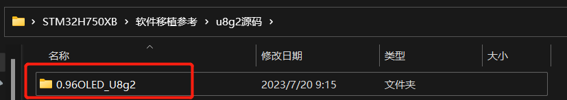

使用硬件i2c，选择引脚如下    

i2c_scl-->PB8

i2c_sda-->PB9

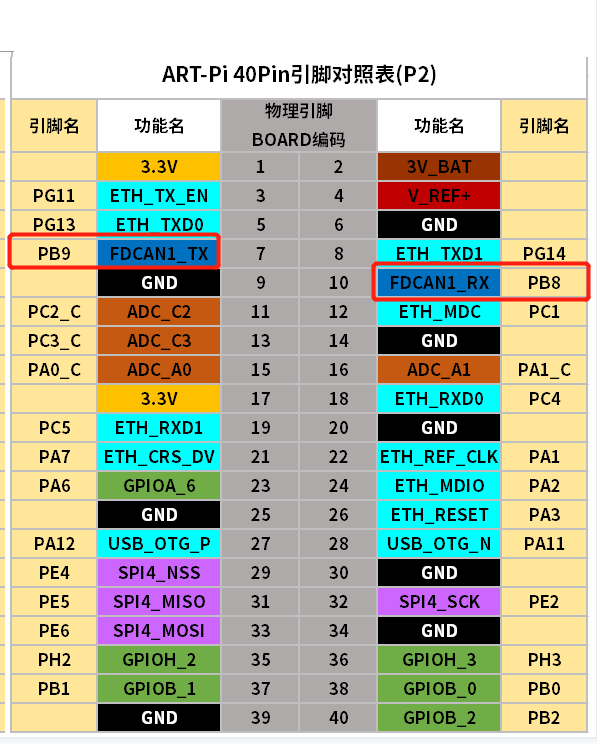

# CubeMX配置如下

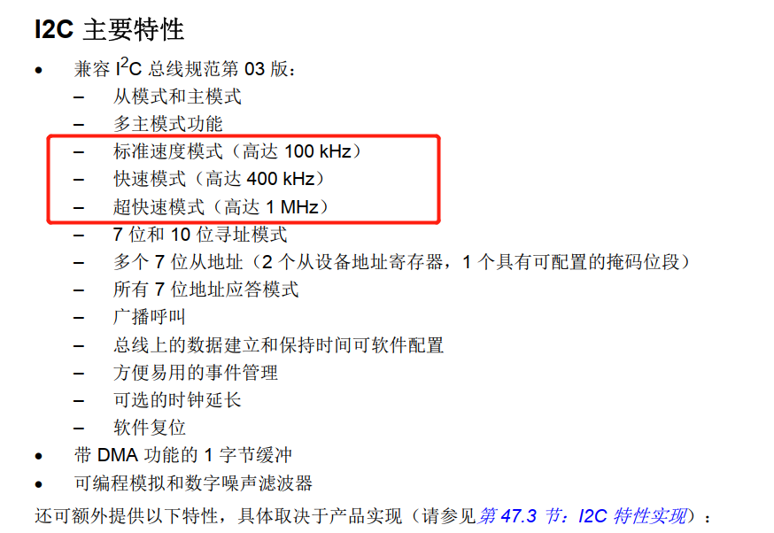

这里如上图对应三种速度模式,我们使用标准的100khz

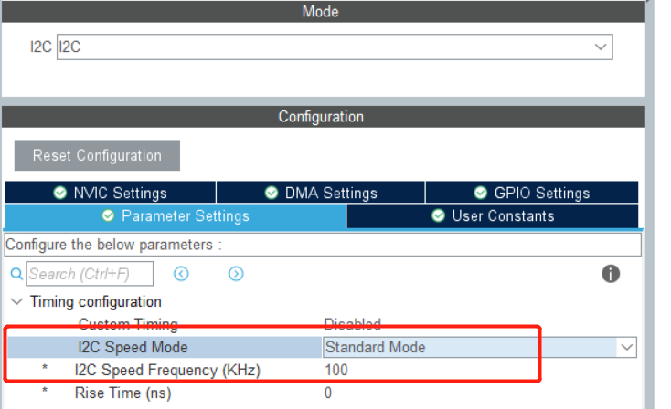

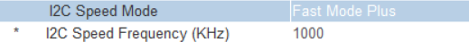

生成工程，编译未报错，开始移植

## 在自己的工程中新建目录文件夹，并添加文件

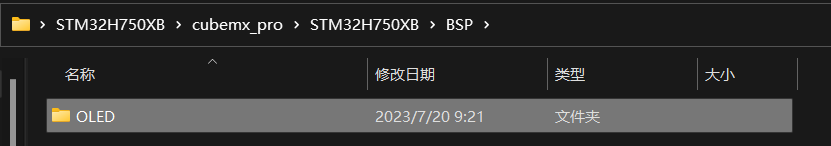

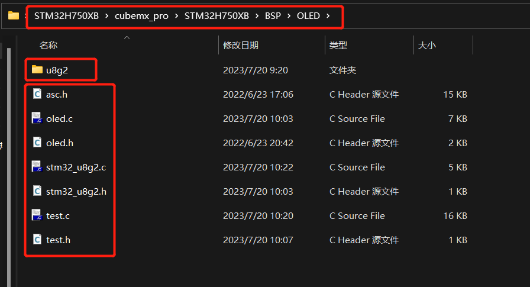

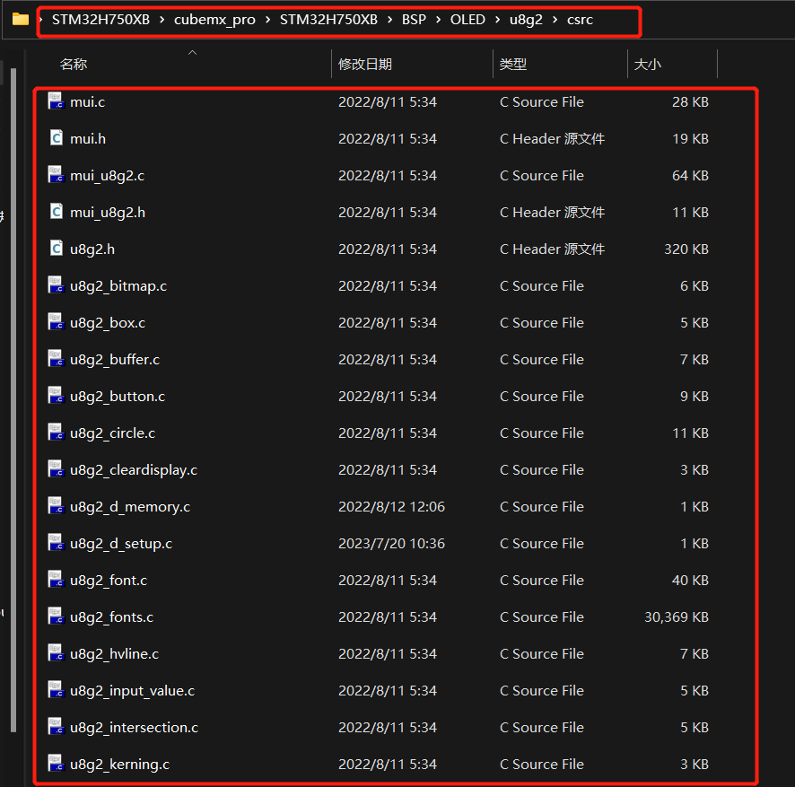

## 工程中添加文件并包含路径

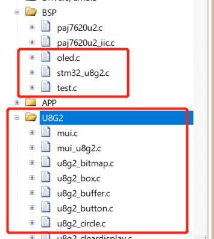

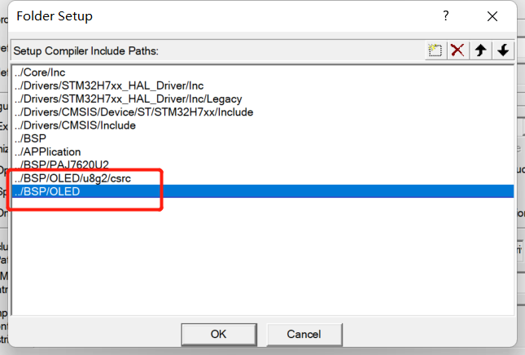

编译应该会有很多警告，最多是在末尾未空置行可忽略，解决err即可，不使用定时器，有一个微秒级延时函数需要屏蔽，如下：

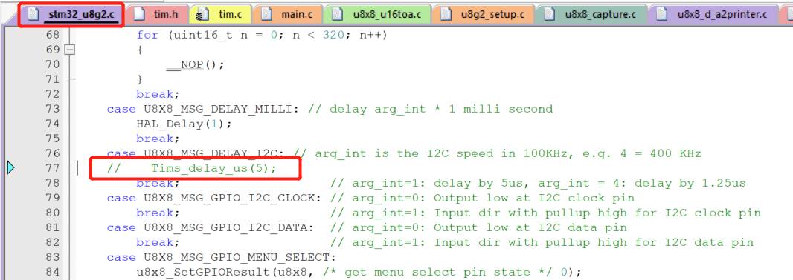

实际测试使用硬件i2c的高频率会流畅很多，可改变频率自行测试

测试视频可在该文档目录下查看