# 项目记录

## 环境搭建：

- 硬件平台：STM32H750XBH6
- 开发环境：STM32CubeMX V6.8.1+KEIL V5.28.0.0
- STM32H750固件版本：package V1.11.0
- 仿真下载驱动：ST-Link

# 9. DHT11

DHT11数字温湿度传感器是一款含有已校准数字信号输出的温湿度复合传感器。它应用专用的数字模块采集技术和温湿度传感技术，确保产品具有极高的可靠性与卓越的长期稳定性。传感器包括一个电阻式感湿元件和一个NTC测温元件，并与一个高性能8位单片机相连接。因此该产品具有品质卓越、超快响应、抗干扰能力强、性价比极高等优点。每个DHT11传感器都在极为精确的湿度校验室中进行校准。校准系数以程序的形式储存在OTP内存中，传感器内部在检测信号的处理过程中要调用这些校准系数。单线制串行接口，使系统集成变得简易快捷。超小的体积、极低的功耗，信号传输距离可达20米以上，使其成为各类应用甚至最为苛刻的应用场合的最佳选则。

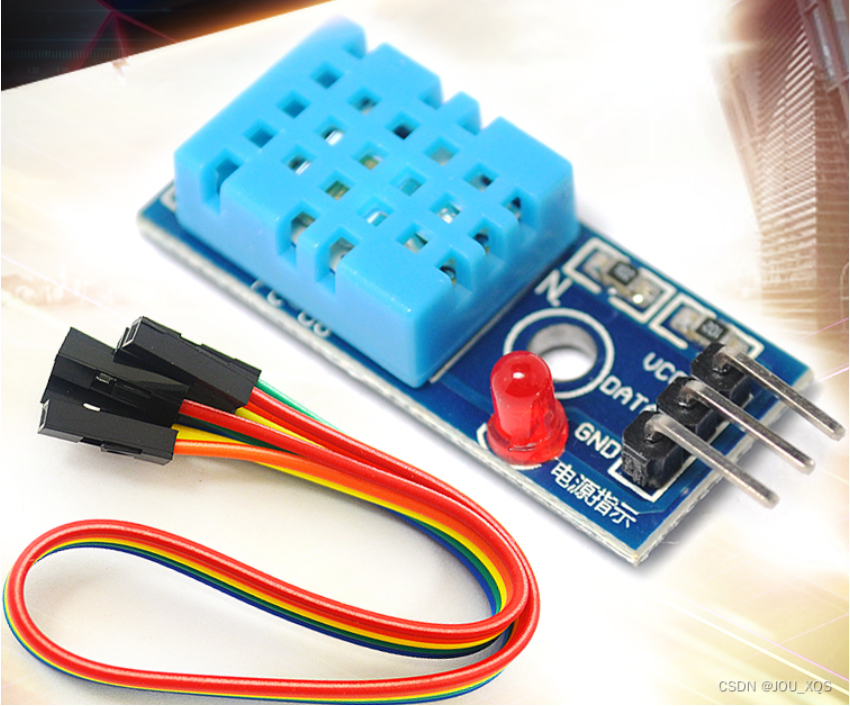

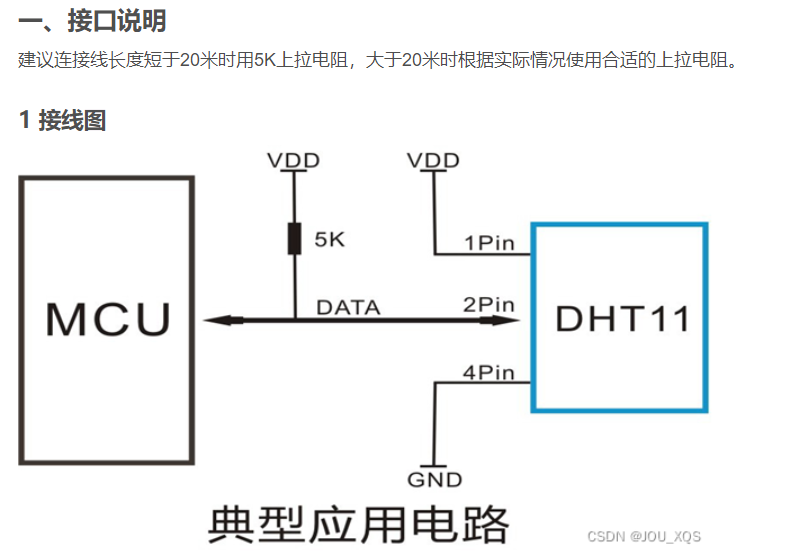

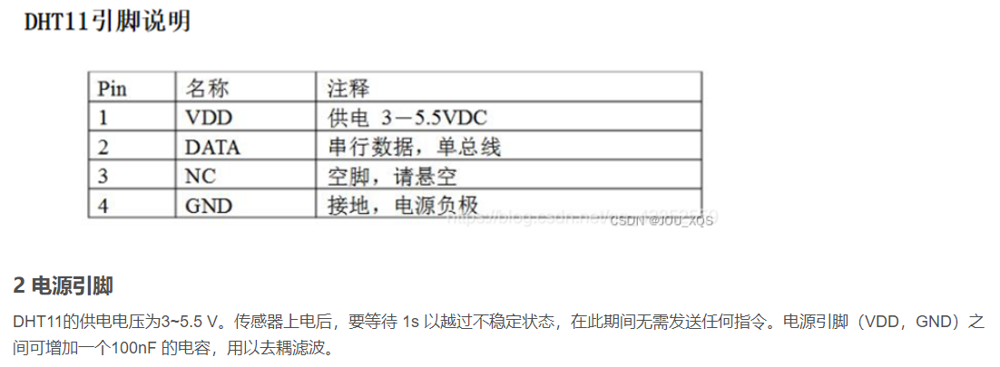

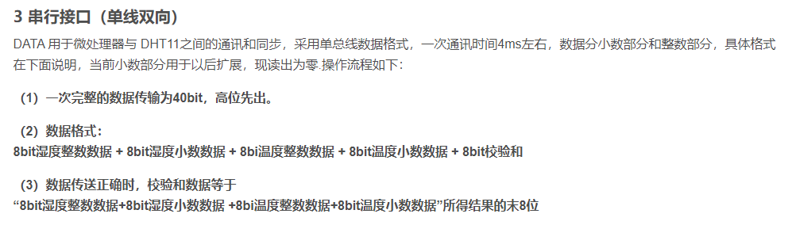

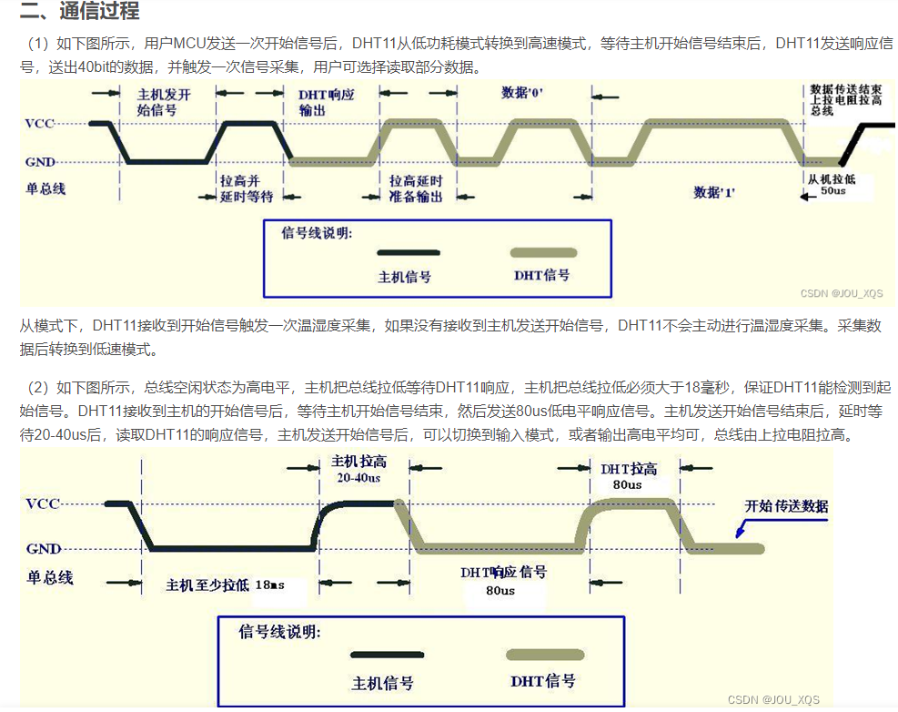

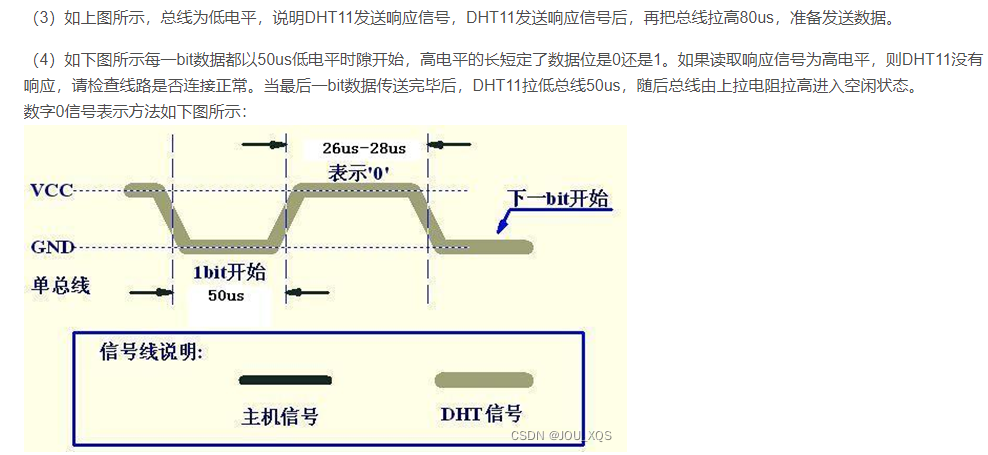

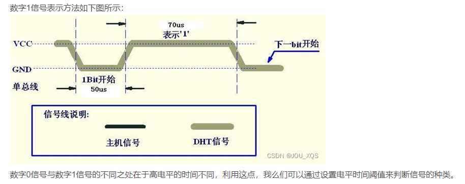

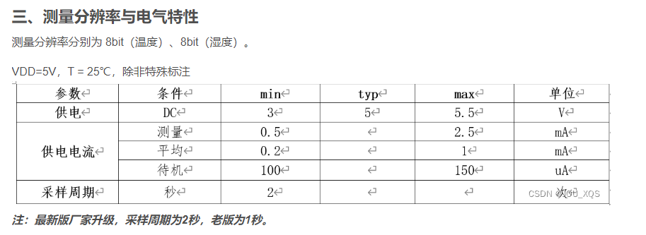

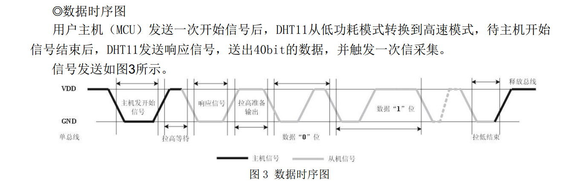

结合上面的时序图我们可以看出,DHT11的dat脚默认高电平,

**起始信号**：检测到主机发来80us左右的低电平和20-40us的高电平

**响应信号**：80us低电平和80us高电平

**DHT11发送数据40位数据：**

bit0:50us低电平+26-28us高电平

bit1:50us低电平+70us高电平

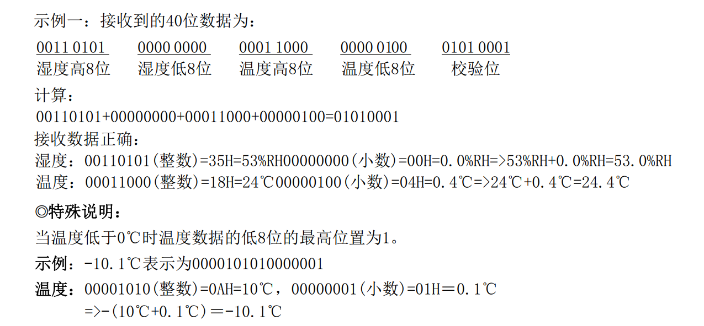

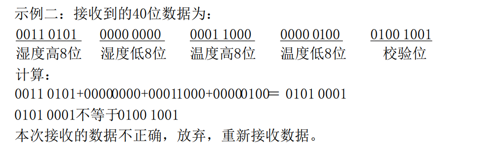

## 使用PB1作为data引脚

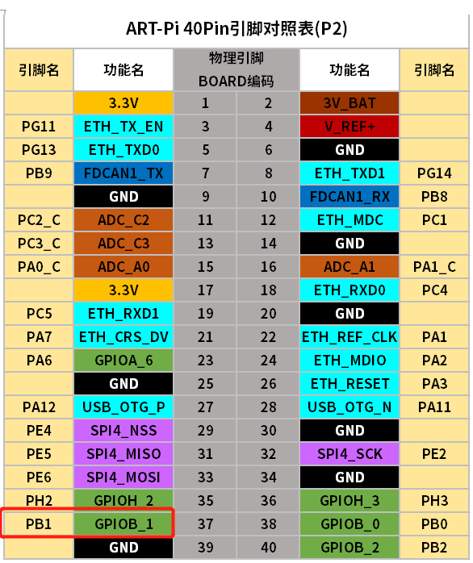

配置如下：

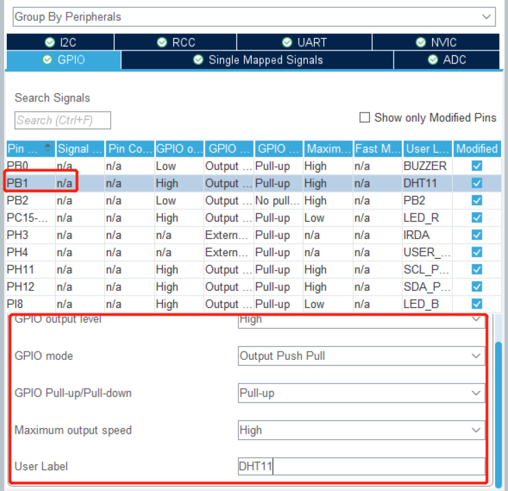

生成工程开始移植

如下进行了校验，但只使用了整数位，dht11的精度来说不太准确，需要小数位可以在这里改写

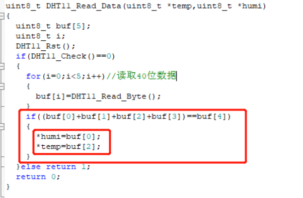

移植工程参考链接：

https://blog.csdn.net/weixin_44337303/article/details/117921137?spm=1001.2014.3001.5501

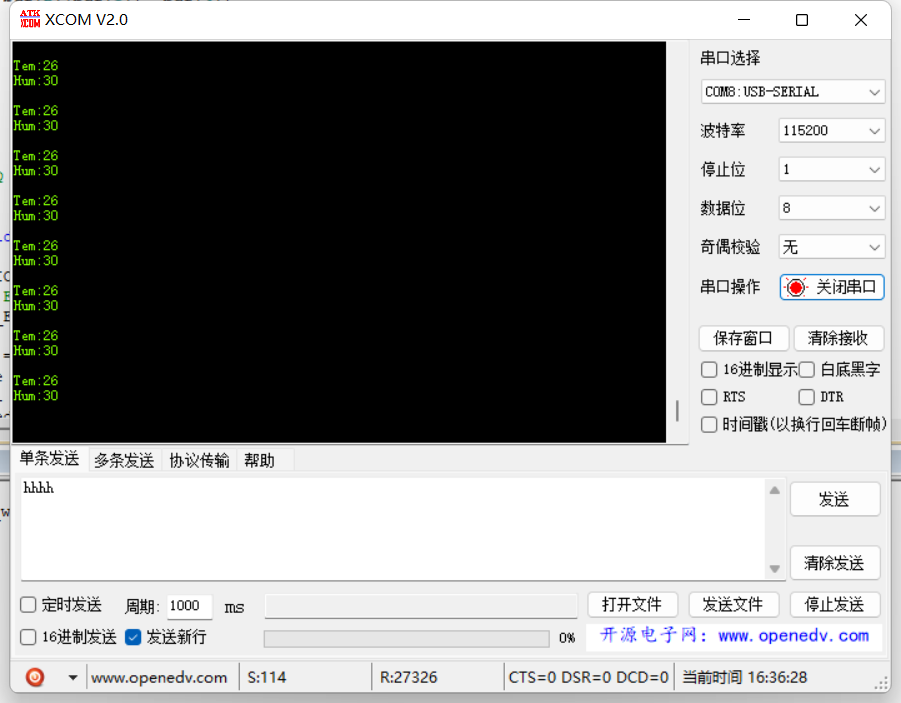