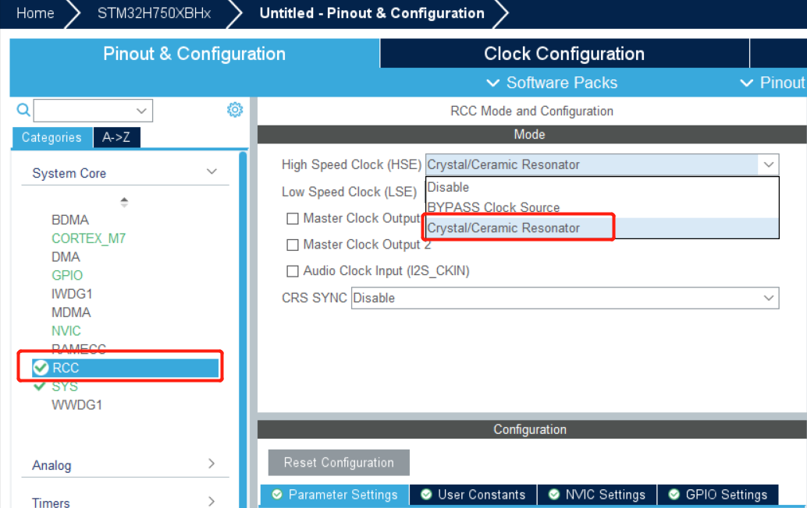
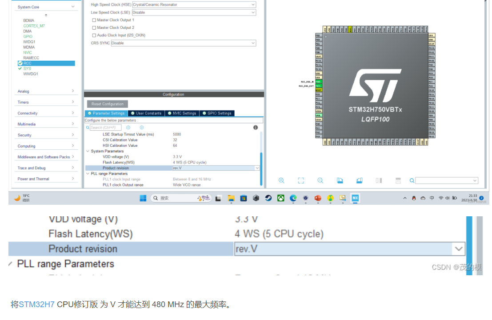

# 项目实现记录

## 环境搭建：

- 硬件平台：STM32H750XBH6
- 开发环境：STM32CubeMX V6.8.1+KEIL V5.28.0.0
- STM32H750固件版本：package V1.8.0（使用较高版本时钟频率无法配置到最大）
- 仿真下载驱动：ST-Link

# Cubemx配置时钟频率&时钟基准&生成项目模板

## 使用外部晶振

更改以下设置才能配置时钟最大为480MHZ

